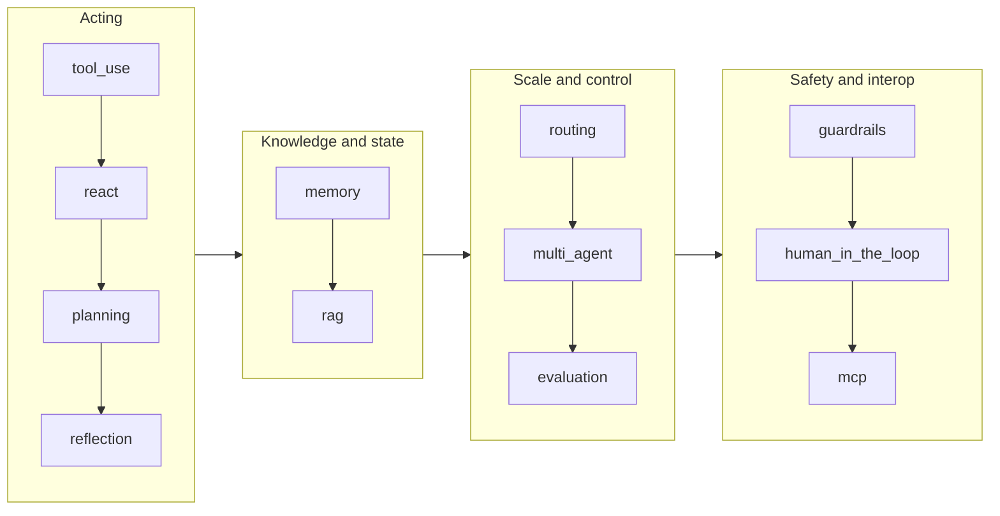

# agentic-patterns

[](https://github.com/SarthakB11/agentic-patterns/actions/workflows/ci.yml)

Twelve core agentic AI patterns implemented as runnable, tested reference code in plain Python. Each pattern folder covers its variants from the canonical form through what 2025-2026 research added: tree search over trajectories, localized plan repair, dual-LLM injection defenses, oversight capacity, stateless MCP, and more, each module tied to the paper or system it implements. Every example runs offline against a deterministic scripted mock provider: clone the repo and run any pattern with no API key, no install, and no network.

## Why this repo

Agent frameworks change monthly; the patterns underneath them do not. This repo implements the patterns themselves, without a framework, so you can see exactly what a supervisor, a reflection loop, or an MCP handshake does at the level of messages and control flow. Each module is teaching code: typed, documented, tested, and small enough to read in one sitting, with the research it implements cited next to the mechanism. Each folder README says which sub-variants were left out and why, so the coverage claims are checkable, and every citation was verified against its primary source before shipping.

## Quickstart

```bash
git clone https://github.com/SarthakB11/agentic-patterns.git
cd agentic-patterns
python3 -m patterns.react.main
```

That already works. There is nothing to install and no key to set: the mock provider replays a scripted, coherent conversation, so each pattern's control flow (tool calls, critiques, routing decisions, handshakes) completes exactly as it would against a live model, deterministically.

To run the test suite:

```bash
python3 -m pip install -e ".[dev]"
pytest -q
```

To run any example against a real API instead of the mock, set environment variables and run the same command:

| Provider                                 | Variables                                                                                        |
| ---------------------------------------- | ------------------------------------------------------------------------------------------------ |
| OpenAI or any OpenAI-compatible endpoint | `AGENTIC_PATTERNS_PROVIDER=openai`, `OPENAI_API_KEY`, optional `OPENAI_BASE_URL`, `OPENAI_MODEL` |
| Anthropic                                | `AGENTIC_PATTERNS_PROVIDER=anthropic`, `ANTHROPIC_API_KEY`, optional `ANTHROPIC_MODEL`           |
| Real embeddings (memory, RAG, routing)   | `AGENTIC_PATTERNS_EMBEDDER=openai`, `OPENAI_API_KEY`                                             |

## The twelve patterns

| Pattern                                          | What it does                                                                                                                                                                             | Reach for it when                                                                                             |
| ------------------------------------------------ | ---------------------------------------------------------------------------------------------------------------------------------------------------------------------------------------- | ------------------------------------------------------------------------------------------------------------- |
| [ReAct](patterns/react/)                         | The reason-and-act loop from text grammar to native tool calling, then tree search over trajectories, compaction, self-consistency, a verify-before-finish gate, and derailment recovery | The number of steps is unknown upfront and each action depends on the last observation                        |
| [Planning](patterns/planning/)                   | Explicit plans: sequential, DAG-parallel, replanning, ReWOO, then localized repair, sound-verifier loops, hierarchical expansion, plan selection, and premortem simulation               | The task structure is predictable, steps can run in parallel, or a plan needs review before anything executes |
| [Reflection](patterns/reflection/)               | Generate, critique, refine with explicit stops and best-so-far tracking, then multi-critic panels, adaptive stopping, and critique in the reasoning-model era                            | Output quality matters more than latency and a checkable signal (tests, a rubric) exists                      |
| [Tool use](patterns/tool_use/)                   | Function calling from a single shot through parallel calls and self-repair to code-as-action, constrained decoding, failure taxonomies, and tool search over flooded catalogs            | The model must act on the world, not just describe it                                                         |
| [Memory](patterns/memory/)                       | Short-term windows and paging to vector stores, then typed write decisions, sleep-time consolidation, principled forgetting, and a five-ability benchmark harness                        | State must survive past the context window, across turns or across sessions                                   |
| [RAG](patterns/rag/)                             | Naive dense to hybrid RRF and reranking, grading with abstain, then graph retrieval, deep-research loops, rationale-based reranking, and position effects                                | Answers must be grounded in a corpus the model was not trained on, with citations                             |
| [Multi-agent](patterns/multi_agent/)             | Supervisor and workers, handoffs, debate, then dual-ledger orchestration with stall detection, failure attribution, agent cards, and the economics of adding an agent                    | Work genuinely splits into roles with separate contexts, and coordination overhead pays for itself            |
| [Evaluation](patterns/evaluation/)               | Exact checks and LLM-as-judge with bias controls, then a three-axis judge validation protocol, process rewards, preference leakage, selective judging, and regression gates              | You change a prompt or model and need to know nothing broke                                                   |
| [MCP](patterns/mcp/)                             | A client and server from scratch over JSON-RPC 2.0: the stdio handshake and the stateless variant, plus integrity defenses, async tasks, elicitation, and discovery                      | A tool integration should be reusable across hosts and run behind a process boundary                          |
| [Guardrails](patterns/guardrails/)               | Fail-closed validation at every trust boundary, up to dual-LLM quarantine, capability-based flow control, a policy engine, and an injection attack suite                                 | Anything untrusted flows in or consequential actions flow out                                                 |
| [Human-in-the-loop](patterns/human_in_the_loop/) | Approval gates with audit and resume, risk tiers, then oversight as a finite fatiguing resource, learned gates that fail closed, and mandated-oversight mapping                          | An action is irreversible or expensive enough that a person must stay in the chain                            |
| [Routing](patterns/routing/)                     | Semantic, classifier, and cascade routing, then router evaluation against oracle baselines, verifier-gated escalation, threshold sweeps, and paraphrase robustness                       | One model or one configuration should not serve every request                                                 |

Every folder follows the same arc: the canonical mechanism first, the production form next, then the modules implementing specific 2025-2026 results, each citing the paper or system it comes from. The folder READMEs carry the full variant lists, control-flow diagrams, honest skipped-with-reasons notes, and sources.

## A reading order

If you are new to agents, read the folders in this order. Each group builds on the one before it, and the same order works inside each folder: read the early modules before the research-current ones.



Start with tool use, since every other pattern assumes a model that can call functions. ReAct turns tool calls into a loop; planning front-loads the loop's decisions; reflection closes the loop on quality. Memory and RAG give the loop state and knowledge. Routing, multi-agent, and evaluation are what you add when one loop is not enough. Guardrails and human-in-the-loop are what you add before you trust any of it, and MCP is how tools outgrow a single codebase.

## Repo layout

```
agentic_patterns/core/   shared harness: Provider abstraction (mock, OpenAI-compatible,
                         Anthropic, with a reasoning channel), ToolRegistry,
                         deterministic hash embedder, env config
patterns/<name>/         one folder per pattern: runnable main.py, one module per
                         sub-variant, a README with a flowchart and sources
tests/                   one test file per pattern, plus core tests and a smoke test
                         that runs every entrypoint offline
```

Current size: 206 pattern modules and a 754-test suite, all offline and deterministic.

Design choices worth knowing about:

- The offline path imports only the standard library. `httpx` is needed only for real providers and is imported lazily.
- Mock scripts live next to the demo functions, so a reader sees the whole scripted conversation next to the loop that consumes it. The pattern logic itself never special-cases the mock; swapping providers is a config change.
- Wire-format conversions for the real providers are pure functions with their own unit tests, so provider correctness is tested without a network call.
- Tests assert on mechanics (what was sent to the model, how loops stop, what gets refused), not on prose.

## License

MIT. Built by [Sarthak Bhardwaj](https://github.com/SarthakB11).
