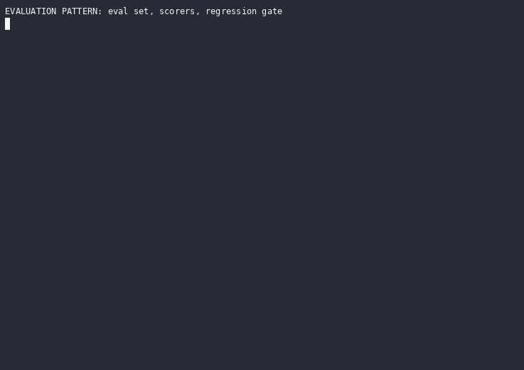
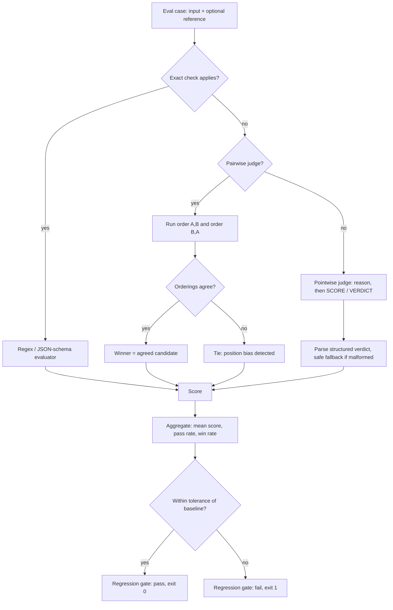
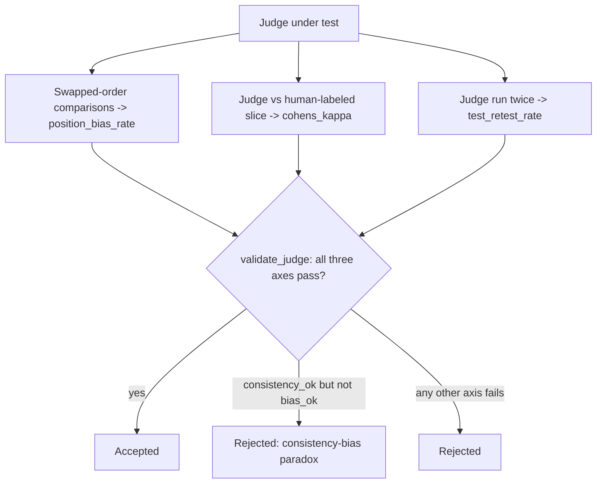

# Evaluation

An evaluation loop turns "did this change make the system better or worse?" into a repeatable, automatable answer. It has three parts: a versioned eval set of input cases, one or more scorers that grade a candidate output per case (from exact programmatic checks to an LLM acting as a judge), and a regression gate that aggregates a run's scores and compares them to a baseline, returning pass or fail so CI can block a change that degrades quality.



_Recorded from `python3 -m patterns.evaluation.main`, offline, no API key. Regenerate with `python3 tools/record_demos.py record-all`._

## When to use it

Use an evaluation loop whenever you iterate on a prompt, model, retrieval setup, or agent and need to know if a change helped. Reach for an LLM judge specifically when the output is open-ended (summaries, chat replies, extractions) so string equality and regex are too brittle, yet human grading of every candidate is too slow. Skip the judge when a deterministic check suffices: a verifiable answer (valid JSON, correct arithmetic, a passing unit test) is cheaper and perfectly reliable to check directly. Avoid LLM judges for high-stakes safety or legal decisions without human sign-off, and be careful using one as an optimization target, since a system tuned against a flawed judge learns to please the judge rather than the user.

## How this example works

Every case in the eval set is scored by whichever evaluator fits it: an exact evaluator when the task has a verifiable answer, an LLM judge when it does not. Pairwise judging always runs both presentation orders and aggregates before trusting a winner. Per-case scores roll up into run metrics, which a regression gate checks against a stored baseline.



A judge is not trusted just because it produced a verdict. Before a judge's verdicts feed the flow above, `validation_protocol.py` measures it on three independent axes and only accepts it if all three pass:



## Variants implemented

- `eval_set.py`: the eval set as versioned data, five cases spanning exact-checkable and open-ended tasks for one running scenario, a subscription-product support bot.
- `exact.py`: two exact evaluators, regex/string match and JSON-schema validity, fully offline and model-free.
- `semantic.py`: a semantic-similarity evaluator using `HashEmbedder` and cosine distance against a reference, catching paraphrases exact match misses.
- `verdict.py`: shared structured-verdict parsing (`SCORE`/`VERDICT` and `WINNER` lines) with a safe, fail-closed fallback for malformed judge output, reused by every judge module.
- `pointwise.py`: a pointwise rubric judge that reasons through named evaluation steps before scoring (G-Eval style), reference-based and reference-free modes on the same judge, an instruction-specific checklist judge that derives criteria per case, and a position-order check showing pointwise scoring is not immune to ordering effects either.
- `pairwise.py`: a pairwise comparison judge run in both presentation orders and aggregated, so a candidate only wins if preferred in both orders and a disagreement falls back to a tie instead of trusting either single call.
- `ensemble.py`: a jury of three independent judges combined by majority vote.
- `trajectory.py`: agent-as-judge trajectory evaluation, grading an agent's whole action/observation trace against its goal, contrasted directly against final-answer-only judging on the same shortcut trajectory.
- `aggregate.py`: pure metrics functions, mean score, pass rate, pairwise win rate, and an Elo-style ranking rolled up from pairwise verdicts (the same idea behind the LMSYS Chatbot Arena leaderboard, using an Elo update rather than a full Bradley-Terry fit for simplicity).
- `regression.py`: a regression gate comparing a run's aggregate metric to a stored baseline within a tolerance band, with the non-zero CI exit code a real pipeline would check.
- `meta.py`: meta-evaluation, Cohen's kappa for chance-corrected judge-vs-human agreement, and a test-retest same-verdict rate for judge stability across repeated runs.
- `validation_protocol.py`: the Minimum Viable Validation protocol, a third axis (position bias, via swapped-order comparisons) alongside `meta.py`'s kappa and test-retest, and a joint accept/reject decision that names the consistency-bias paradox, high stability with severe bias, still rejected.
- `selective.py`: calibrated selective judging, a judge resamples itself to estimate confidence per case, abstains below a threshold, and escalates abstained cases, trading coverage for reliability along a measurable curve.
- `leakage.py`: preference leakage measured, not just named, the win-rate gap a judge gives a related generator's output over an unrelated one on equal-quality work, across three relatedness tiers, collapsing once the judge is unrelated.
- `process_reward.py`: step-level process reward as a trajectory evaluator, scoring each step independently and aggregating under `min`/`product`/`mean`/`last`, localizing the weakest step instead of one holistic verdict.

Not implemented: a full Bradley-Terry maximum-likelihood ranking. `aggregate.py` uses an Elo update instead, which serves the same purpose (turning pairwise verdicts into one global ranking) with far less code, at the cost of being order-sensitive to the sequence of matches, a fine tradeoff for a teaching example.

## Run it

```
python -m patterns.evaluation.main
```

Expected output (truncated):

```
EVALUATION PATTERN: eval set, scorers, regression gate

=== 1. Eval set (version 2026.07.1) ===
  [refund_policy] tags=['billing', 'open_ended'] reference=yes expected_property=-
  ...
=== 5. Pairwise judge (both orderings, position-bias cancellation) ===
fair comparison: winner=candidate_b position_bias_detected=False
biased comparison: winner=tie position_bias_detected=True
...
=== 9. Regression gate ===
candidate run: metric=1.00 baseline=1.00 passed=True exit_code=0
regressed run: metric=0.50 baseline=1.00 passed=False exit_code=1
...
=== 11. Judge validation protocol (agreement, consistency, bias) ===
healthy judge:  kappa=0.6 test_retest=0.97 bias_rate=0.05 accepted=True paradox=False
paradox judge:  kappa=0.6 test_retest=0.97 bias_rate=0.67 accepted=False paradox=True
...
=== 13. Preference leakage (contamination, not just named) ===
same_model  leakage_score=1.00 detected=True
inheritance leakage_score=0.67 detected=True
unrelated   leakage_score=0.00 detected=False
...
All fourteen sections completed without exhausting their scripts.
```

## Real providers

Set `AGENTIC_PATTERNS_PROVIDER=openai` (with `OPENAI_API_KEY` set) or `AGENTIC_PATTERNS_PROVIDER=anthropic` (with `ANTHROPIC_API_KEY` set) to run every judge in this pattern against a real model, with no source change: each demo function builds its provider through `agentic_patterns.get_provider`. Set `AGENTIC_PATTERNS_EMBEDDER=openai` (with `OPENAI_API_KEY` set) to run `semantic.py` against real embeddings instead of the deterministic `HashEmbedder`.

## Measured

Against Gemini 3.1 Flash-Lite on 20 human-labeled answers, a correctness-aligned judge reached 0.95 accuracy and Cohen's kappa 0.90 with no position bias. An earlier version scored 0.60 accuracy and kappa 0.20 because its rubric graded support-desk polish instead of correctness, a mismatch this benchmark caught and fixed. Full method and numbers in [RESULTS.md](../../RESULTS.md#evaluation-a-judge-is-only-as-good-as-the-question-you-ask-it).

## Sources

- Chip Huyen, _AI Engineering_ (O'Reilly, 2025), Ch. 3 "Evaluation Methodology" and Ch. 4 "Evaluate AI Systems".
- Liu et al., "G-Eval: NLG Evaluation using GPT-4 with Better Human Alignment," EMNLP 2023. arXiv:2303.16634.
- Zheng et al., "Judging LLM-as-a-Judge with MT-Bench and Chatbot Arena," NeurIPS 2023. arXiv:2306.05685.
- "A Survey on LLM-as-a-Judge," arXiv:2411.15594.
- Justin D. Norman, Michael U. Rivera, D. Alex Hughes, "Reliability without Validity: A Systematic, Large-Scale Evaluation of LLM-as-a-Judge Models Across Agreement, Consistency, and Bias," 2026. arXiv:2606.19544 (~541,000 judgments, 21 judges; consistency-bias paradox: test-retest >0.95 with position bias >0.10; Minimum Viable Validation protocol over agreement, consistency, bias; `validation_protocol.py`).
- Zhuge et al., "Agent-as-a-Judge," arXiv:2410.10934: whole-trajectory grading against final-answer-only judging.
- Hunter Lightman, Vineet Kosaraju, Yura Burda, Harri Edwards, Bowen Baker, Teddy Lee, Jan Leike, John Schulman, Ilya Sutskever, Karl Cobbe, "Let's Verify Step by Step," May 2023. arXiv:2305.20050 (process supervision, step-level scoring, PRM800K; `process_reward.py`).
- Jaehun Jung, Faeze Brahman, Yejin Choi, "Trust or Escalate: LLM Judges with Provable Guarantees for Human Agreement," July 2024. arXiv:2407.18370 (selective evaluation, Simulated Annotators for confidence, cascaded escalation, provable human-agreement level; `selective.py`).
- Dawei Li, Renliang Sun, Yue Huang, Ming Zhong, Bohan Jiang, Jiawei Han, Xiangliang Zhang, Wei Wang, Huan Liu, "Preference Leakage: A Contamination Problem in LLM-as-a-judge," February 2025 (v3 March 2026). arXiv:2502.01534 (leakage score as related-minus-unrelated win-rate gap; same-model, inheritance, same-family tiers; `leakage.py`).
- Zhu et al., "Where LLM Agents Fail and How They can Learn From Failures," September 2025. arXiv:2509.25370 (root-cause step attribution; motivates `process_reward.py`'s weak-step localization).
- Gunjal et al., "Rubrics as Rewards," arXiv:2507.17746 (weighted rubric scoring, a training-time RL reward method; `pointwise.py`'s checklist judge borrows the rubric idea and drops the weighting, noted in its docstring).
- "Am I More Pointwise or Pairwise?", arXiv:2602.02219 (position bias inside pointwise judging; `pointwise.py`'s order-check demo).
