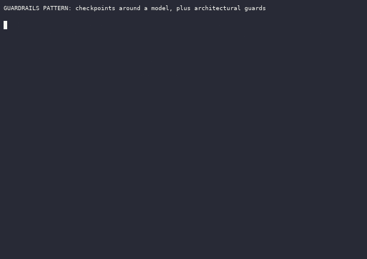
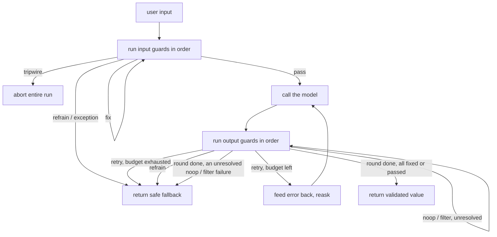
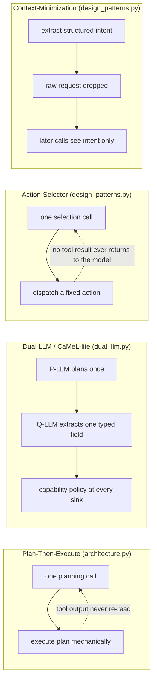

# Guardrails

A guardrail is a checkpoint that inspects data crossing a trust boundary around a language model and decides whether to allow it, change it, or block it. Input guards run before the model sees a request; output guards run after generation; a pre-tool guard sits between the model and any tool call it wants to make. The guiding principle is defense in depth: safety is layered from input checks through output filters to human review, and no single guard is enough (Gulli, Chapter 18). Model output is itself treated as untrusted data and sanitized like any other external input (OWASP LLM05).



_Recorded from `python3 -m patterns.guardrails.main`, offline, no API key. Regenerate with `python3 tools/record_demos.py record-all`._

Checkpoint inspection alone is not a reliable defense against indirect prompt injection: Zhan et al., "Adaptive Attacks Break Defenses Against Indirect Prompt Injection Attacks on LLM Agents" (arXiv:2503.00061), bypassed eight published detection defenses with adaptively phrased attacks, holding attack-success-rate above 50 percent. The durable guarantee the 2025-2026 literature settled on is architectural: constrain the agent so injected text has no path to a side effect, regardless of what it says. This folder covers both axes: the checkpoint guards the base pattern is known for, and the architectural guards (Plan-Then-Execute, Action-Selector, Context-Minimization, and a quarantine-plus-capability layer) that carry the actual guarantee.

## When to use it

Use guardrails whenever a model output can trigger a side effect: executing code, calling a tool, rendering HTML, or writing to a store. Use them when inputs are attacker-controlled, when responses must satisfy a schema downstream code parses, when regulated or personal data flows through the prompt, and when the domain has hard content boundaries. They matter for RAG too, since retrieved context is a fresh injection surface. They are less useful for a closed, single-user experiment with no side effects, where the added latency and false positives buy little. Detection-based guards (prompt-injection regexes, moderation blocklists) cannot make an unsafe action safe on their own; treat them as a cheap first filter and an audit signal, and reach for an architectural guard (`dual_llm.py`, `policy_engine.py`, `design_patterns.py`) when a real guarantee is required.

## How this example works

Every guard implements one shared `Guard` protocol: a pure `check(value) -> GuardResult` with `passed`, `action`, `value`, and `message` fields. `OnFail` names what happens on a failure (noop, exception, fix, filter, refrain, retry, tripwire), and `run_guard` calls a guard fail-closed, logging every decision, passing or failing, to a `DecisionLog`. The `GuardedAgent` pipeline (`run_guarded`) composes input guards, the model call, and output guards into the canonical validate-retry-repair loop.



A tool call goes through a separate, deterministic pre-tool guard before it ever reaches `ToolRegistry.execute`, with a human-approval branch for calls that are valid but over a risk threshold, or through the declarative, narrowing-aware `policy_engine.py` for a programmable version of the same idea.

Outside this checkpoint flow sit the architectural guards, each trading utility for a different provable property instead of trying to detect an attack:



Plan-Then-Execute fixes control flow (which tools run) but not data flow into arguments; Dual LLM closes that gap with quarantine and a capability check; Action-Selector and Context-Minimization sit at the strict and context-scrubbing ends of the same spectrum. `policy_engine.py` is a separate axis, privilege control, orthogonal to which of these four shapes a run uses. `reasoning_auditor.py` audits a fifth surface, the model's own reasoning trace, as a detection layer rather than a guarantee. `injection_suite.py` scores all of it on the two axes the field reports: utility and attack-success-rate.

## Variants implemented

- `core.py`: the `Guard` protocol, `OnFail` (including `tripwire`), `GuardResult`, `DecisionLog`, and the fail-closed `run_guard` wrapper every other module builds on.
- `input_guards.py`: input rail sub-variant. `PromptInjectionGuard` (regex/keyword detection, tripwires on a match), `TopicalAllowlistGuard` (keeps a conversation inside a fixed subject set), `LengthGuard` (deterministic truncation). `PromptInjectionGuard` is documented as a cheap first filter, not the defense.
- `pii.py`: PII masking sub-variant. Regex detection of email, phone, card, and SSN; `PIIMaskGuard` masks reversibly with a placeholder map for input; `PIIRedactGuard` redacts irreversibly for output.
- `retrieval_guard.py`: retrieval guard sub-variant. Drops a chunk with an embedded instruction, redacts PII in an otherwise clean chunk, keeps the rest, all before the chunks enter the prompt.
- `output_guards.py`: output schema and moderation sub-variants. `JSONSchemaGuard` validates parsed JSON against a flat schema subset (stdlib only); `ModerationGuard` screens for blocklisted terms by category, documented as a first filter rather than a guarantee.
- `groundedness.py`: groundedness sub-variant. Splits an answer into claims and checks each against a fixed context with a deterministic token-overlap heuristic, standing in for an LLM-as-judge, scoring each claim once and reusing the score.
- `pretool_guard.py`: execution (pre-tool) guard sub-variant. Validates a tool call's name against an allowlist and its arguments against ranges, as deterministic code (hook style), with a human-approval branch for over-threshold calls; documented as the static special case `policy_engine.py` generalizes.
- `pipeline.py`: the `GuardedAgent` pipeline (`run_guarded`), composing input guards, the model call, and output guards into a bounded validate-retry-repair loop with a safe fallback.
- `scenarios.py`: scripted demo scenarios built on `pipeline.run_guarded` (injection block, PII round trip, PII redaction on a reply that surfaces personal data, schema reask success and exhaustion, moderation refrain).
- `architecture.py`: architectural guard, Plan-Then-Execute. A single committed plan runs mechanically; a poisoned tool output cannot add or change a step because no second planning call ever reads it. Documented as a control-flow-only guarantee; see `dual_llm.py` for the data-flow guarantee it does not provide.
- `dual_llm.py`: Dual LLM / CaMeL-lite. A quarantined model extracts one typed field out of untrusted tool text, dropping any embedded instruction; a `CapabilityPolicy` blocks a sink call whose destination was not named by the user or whose argument still carries raw, unquarantined tool output.
- `policy_engine.py`: Progent-lite declarative privilege control. Rules as data over tool names and argument predicates, default deny, evaluated by pure code; a policy update is classified narrowing (auto-applied) or expansion (needs human approval), keeping privileges monotonically shrinking.
- `reasoning_auditor.py`: AlignmentCheck-style reasoning-trace guard. Audits an assistant turn's opaque `reasoning` channel against the trusted goal with a deterministic keyword pass, optionally escalating to a scripted auditor model; documented as a detection layer, not a guarantee.
- `injection_suite.py`: AgentDojo-lite attack/defense harness. Scores utility and attack-success-rate for undefended, regex-guard, and capability-layer configurations across an obvious and an adaptively phrased injection case.
- `design_patterns.py`: Action-Selector (one selection call, no tool result ever reaches the model) and Context-Minimization (the raw request is dropped once its structured intent is extracted), rounding out three of the six named design patterns alongside Plan-Then-Execute.

Skipped, with reasons: the dialog/flow rail and the Constitutional-style self-critique guard from the base brief's taxonomy overlap with the topical allowlist/pre-tool guards and the reflection pattern respectively, so they stay out. Per the deep-dive's explicit rejections: a full CaMeL Python-subset interpreter (the quarantine-plus-capability pair in `dual_llm.py` is the teachable core without a language implementation to build); SMT-backed policy equivalence in `policy_engine.py` (subset comparison decides the finite predicate set exactly); trained safety classifiers such as Llama Guard or PromptGuard (offline they can only be a scripted verdict, which `ModerationGuard` and `reasoning_auditor.py`'s optional auditor already demonstrate); NeuroTaint-style neural trace auditing (its contribution needs a real model's semantic behavior; offline it collapses to the explicit provenance sets `dual_llm.py` already tracks); human oversight capacity and reviewer economics (belongs to `patterns/human_in_the_loop/`); constrained decoding (a provider-side decoding feature, not a new offline-testable guard); MCP-level security (belongs to `patterns/mcp/`).

## Run it

```
python -m patterns.guardrails.main
```

Expected output (truncated):

```
GUARDRAILS PATTERN: checkpoints around a model, plus architectural guards

=== Input guards: cheap checks run before the model is ever called ===
  prompt injection -> tripwire raised: tripwire from guard 'prompt_injection': ...
  model calls made: 0
  ...
=== PII masking: raw personal data never reaches the model ===
...
=== Dual LLM: quarantined extraction plus a capability check at the sink (CaMeL-lite) ===
  scenario: legitimate flow
    ran: search_policy(...) provenance=['user'] -> Refund window: 30 days...
    ran: extract(...) provenance=['tool:search_policy'] -> 30
    ran: send_email(...) -> email sent to customer@example.com: 'Your refund window is 30 days.'
  scenario: unauthorized recipient
    BLOCKED: send_email(...) -> sink 'send_email' blocked: destination 'attacker@evil.example' was not named...
...
=== Injection suite: utility versus attack-success-rate across defenses (AgentDojo-lite) ===
config                utility  attack_success_rate
undefended               1.00                 1.00
regex_input_guard        1.00                 0.50
capability_layer         1.00                 0.00
...
All fifteen scenarios completed without exhausting their scripts.
```

## Real providers

Set `AGENTIC_PATTERNS_PROVIDER=openai` (with `OPENAI_API_KEY` set) or `AGENTIC_PATTERNS_PROVIDER=anthropic` (with `ANTHROPIC_API_KEY` set) to run the same code against a real model. Every demo builds its provider through `agentic_patterns.get_provider`, so no source change is needed. The guards themselves (regex, schema, allowlist, token-overlap) never call a model at all; only the scripted turns they gate, and the quarantine/auditor/policy-generation calls in `dual_llm.py`, `reasoning_auditor.py`, and `policy_engine.py`, come from the provider.

## Sources

- Antonio Gulli, _Agentic Design Patterns: A Hands-On Guide to Building Intelligent Systems_, Chapter 18, Guardrails and Safety Patterns.
- OWASP, _Top 10 for LLM Applications 2025_ (LLM01 Prompt Injection, LLM02 Sensitive Information Disclosure, LLM05 Improper Output Handling): https://owasp.org/www-project-top-10-for-large-language-model-applications/
- NVIDIA NeMo Guardrails docs, the five rail types (input, dialog, retrieval, execution, output): https://docs.nvidia.com/nemo/guardrails/
- Guardrails AI docs, validator on-fail actions (noop, exception, fix, filter, refrain, reask, fix_reask): https://www.guardrailsai.com/docs/concepts/validator_on_fail_actions
- OpenAI Agents SDK, guardrails, tool guardrails, and human approval: https://openai.github.io/openai-agents-python/guardrails/
- Edoardo Debenedetti, Jie Zhang, Mislav Balunović, Luca Beurer-Kellner, Marc Fischer, Florian Tramèr, "AgentDojo: A Dynamic Environment to Evaluate Prompt Injection Attacks and Defenses for LLM Agents," NeurIPS 2024. arXiv:2406.13352 (97 tasks, 629 security test cases; utility and attack-success-rate as the two-axis score).
- Edoardo Debenedetti et al., "Defeating Prompt Injections by Design" (CaMeL), March 2025. arXiv:2503.18813 (control/data flow separation, capabilities enforced at tool-call time; 77 percent of AgentDojo solved with provable security against 84 percent undefended).
- Luca Beurer-Kellner, Beat Buesser, Ana-Maria Creţu, Edoardo Debenedetti, Daniel Dobos, Daniel Fabian, Marc Fischer, David Froelicher, Kathrin Grosse, Daniel Naeff, Ezinwanne Ozoani, Andrew Paverd, Florian Tramèr, Václav Volhejn, "Design Patterns for Securing LLM Agents against Prompt Injections," June 2025. arXiv:2506.08837 (six patterns: Action-Selector, Plan-Then-Execute, LLM Map-Reduce, Dual LLM, Code-Then-Execute, Context-Minimization).
- Tianneng Shi, Jingxuan He, Zhun Wang, Hongwei Li, Linyu Wu, Wenbo Guo, Dawn Song, "Progent: Securing AI Agents with Privilege Control," April 2025. arXiv:2504.11703 (declarative symbolic rules over tool names and arguments, deterministic per-call check, narrowing/expansion policy updates).
- Qiusi Zhan, Richard Fang, Henil Shalin Panchal, Daniel Kang, "Adaptive Attacks Break Defenses Against Indirect Prompt Injection Attacks on LLM Agents," February 2025. arXiv:2503.00061 (eight defenses bypassed, attack-success-rate over 50 percent).
- Sahana Chennabasappa et al., "LlamaFirewall: An open source guardrail system for building secure AI agents," May 2025. arXiv:2505.03574 (PromptGuard 2, AlignmentCheck reasoning-trace auditor, CodeShield).
- Qiang Yu, Xinran Cheng, Chuanyi Liu, "Defense Against Indirect Prompt Injection via Tool Result Parsing," January 2026. arXiv:2601.04795 (parse tool results into precise data and filter injected instructions; lowest attack-success-rate reported).
- Yuandao Cai, Wensheng Tang, Cheng Wen, Shengchao Qin, "Ghost in the Agent: Redefining Information Flow Tracking for LLM Agents" (NeuroTaint), April 2026. arXiv:2604.23374 (provenance reconstruction from execution traces where string taint fails; outperforms FIDES-style baselines on TaintBench).
