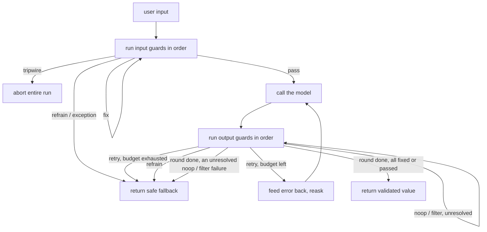

# Guardrails

A guardrail is a checkpoint that inspects data crossing a trust boundary around a language model and decides whether to allow it, change it, or block it. Input guards run before the model sees a request; output guards run after generation; a pre-tool guard sits between the model and any tool call it wants to make. The guiding principle is defense in depth: safety is layered from input checks through output filters to human review, and no single guard is enough (Gulli, Chapter 18). Model output is itself treated as untrusted data and sanitized like any other external input (OWASP LLM05).

## When to use it

Use guardrails whenever a model output can trigger a side effect: executing code, calling a tool, rendering HTML, or writing to a store. Use them when inputs are attacker-controlled, when responses must satisfy a schema downstream code parses, when regulated or personal data flows through the prompt, and when the domain has hard content boundaries. They matter for RAG too, since retrieved context is a fresh injection surface. They are less useful for a closed, single-user experiment with no side effects, where the added latency and false positives buy little, and they cannot make an unsafe action safe on their own: 2025 work on indirect prompt injection (CaMeL, arXiv:2503.18813) shows that checkpoint inspection alone is not a reliable defense, which is why this pattern also includes one architectural guard that removes the injection's path to a side effect instead of trying to detect it.

## How this example works

Every guard implements one shared `Guard` protocol: a pure `check(value) -> GuardResult` with `passed`, `action`, `value`, and `message` fields. `OnFail` names what happens on a failure (noop, exception, fix, filter, refrain, retry, tripwire), and `run_guard` calls a guard fail-closed, logging every decision, passing or failing, to a `DecisionLog`. The `GuardedAgent` pipeline (`run_guarded`) composes input guards, the model call, and output guards into the canonical validate-retry-repair loop.



A tool call goes through a separate, deterministic pre-tool guard before it ever reaches `ToolRegistry.execute`, with a human-approval branch for calls that are valid but over a risk threshold. The Plan-Then-Execute demo sits outside this checkpoint flow entirely: the model commits to a full plan in one call, before any tool has run, so a later tool's poisoned output has no second planning call to reach.

## Variants implemented

- `core.py`: the `Guard` protocol, `OnFail` (including `tripwire`), `GuardResult`, `DecisionLog`, and the fail-closed `run_guard` wrapper every other module builds on.
- `input_guards.py`: input rail sub-variant. `PromptInjectionGuard` (regex/keyword detection, tripwires on a match), `TopicalAllowlistGuard` (keeps a conversation inside a fixed subject set), `LengthGuard` (deterministic truncation).
- `pii.py`: PII masking sub-variant. Regex detection of email, phone, card, and SSN; `PIIMaskGuard` masks reversibly with a placeholder map for input; `PIIRedactGuard` redacts irreversibly for output.
- `retrieval_guard.py`: retrieval guard sub-variant. Drops a chunk with an embedded instruction, redacts PII in an otherwise clean chunk, keeps the rest, all before the chunks enter the prompt.
- `output_guards.py`: output schema and moderation sub-variants. `JSONSchemaGuard` validates parsed JSON against a flat schema subset (stdlib only); `ModerationGuard` screens for blocklisted terms by category.
- `groundedness.py`: groundedness sub-variant. Splits an answer into claims and checks each against a fixed context with a deterministic token-overlap heuristic, standing in for an LLM-as-judge.
- `pretool_guard.py`: execution (pre-tool) guard sub-variant. Validates a tool call's name against an allowlist and its arguments against ranges, as deterministic code (hook style), with a human-approval branch for over-threshold calls.
- `pipeline.py`: the `GuardedAgent` pipeline (`run_guarded`), composing input guards, the model call, and output guards into a bounded validate-retry-repair loop with a safe fallback.
- `scenarios.py`: scripted demo scenarios built on `pipeline.run_guarded` (injection block, PII round trip, PII redaction on a reply that surfaces personal data, schema reask success and exhaustion, moderation refrain).
- `architecture.py`: architectural guard, Plan-Then-Execute. A single committed plan runs mechanically; a poisoned tool output cannot add or change a step because no second planning call ever reads it.

Skipped: the dialog/flow rail and the Constitutional-style self-critique guard from the brief's taxonomy. Both are in scope conceptually but not in the brief's must-cover checklist; the dialog rail overlaps heavily with the topical allowlist and pre-tool guards already implemented, and the self-critique loop's structural shape (draft, critique, revise) is already the reflection pattern's subject in this repository. Evaluating the pipeline against a full AgentDojo-style injection harness, as the brief's expansion suggests, is also out of scope for an offline teaching example; `test_guardrails.py` covers the same failure mode with one targeted poisoned-tool-output test instead.

## Run it

```
python -m patterns.guardrails.main
```

Expected output (truncated):

```
GUARDRAILS PATTERN: checkpoints around a model, plus one architectural guard

=== Input guards: cheap checks run before the model is ever called ===
  prompt injection -> tripwire raised: tripwire from guard 'prompt_injection': ...
  model calls made: 0
  ...
=== PII masking: raw personal data never reaches the model ===
...
All ten scenarios completed without exhausting their scripts.
```

## Real providers

Set `AGENTIC_PATTERNS_PROVIDER=openai` (with `OPENAI_API_KEY` set) or `AGENTIC_PATTERNS_PROVIDER=anthropic` (with `ANTHROPIC_API_KEY` set) to run the same code against a real model. Every demo builds its provider through `agentic_patterns.get_provider`, so no source change is needed. The guards themselves (regex, schema, allowlist, token-overlap) never call a model at all; only the scripted turns they gate come from the provider.

## Sources

- Antonio Gulli, _Agentic Design Patterns: A Hands-On Guide to Building Intelligent Systems_, Chapter 18, Guardrails and Safety Patterns.
- OWASP, _Top 10 for LLM Applications 2025_ (LLM01 Prompt Injection, LLM02 Sensitive Information Disclosure, LLM05 Insecure Output Handling): https://owasp.org/www-project-top-10-for-large-language-model-applications/
- NVIDIA NeMo Guardrails docs, the five rail types (input, dialog, retrieval, execution, output): https://docs.nvidia.com/nemo/guardrails/
- Guardrails AI docs, validator on-fail actions (noop, exception, fix, filter, refrain, reask, fix_reask): https://www.guardrailsai.com/docs/concepts/validator_on_fail_actions
- OpenAI Agents SDK, guardrails, tool guardrails, and human approval: https://openai.github.io/openai-agents-python/guardrails/
- Debenedetti et al., "Defeating Prompt Injections by Design" (CaMeL), arXiv:2503.18813.
- Beurer-Kellner et al., "Design Patterns for Securing LLM Agents against Prompt Injections," arXiv:2506.08837.
