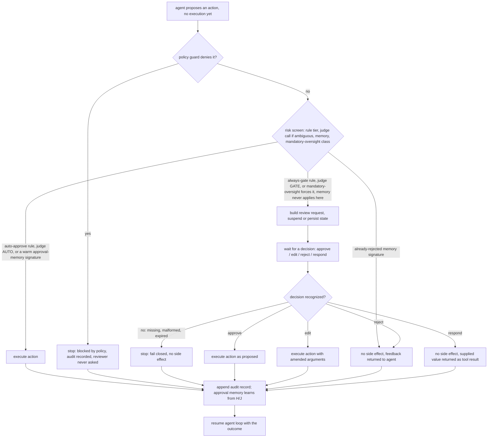

# Human-in-the-loop

Human-in-the-loop (HITL) is the pattern of pausing an autonomous agent at a defined point so a person can inspect a proposed action, then approve it, change it, reject it, or supply missing information before execution continues. The agent handles high-volume, low-risk work on its own; a human is inserted only at strategic decision points where stakes, uncertainty, irreversibility, or compliance demand judgment. The defining mechanic is a gate: the agent produces a proposed action but does not perform any side effect until a human decision is recorded.

## When to use it

Use an approval gate when an action is irreversible or expensive (sending money, deleting data, publishing content, signing a document), when it touches a regulated domain that mandates sign-off, when the model reports low confidence, or when a correction from the reviewer is worth capturing as an audit or training signal. It is also a reasonable default for a new agent: start with a human approving most actions, then widen automation as trust grows.

Avoid gating when the action is cheap, reversible, and high-frequency; a person cannot review thousands of low-value calls without fatigue and rubber-stamping. Do not gate reads or pure computation. A gate is not a substitute for real guardrails: validation, permission checks, and rate limits should still run whether or not a human is watching, and the risk-tier and flooding demos in this pattern show why a deterministic check underneath the human decision still matters.

## How this example works

Every variant builds a proposed action and hands it to a review point. What decides whether a human is asked at all differs per variant (a risk predicate, a model judge, a confidence score, a learned memory, always); what happens once a decision exists is the same small vocabulary everywhere: approve, edit, reject, respond.



Two mechanisms sit outside this single-action shape. `mandatory_oversight.py` adds a stop decision that halts the whole run in a recorded safe state rather than resolving one action, and a two-person quorum variant for its highest-risk class. `interrupt.py` is a separate control flow entirely: before each step of a running multi-step plan, it checks whether a human has raised a take-over (edit the remaining steps, inject a step, or abort), triggered by the reviewer's own timing rather than by classifying the action.

## Variants implemented

- `approval_gate.py`: the base approval gate, one refund task walked end to end through all four decisions (approve, edit, reject, respond) plus the fail-closed default when a decision is missing or unrecognized.
- `risk_tier.py`: risk-tiered gating (conditional interrupt) on a single scalar threshold, auto-approving a low-risk refund with no reviewer consulted and gating a high-risk one; a flooding demo shows one point of the inverted-U safety curve `capacity.py` sweeps in full.
- `risk_classifier.py`: model-judged risk tiering, a cheap rule tier for the obvious ends (always-gate, never-gate) with the ambiguous middle routed to an LLM judge; two of five demo actions cost a model call, the rest resolve by rule alone.
- `capacity.py`: load-aware guard calibration, sweeping the escalation threshold to trace Turan's inverted-U safety curve against a capacity-limited, fatiguing reviewer; the safety-optimal threshold sits strictly between escalate-nothing and escalate-everything, and escalating everything floods the reviewer and is itself unsafe.
- `approval_memory.py`: a learned allow-list that caches a human's verdict against a coarsened action signature, so a repeated already-blessed action auto-resolves without a new prompt, while a hard safety ceiling still forces a high-risk cousin action to a human regardless of memory.
- `resume.py`: durable interrupt-and-resume, suspending a gate to a JSON-serializable state, reconstructing it in a separate call, and resuming to the same result as an uninterrupted run; a timeout/expiry path fails closed on a decision that arrives past its deadline.
- `escalation.py`: escalation on confidence, synchronous and asynchronous; a low-confidence proposal escalates for review while a high-confidence one auto-approves, and a queued escalation does not block other tasks from completing.
- `plan_review.py`: plan review / co-planning, where a whole multi-step plan is approved, edited, or rejected once, before any step in it executes.
- `post_hoc.py`: post-hoc review with override, where an action executes immediately and a later sampled review can confirm it or roll it back.
- `batched.py`: batched / queued review, where several pending actions are cleared in one reviewer pass and decisions map back to the right action by identifier, not by submission order.
- `mandatory_oversight.py`: the EU AI Act Article 14 non-overridable gate, a class of actions that no risk score, judge verdict, or approval memory may auto-approve; a stop path halts a run in a recorded safe state, an override path records a reversed decision, and a two-person quorum enforces Article 14(5) for biometric identification.
- `interrupt.py`: human-initiated take-over during a running plan (real-time monitoring), where a reviewer can edit the remaining steps, inject a step, or abort mid-run, distinct from an agent-initiated gate at a single action.
- `interactive.py`: the one genuinely interactive decision source, using `input()`. Reachable only via `python -m patterns.human_in_the_loop.main --interactive`; never used by the default flow and never imported by the tests.

`gate.py` holds the shared engine (`ReviewRequest`, `Decision`, `AuditLog`, `ScriptedDecisionSource`, `run_gate`) every variant builds on. `fake_tools.py` holds the shared refund, cancellation, lookup, biometric-match, and reversal tools every demo executes against, so approve versus reject is observable through a plain Python list rather than a mock network call. `transcript.py` renders a readable transcript for `main.py`.

Not implemented: Spider-Sense's trained Intrinsic Risk Sensing probe on model internals (arXiv:2602.05386), since it needs weights or activations the offline harness does not have; `risk_classifier.py` implements the rest of its shape, the cheap-tier-then-model-judge screen, which is an ordinary scripted completion under `MockProvider`. Embedding or vector similarity for `approval_memory.py`'s signatures is likewise out of reach offline; the memory here matches on exact tool name plus coarsened arguments instead. Cross-session persistent memory belongs in `patterns/memory`; `approval_memory.py` is deliberately in-session only. EU AI Act Article 14's human-factors obligations (automation-bias training, interpretation tooling, interface design) are HCI and process concerns left as documentation; `mandatory_oversight.py` models the enforceable control-flow subset: a non-overridable gate, a stop-to-safe-state path, an override record, and the two-person quorum.

## Run it

```
python -m patterns.human_in_the_loop.main
```

Expected output (truncated):

```
HUMAN-IN-THE-LOOP PATTERN: approval gates for agent actions

=== 1. Approval gate: approve ===
task: Customer c-4471 was double-charged $42.50 for order #8823. ...
proposed: send_refund({'customer_id': 'c-4471', 'amount_usd': 42.5, ...})
[executed] refund of $42.50 sent to c-4471 (duplicate charge on order #8823)
...
=== 2b. Risk-tiered gating: escalation-fatigue failure mode ===
no policy backstop, rubber-stamping reviewer: malicious $50,000.00 refund sent = True
with a deterministic policy cap in front of the gate: same refund sent = False
...
=== 8. Model-judged risk classification ===
always_gate: [executed] subscription for c-01 canceled (customer requested cancellation)
...
model (judge) calls made for five actions: 2

=== 9. Load-aware capacity calibration (inverted-U safety curve) ===
escalate-nothing safety:    0.00 (threshold 10)
escalate-everything safety: 0.50 (threshold 2)
safety-optimal safety:      0.75 (threshold 7)
...
=== 11. Mandatory oversight (EU AI Act Article 14) ===
in-set action, permissive shortcut ignored: [executed] refund of $12000.00 sent to c-90 (chargeback dispute settled in the customer's favor)
oversight capability recorded: True
two-person biometric quorum: [executed] biometric match confirmed: cand-77 -> member-4471
...
All twelve sub-variants completed without exhausting their scripts.
```

Pass `--interactive` to try the one live decision path instead, which prompts a real person with `input()` for a single review request:

```
python -m patterns.human_in_the_loop.main --interactive
```

## Real providers

Set `AGENTIC_PATTERNS_PROVIDER=openai` (with `OPENAI_API_KEY` set) or `AGENTIC_PATTERNS_PROVIDER=anthropic` (with `ANTHROPIC_API_KEY` set) to run the proposal side of each demo against a real model. Every demo function builds its provider through `agentic_patterns.get_provider`, so no source change is needed. The human decisions themselves stay scripted regardless of provider, since `--interactive` is the dedicated path for a real reviewer.

## Sources

- Antonio Gulli, _Agentic Design Patterns: A Hands-On Guide to Building Intelligent Systems_ (Springer, 2025), Human-in-the-Loop chapter in the Reliability part: escalation triggers (confidence, action classification, anomaly, explicit signals), reviewer-friction reduction, and audit-plus-learning logging.
- Chip Huyen, _AI Engineering_ (O'Reilly, 2025): start with a human in the loop and increase automation as confidence grows; input and output guardrails as the layer that decides what escalates.
- LangChain / LangGraph human-in-the-loop documentation: the four decisions (approve, edit, reject, respond), the `interrupt()` and `Command(resume=...)` primitives, checkpointing as a requirement for durable interrupts, and the `interrupt_on` / `when` predicate for conditional risk-tiered gating. https://docs.langchain.com/oss/python/langchain/human-in-the-loop
- OpenAI Agents SDK human-in-the-loop documentation: `needs_approval`, `approve()` / `reject()` on pending interruptions, and resuming from a serialized `RunState`. https://openai.github.io/openai-agents-python/human_in_the_loop/
- Hussein Mozannar, Gagan Bansal, et al., "Magentic-UI: Towards Human-in-the-loop Agentic Systems," July 2025. arXiv:2507.22358 (six interaction mechanisms; action guards as a three-value irreversibility heuristic with an LLM judge for the ambiguous middle; co-tasking pause-and-take-over). HTML full text fetched.
- Emre Turan, "Oversight Has a Capacity: Calibrating Agent Guards to a Subjective, Fatiguing Human," 2026. arXiv:2606.08919 (Fleiss kappa 0.52 on 125 adversarially weighted actions; realized safety is an inverted-U in escalation rate; selective classification under asymmetric cost; load-aware escalation policy).
- Zhenxiong Yu et al., "Spider-Sense: Intrinsic Risk Sensing for Efficient Agent Defense with Hierarchical Adaptive Screening," February 2026. arXiv:2602.05386 (cheap similarity tier plus deep model-reasoning tier for ambiguous cases).
- Shipi Dhanorkar, Samir Passi, Mihaela Vorvoreanu, "Human oversight of agentic systems in practice," 2026. arXiv:2606.05391 (four emergent oversight forms: a priori control, co-planning, real-time monitoring, post hoc review; 17-developer interview study).
- Feedzai, "Cost-Sensitive Learning to Defer to Multiple Experts with Workload Constraints" (DeCCaF), TMLR 2024. arXiv:2403.06906 (deferral under per-expert capacity and asymmetric error cost; 8.4% average misclassification-cost reduction).
- Hussein Mozannar, David Sontag, "Consistent Estimators for Learning to Defer to an Expert," 2020. arXiv:2006.01862 (foundational learning-to-defer estimator; same first author as Magentic-UI).
- EU AI Act Article 14 (Human Oversight). https://artificialintelligenceact.eu/article/14/ . Enforceable for high-risk systems on 2 August 2026; fines up to 35M EUR or 6% of global turnover. Article 14(4): overseer enabled to understand limits, resist automation bias, interpret output, disregard/override/reverse output, and interrupt via a stop to a safe state. Article 14(5): two-person verification for biometric identification.

Verified in search but cited only as background, not load-bearing: Aarya Doshi et al., "Towards Verifiably Safe Tool Use for LLM Agents," 2026, arXiv:2601.08012 (STPA plus formal specs over a capability-labeled MCP framework; guardrails/MCP territory, not built here); "A Benchmark for Scalable Oversight Protocols" (arXiv:2504.03731); practitioner posts on approval fatigue and habituation (getclaw.sh, 2026).
