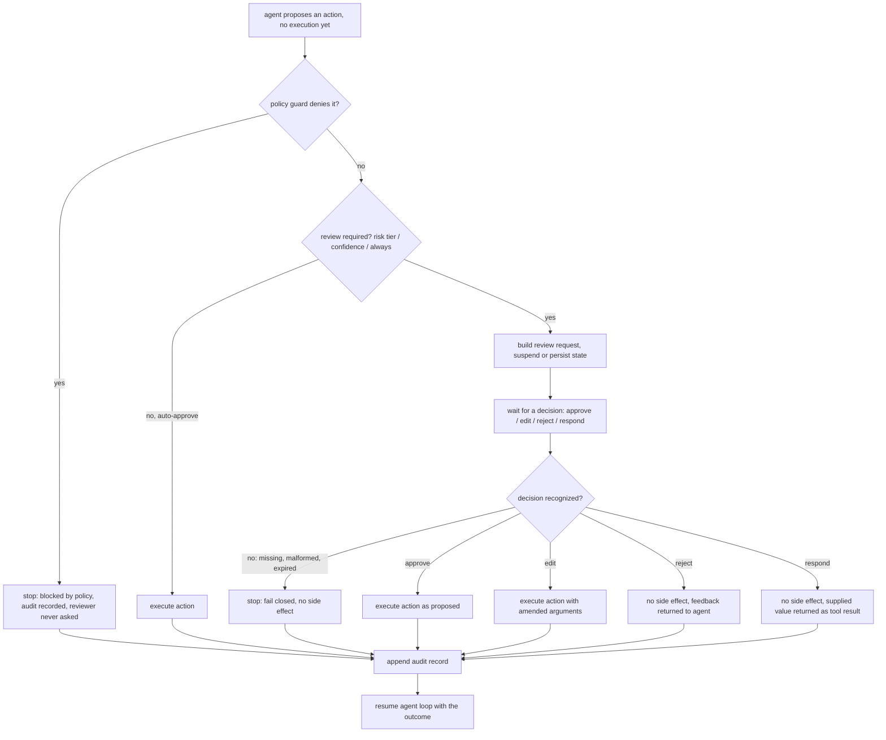

# Human-in-the-loop

Human-in-the-loop (HITL) is the pattern of pausing an autonomous agent at a defined point so a person can inspect a proposed action, then approve it, change it, reject it, or supply missing information before execution continues. The agent handles high-volume, low-risk work on its own; a human is inserted only at strategic decision points where stakes, uncertainty, irreversibility, or compliance demand judgment. The defining mechanic is a gate: the agent produces a proposed action but does not perform any side effect until a human decision is recorded.

## When to use it

Use an approval gate when an action is irreversible or expensive (sending money, deleting data, publishing content, signing a document), when it touches a regulated domain that mandates sign-off, when the model reports low confidence, or when a correction from the reviewer is worth capturing as an audit or training signal. It is also a reasonable default for a new agent: start with a human approving most actions, then widen automation as trust grows.

Avoid gating when the action is cheap, reversible, and high-frequency; a person cannot review thousands of low-value calls without fatigue and rubber-stamping. Do not gate reads or pure computation. A gate is not a substitute for real guardrails: validation, permission checks, and rate limits should still run whether or not a human is watching, and the risk-tier and flooding demos in this pattern show why a deterministic check underneath the human decision still matters.

## How this example works

Every variant builds a proposed action and hands it to a review point. What decides whether a human is asked at all differs per variant (a risk predicate, a confidence score, always); what happens once a decision exists is the same small vocabulary everywhere: approve, edit, reject, respond.



## Variants implemented

- `approval_gate.py`: the base approval gate, one refund task walked end to end through all four decisions (approve, edit, reject, respond) plus the fail-closed default when a decision is missing or unrecognized.
- `risk_tier.py`: risk-tiered gating (conditional interrupt), auto-approving a low-risk refund with no reviewer ever consulted and gating a high-risk one; a second demo shows that gating everything without a deterministic policy backstop still lets a fatigued, rubber-stamping reviewer approve a malicious action.
- `resume.py`: durable interrupt-and-resume, suspending a gate to a JSON-serializable state, reconstructing it in a separate call, and resuming to the same result as an uninterrupted run; a timeout/expiry path fails closed on a decision that arrives past its deadline.
- `escalation.py`: escalation on confidence, synchronous and asynchronous; a low-confidence proposal escalates for review while a high-confidence one auto-approves, and a queued escalation does not block other tasks from completing.
- `plan_review.py`: plan review / co-planning, where a whole multi-step plan is approved, edited, or rejected once, before any step in it executes.
- `post_hoc.py`: post-hoc review with override, where an action executes immediately and a later sampled review can confirm it or roll it back.
- `batched.py`: batched / queued review, where several pending actions are cleared in one reviewer pass and decisions map back to the right action by identifier, not by submission order.
- `interactive.py`: the one genuinely interactive decision source, using `input()`. Reachable only via `python -m patterns.human_in_the_loop.main --interactive`; never used by the default flow and never imported by the tests.

`gate.py` holds the shared engine (`ReviewRequest`, `Decision`, `AuditLog`, `ScriptedDecisionSource`, `run_gate`) every variant builds on. `fake_tools.py` holds the shared refund, cancellation, and reversal tools every demo executes against, so approve versus reject is observable through a plain Python list rather than a mock network call. `transcript.py` renders a readable transcript for `main.py`.

Not implemented: a learned "latent vigilance" escalation trigger (Spider-Sense, arXiv:2602.05386), since it requires a trained detector rather than a rule; `escalation.py`'s confidence threshold demonstrates the same two-tier gate shape with a static rule instead. Regulatory obligations under EU AI Act Article 14 are discussed in the research brief as context for why oversight matters but are not modeled as code, since they are a compliance requirement rather than a control-flow variant.

## Run it

```
python -m patterns.human_in_the_loop.main
```

Expected output (truncated):

```
HUMAN-IN-THE-LOOP PATTERN: approval gates for agent actions

=== 1. Approval gate: approve ===
task: Customer c-4471 was double-charged $42.50 for order #8823. ...
proposed: send_refund({'customer_id': 'c-4471', 'amount_usd': 42.5, ...})
[executed] refund of $42.50 sent to c-4471 (duplicate charge on order #8823)
...
=== 2b. Risk-tiered gating: escalation-fatigue failure mode ===
no policy backstop, rubber-stamping reviewer: malicious $50,000.00 refund sent = True
with a deterministic policy cap in front of the gate: same refund sent = False
...
All seven sub-variants completed without exhausting their scripts.
```

Pass `--interactive` to try the one live decision path instead, which prompts a real person with `input()` for a single review request:

```
python -m patterns.human_in_the_loop.main --interactive
```

## Real providers

Set `AGENTIC_PATTERNS_PROVIDER=openai` (with `OPENAI_API_KEY` set) or `AGENTIC_PATTERNS_PROVIDER=anthropic` (with `ANTHROPIC_API_KEY` set) to run the proposal side of each demo against a real model. Every demo function builds its provider through `agentic_patterns.get_provider`, so no source change is needed. The human decisions themselves stay scripted regardless of provider, since `--interactive` is the dedicated path for a real reviewer.

## Sources

- Antonio Gulli, _Agentic Design Patterns: A Hands-On Guide to Building Intelligent Systems_ (Springer, 2025), Human-in-the-Loop chapter in the Reliability part: escalation triggers (confidence, action classification, anomaly, explicit signals), reviewer-friction reduction, and audit-plus-learning logging.
- Chip Huyen, _AI Engineering_ (O'Reilly, 2025): start with a human in the loop and increase automation as confidence grows; input and output guardrails as the layer that decides what escalates.
- LangChain / LangGraph human-in-the-loop documentation: the four decisions (approve, edit, reject, respond), the `interrupt()` and `Command(resume=...)` primitives, checkpointing as a requirement for durable interrupts, and the `interrupt_on` / `when` predicate for conditional risk-tiered gating. https://docs.langchain.com/oss/python/langchain/human-in-the-loop
- "Magentic-UI: Towards Human-in-the-loop Agentic Systems," arXiv:2507.22358: co-planning, co-tasking, action guards/approval, plan editing, interruption, and escalation as distinct interaction modes. https://arxiv.org/pdf/2507.22358
- Turan, "Oversight Has a Capacity" (arXiv:2606.08919): reviewer agreement on what is risky is only moderate, safety follows an inverted-U against escalation rate, and a fatigued reviewer is exploitable by flooding attacks; over-escalation is an attack surface, not just a UX cost.
- OpenAI Agents SDK human-in-the-loop documentation: `needs_approval`, `approve()` / `reject()` on pending interruptions, and resuming from a serialized `RunState`. https://openai.github.io/openai-agents-python/human_in_the_loop/
