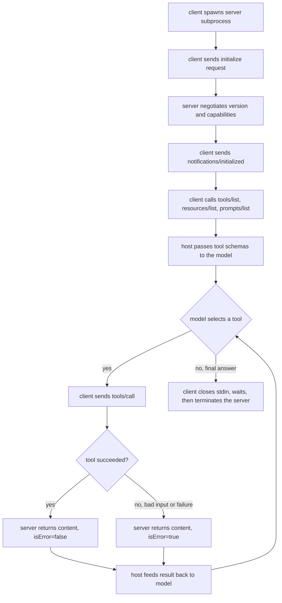
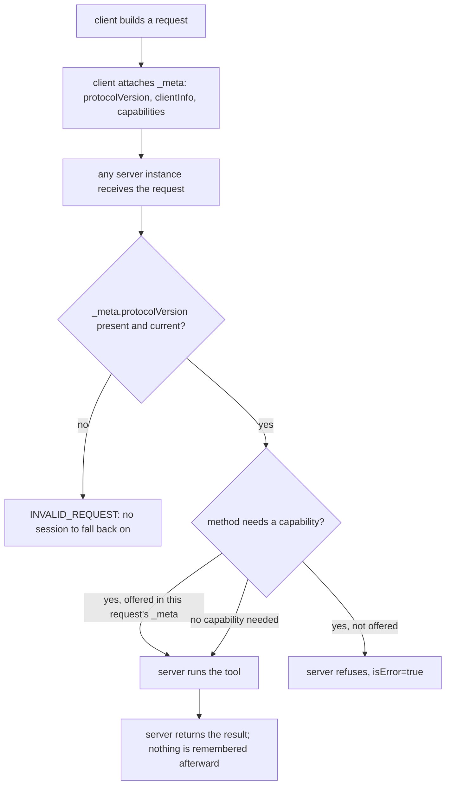

# MCP (Model Context Protocol)

The Model Context Protocol is an open standard for connecting AI applications to external tools, data, and reusable prompts through one wire format: JSON-RPC 2.0. It defines three roles: a host is the AI application the user interacts with, a client lives inside the host and holds one connection to one server, and a server exposes tools, resources, and prompts to whichever client connects. A connection starts with an `initialize` handshake that negotiates protocol version and capabilities, then moves into an operation phase where the client discovers and invokes what the server offers. MCP turns the N-times-M integration problem, every host wiring up every tool by hand, into N plus M: any MCP host can talk to any MCP server.

## When to use it

Reach for MCP when a tool or data integration needs to be reusable across different hosts, or when a tool should run as a separate process with its own dependencies, secrets, or trust boundary. It fits an agent that draws on several independent capability providers and needs to discover what each one offers at runtime rather than hard-coding a tool list. Skip it when a plain in-process function call will do: a script calling one Python function gains nothing from JSON-RPC framing and subprocess management. It is also a poor fit for high-throughput streaming data planes, where the request-response envelope adds overhead, and for a tool surface that never changes and lives in the same codebase as the agent.

## How this example works

Every demo in this pattern spawns the real server in `server.py` as a child process (or, for the HTTP variant, in a background thread) and talks to it over the transport being demonstrated. Nothing here is simulated: the subprocess is real, the JSON-RPC framing is real, only the network and the model are absent.



`stateless.py` replaces this whole flow with something flatter: there is no handshake to unlock an operation phase, because there is no operation phase distinct from a connection. Every request carries what it needs and is answered on its own, so any server instance can answer any request.



## Variants implemented

- `jsonrpc.py`: the JSON-RPC 2.0 codec (build request, notification, response, error; decode and reject malformed lines), independent of any transport.
- `transport.py`: the stdio transport, both sides; the server reads stdin and writes stdout with logging kept on stderr, and the client spawns the subprocess and does clean shutdown (close stdin, wait, escalate to SIGTERM then SIGKILL).
- `server.py` + `server_data.py`: the standalone MCP server (`python -m patterns.mcp.server`), with three deterministic tools (`add`, `divide`, `summarize_note`), one text and one binary resource, and one prompt template. `handle_message` is transport-agnostic so `http_transport.py` reuses it verbatim.
- `client.py`: `MCPClient`, the host-side connection: the full `initialize`/`initialized` handshake, capability gating on every later call, `tools/call` with a nested `sampling/createMessage` request handled mid-flight, and per-request timeouts.
- `bridge.py`: exposes a live server's tools through the core `ToolRegistry`, so a `MockProvider`-driven host loop calls a real MCP server exactly like any other tool.
- `multi_server.py`: a host that connects to two servers at once, merges their tool lists into one namespace, resolves name collisions by prefixing with the server's alias, and routes each call to the right connection.
- `sampling.py`: the reverse-direction round trip, where the server asks the client to run a model call instead of holding its own API key, gated on the client having offered the `sampling` capability.
- `http_transport.py`: the same JSON-RPC semantics carried over loopback HTTP instead of stdio pipes, plus the PR #1439 HTTP 403 rejection of an untrusted `Origin` header.
- `stateless.py`: the 2026-07-28 release candidate's stateless core, no `initialize` handshake, protocol version and capabilities riding in `_meta` on every request, two independent server instances answering the same client correctly.
- `integrity.py`: a client-side pin ledger that hashes each tool definition on first sight, screens descriptions for hidden-instruction and zero-width-character poisoning markers, and fails closed the moment a later `tools/list` changes a pinned tool's definition, the rug-pull (TOCTOU) defense.
- `tasks.py`: the durable async task lifecycle, a task-augmented `tools/call` returns a `working` receipt instead of a result, `tasks/get` polls it forward on a deterministic counter, `tasks/result` retrieves the terminal outcome, and `tasks/cancel` / the `taskSupport: "required"` gate are enforced.
- `elicitation.py`: server-initiated structured input, a `requestedSchema` the server sends so the client can render a constrained form, a three-way `accept`/`decline`/`cancel` response, and a URL-mode variant that hands the user to an external page and resumes.
- `discovery.py`: a static, `server.json`-shaped registry document, filtered by capability or name, with the selected record's real subprocess connected and its tools listed to prove the discovered record actually works.

Skipped, with reasons:

- **Full Streamable HTTP transport** (sessions via `Mcp-Session-Id`, resumable streams, Server-Sent Events). `http_transport.py` shows the framing difference the brief asks for, one JSON-RPC message per POST, plus the one small piece worth folding in without the rest of the transport, the PR #1439 origin check; it is still not the complete spec transport.
- **Roots** (`roots/list`). A client capability for declaring filesystem boundaries; no tool in this server needs filesystem access, so there is nothing for it to gate.
- **OAuth and the authorization stack** (Client ID Metadata Documents, incremental scope consent, OpenID Connect discovery). Offline this is mostly network ceremony with little deterministic protocol logic to test; the interesting security angle, the confused-deputy problem where a server forwards a user's token to a third party, needs a real OAuth flow to demonstrate rather than a scripted mock.
- **MCP Apps** (server-shipped HTML in a sandboxed iframe). UI rendering, not offline-testable protocol logic.
- **Sampling tool calling** (`tools` and `toolChoice` on `sampling/createMessage`). A field addition to the round trip `sampling.py` already has, not a new mechanic; noted in that module's docstring instead of built as its own module.
- **Real SDKs and vendor framework integration**. Out of scope for a from-scratch, stdlib-only teaching implementation.

## Run it

```
python -m patterns.mcp.main
```

Expected output (truncated):

```
MCP PATTERN: a client and server built from scratch over JSON-RPC 2.0

=== 1. JSON-RPC codec: round-trip and rejection ===
encoded:  {"jsonrpc":"2.0","id":"demo-1","method":"tools/call", ...}
decoded matches original: True
malformed frame rejected: line is not valid JSON: ...

=== 2. Baseline stdio walkthrough ===
negotiated protocol version: 2025-11-25
tools/call add(12, 30): '42' isError=False
tools/call divide(10, 0): 'cannot divide by zero' isError=True
tools/call multiply (unknown tool) raised JSON-RPC error: code=-32601
...
=== 7. Stateless core (2026-07-28 RC): no handshake, _meta per request ===
add(12, 30) served by instance-a: '42'
add(100, 1) served by instance-b: '101'
...
=== 8. Tool-definition integrity: pinning and the rug-pull defense ===
rug pull across two lists: mutated=['wire_transfer (description)'], call after mutation: isError=True
...
All eleven sections completed without exhausting a script or leaking a subprocess.
```

## Real providers

Set `AGENTIC_PATTERNS_PROVIDER=openai` (with `OPENAI_API_KEY` set) or `AGENTIC_PATTERNS_PROVIDER=anthropic` (with `ANTHROPIC_API_KEY` set) to run the host loop, multi-server, and sampling demos against a real model instead of the mock. No source change is needed; `bridge.py`, `multi_server.py`, and `sampling.py` all build their provider through `agentic_patterns.get_provider`. The server itself never calls a model API; its one model-shaped tool, `summarize_note`, always asks the connected client to run the sampling request, so it works unchanged either way. `stateless.py`, `integrity.py`, `tasks.py`, `elicitation.py`, and `discovery.py` route no traffic through a model at all: they demonstrate protocol mechanics and, in elicitation's case, a request routed to a human, not a model call a provider swap would change.

## Protocol revision and honesty notes

This subset targets protocol revision **2025-11-25**, sent as `protocolVersion` in every `initialize` call and response. Two clarifications from that revision are implemented deliberately: invalid tool arguments come back as `isError: true` rather than a JSON-RPC error (SEP-1303), and a missing resource URI comes back as JSON-RPC error `-32002`, which is the code this revision uses (a later release candidate, 2026-07-28, changes it to `-32602`, so a reader implementing against that revision instead should update the constant and the corresponding test).

Revision 2026-07-28 also removes the `initialize`/`initialized` handshake and `Mcp-Session-Id` entirely in favor of a stateless model; `server.py` and `client.py` still follow the handshake-based 2025-06-18 and 2025-11-25 design, not the 2026-07-28 release candidate. What the RC removes is only half the story: it also replaces the connection-time exchange with per-request `_meta`, so protocol version, client info, and client capabilities that used to be negotiated once now ride on every single request instead. `stateless.py` implements that replacement, not just the removal, and is the module to read for the 2026-07-28 shape.

Deliberately out of scope everywhere in this pattern: official MCP SDKs, the full Streamable HTTP transport, request pipelining and concurrent in-flight calls, `notifications/cancelled` delivery, and roots. Tool descriptions in `server.py` and `server_data.py` are still trusted on sight, since they come from a server this pattern also wrote; `integrity.py` is the module that treats a tool definition as untrusted input and shows what checking it looks like, but that check is not wired into `client.py`'s own dispatch, so a reader who wants it on every call must apply `ToolIntegrityGuard` explicitly.

## Sources

- Model Context Protocol Specification, revision 2025-06-18: Lifecycle, Transports, Tools, Resources. https://modelcontextprotocol.io/specification/2025-06-18/basic/lifecycle
- Model Context Protocol changelog, revision 2025-11-25 (SEP-1686 tasks, SEP-1036 URL-mode elicitation, SEP-1577 sampling tool calling, SEP-1330 ElicitResult enums, SEP-1613 JSON Schema 2020-12, SEP-1303 input-validation clarification, PR #1439 HTTP 403 on invalid Origin, PR #670 stderr logging). https://modelcontextprotocol.io/specification/2025-11-25/changelog
- MCP Tasks utility, revision 2025-11-25 (SEP-1686, experimental): the `working`/`input_required`/`completed`/`failed`/`cancelled` state machine and the `tasks/get`, `tasks/result`, `tasks/list`, `tasks/cancel` methods `tasks.py` implements. https://modelcontextprotocol.io/specification/2025-11-25/basic/utilities/tasks
- MCP 2026-07-28 release candidate: SEP-2575 (remove `initialize`/`initialized`), SEP-2567 (remove `Mcp-Session-Id`), `_meta`-per-request client info and capabilities, SEP-2663 (tasks reshaped as a stateless extension). Locked May 21, 2026; final targeted July 28, 2026, still an RC as of this writing. https://blog.modelcontextprotocol.io/posts/2026-07-28-release-candidate/
- Zhiqiang Wang, Yichao Gao, Yanting Wang, Suyuan Liu, Haifeng Sun, Haoran Cheng, Guanquan Shi, Haohua Du, Xiangyang Li, "MCPTox: A Benchmark for Tool Poisoning Attack on Real-World MCP Servers," August 2025. arXiv:2508.14925 (45 servers, 353 tools, 1,312 cases, 20 agents; o1-mini 72.8% attack success; Claude-3.7-Sonnet under 3%; the finding `integrity.py`'s docstring cites that more capable models were often more susceptible, not less). https://arxiv.org/abs/2508.14925
- CVE-2025-54136 ("MCPoison"): remote code execution in Anysphere Cursor via a previously approved MCP configuration file swapped without re-approval, the concrete rug-pull / TOCTOU case `integrity.py` defends against. NVD: https://nvd.nist.gov/vuln/detail/CVE-2025-54136
- OWASP MCP Top 10, MCP03:2025 Tool Poisoning: malicious instructions embedded in a tool description at registration time, processed by the agent as ground truth. https://owasp.org/www-project-mcp-top-10/2025/MCP03-2025%E2%80%93Tool-Poisoning
- Official MCP Registry (`registry.modelcontextprotocol.io`): REST API and `server.json` format for programmatic server discovery, preview, the shape `discovery.py`'s static registry document stands in for. The client-facing `.well-known/mcp.json` server-card mechanism (SEP-2127 / SEP-1649) is proposed but unshipped and is treated as such in that module. https://registry.modelcontextprotocol.io/
- Antonio Gulli, _Agentic Design Patterns: A Hands-On Guide to Building Intelligent Systems_ (Springer, 2025), Chapter 10, "Model Context Protocol (MCP)".
- Anthropic, "Introducing the Model Context Protocol" (2024). https://www.anthropic.com/news/model-context-protocol
- Anjana Sarkar and Soumyendu Sarkar, "Survey of LLM Agent Communication with MCP: A Software Design Pattern Centric Review," June 2025. arXiv:2506.05364 (primitive and role taxonomy; the base research brief's "Kumar et al." attribution for this paper is stale, the authors are Sarkar and Sarkar). https://arxiv.org/abs/2506.05364
