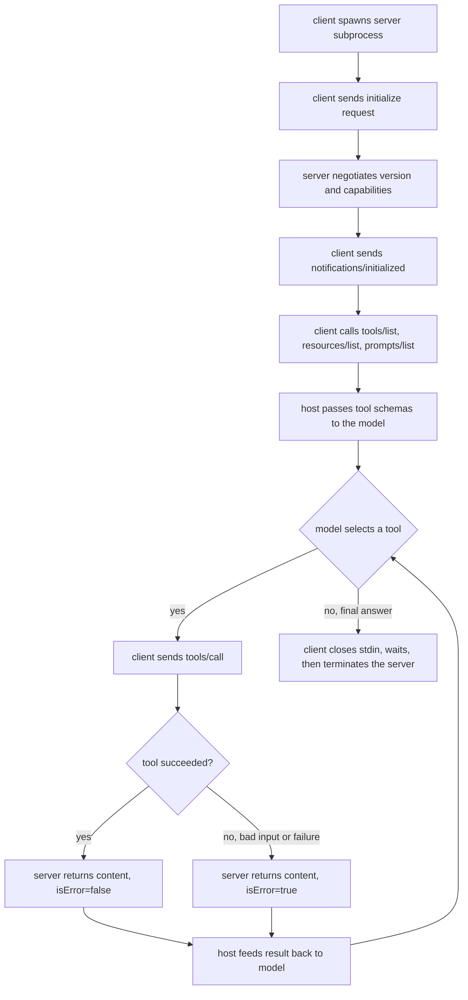

# MCP (Model Context Protocol)

The Model Context Protocol is an open standard for connecting AI applications to external tools, data, and reusable prompts through one wire format: JSON-RPC 2.0. It defines three roles: a host is the AI application the user interacts with, a client lives inside the host and holds one connection to one server, and a server exposes tools, resources, and prompts to whichever client connects. A connection starts with an `initialize` handshake that negotiates protocol version and capabilities, then moves into an operation phase where the client discovers and invokes what the server offers. MCP turns the N-times-M integration problem, every host wiring up every tool by hand, into N plus M: any MCP host can talk to any MCP server.

## When to use it

Reach for MCP when a tool or data integration needs to be reusable across different hosts, or when a tool should run as a separate process with its own dependencies, secrets, or trust boundary. It fits an agent that draws on several independent capability providers and needs to discover what each one offers at runtime rather than hard-coding a tool list. Skip it when a plain in-process function call will do: a script calling one Python function gains nothing from JSON-RPC framing and subprocess management. It is also a poor fit for high-throughput streaming data planes, where the request-response envelope adds overhead, and for a tool surface that never changes and lives in the same codebase as the agent.

## How this example works

Every demo in this pattern spawns the real server in `server.py` as a child process (or, for the HTTP variant, in a background thread) and talks to it over the transport being demonstrated. Nothing here is simulated: the subprocess is real, the JSON-RPC framing is real, only the network and the model are absent.



## Variants implemented

- `jsonrpc.py`: the JSON-RPC 2.0 codec (build request, notification, response, error; decode and reject malformed lines), independent of any transport.
- `transport.py`: the stdio transport, both sides; the server reads stdin and writes stdout with logging kept on stderr, and the client spawns the subprocess and does clean shutdown (close stdin, wait, escalate to SIGTERM then SIGKILL).
- `server.py` + `server_data.py`: the standalone MCP server (`python -m patterns.mcp.server`), with three deterministic tools (`add`, `divide`, `summarize_note`), one text and one binary resource, and one prompt template. `handle_message` is transport-agnostic so `http_transport.py` reuses it verbatim.
- `client.py`: `MCPClient`, the host-side connection: the full `initialize`/`initialized` handshake, capability gating on every later call, `tools/call` with a nested `sampling/createMessage` request handled mid-flight, and per-request timeouts.
- `bridge.py`: exposes a live server's tools through the core `ToolRegistry`, so a `MockProvider`-driven host loop calls a real MCP server exactly like any other tool.
- `multi_server.py`: a host that connects to two servers at once, merges their tool lists into one namespace, resolves name collisions by prefixing with the server's alias, and routes each call to the right connection.
- `sampling.py`: the reverse-direction round trip, where the server asks the client to run a model call instead of holding its own API key, gated on the client having offered the `sampling` capability.
- `http_transport.py`: the same JSON-RPC semantics carried over loopback HTTP instead of stdio pipes, to show that only the framing changes.

Skipped, with reasons:

- **Full Streamable HTTP transport** (sessions via `Mcp-Session-Id`, resumable streams, Server-Sent Events, origin validation). `http_transport.py` shows the framing difference the brief asks for, one JSON-RPC message per POST, but is not the complete spec transport.
- **Roots** (`roots/list`). A client capability for declaring filesystem boundaries; no tool in this server needs filesystem access, so there is nothing for it to gate.
- **Elicitation**. Mid-session structured input requests from server to user. Would need the same nested-request machinery as sampling for no new mechanic; `sampling.py` already demonstrates the server-initiates-a-request-mid-call pattern.
- **Async tasks** (`tasks/get`, `tasks/update`, `tasks/cancel`) and **URL-mode elicitation**. Both are 2025-11-25 and 2026-07-28 additions layered on top of the handshake this pattern targets; adding them would roughly double the module count for one more taxonomy branch.
- **Real SDKs and vendor framework integration**. Out of scope for a from-scratch, stdlib-only teaching implementation.

## Run it

```
python -m patterns.mcp.main
```

Expected output (truncated):

```
MCP PATTERN: a client and server built from scratch over JSON-RPC 2.0

=== 1. JSON-RPC codec: round-trip and rejection ===
encoded:  {"jsonrpc":"2.0","id":"demo-1","method":"tools/call", ...}
decoded matches original: True
malformed frame rejected: line is not valid JSON: ...

=== 2. Baseline stdio walkthrough ===
negotiated protocol version: 2025-11-25
tools/call add(12, 30): '42' isError=False
tools/call divide(10, 0): 'cannot divide by zero' isError=True
tools/call multiply (unknown tool) raised JSON-RPC error: code=-32601
...
All six sections completed without exhausting a script or leaking a subprocess.
```

## Real providers

Set `AGENTIC_PATTERNS_PROVIDER=openai` (with `OPENAI_API_KEY` set) or `AGENTIC_PATTERNS_PROVIDER=anthropic` (with `ANTHROPIC_API_KEY` set) to run the host loop, multi-server, and sampling demos against a real model instead of the mock. No source change is needed; `bridge.py`, `multi_server.py`, and `sampling.py` all build their provider through `agentic_patterns.get_provider`. The server itself never calls a model API; its one model-shaped tool, `summarize_note`, always asks the connected client to run the sampling request, so it works unchanged either way.

## Protocol revision and honesty notes

This subset targets protocol revision **2025-11-25**, sent as `protocolVersion` in every `initialize` call and response. Two clarifications from that revision are implemented deliberately: invalid tool arguments come back as `isError: true` rather than a JSON-RPC error (SEP-1303), and a missing resource URI comes back as JSON-RPC error `-32002`, which is the code this revision uses (a later release candidate, 2026-07-28, changes it to `-32602`, so a reader implementing against that revision instead should update the constant and the corresponding test). Revision 2026-07-28 also removes the `initialize`/`initialized` handshake and `Mcp-Session-Id` entirely in favor of a stateless model; this implementation follows the handshake-based 2025-06-18 and 2025-11-25 design, not the 2026-07-28 release candidate.

Deliberately out of scope everywhere in this pattern: official MCP SDKs, the full Streamable HTTP transport, request pipelining and concurrent in-flight calls, `notifications/cancelled` delivery, roots, elicitation, and tool-description trust screening (tool descriptions here are trusted, since they come from a server this pattern also wrote; a real host should treat server-supplied text as untrusted input).

## Sources

- Model Context Protocol Specification, revision 2025-06-18: Lifecycle, Transports, Tools, Resources. https://modelcontextprotocol.io/specification/2025-06-18/basic/lifecycle
- Model Context Protocol changelog, revision 2025-11-25 (tasks, URL-mode elicitation, sampling tool calling, SEP-1303 input-validation clarification). https://modelcontextprotocol.io/specification/2025-11-25/changelog
- MCP 2026-07-28 release candidate notes (stateless core, handshake removal). https://blog.modelcontextprotocol.io/posts/2026-07-28-release-candidate/
- Antonio Gulli, _Agentic Design Patterns: A Hands-On Guide to Building Intelligent Systems_ (Springer, 2025), Chapter 10, "Model Context Protocol (MCP)".
- Anthropic, "Introducing the Model Context Protocol" (2024). https://www.anthropic.com/news/model-context-protocol
- Sarkar and Sarkar, "Survey of LLM Agent Communication with MCP: A Software Design Pattern Centric Review", arXiv:2506.05364.
