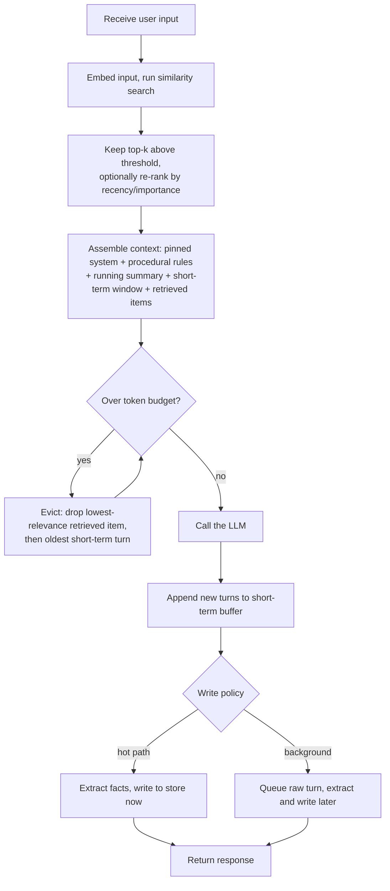

# Memory

Memory is the set of mechanisms that let an agent carry information across turns and sessions, beyond a single prompt, along two horizons. Short-term memory is the working context the model can currently see: system prompt, running conversation, and tool outputs, bounded by the token window and gone once the session ends. Long-term memory is an external store, usually a vector database, holding facts, past events, and learned procedures; items are written to it selectively and retrieved back into the window by similarity search when relevant. The pattern is the plumbing deciding what to keep, evict, persist, and pull back in.

## When to use it

Reach for memory when a task spans many turns and the raw history no longer fits the token budget, when the agent must personalize across separate sessions, or when it should learn from past runs instead of repeating the same mistake. Do not add a vector store prematurely: if the whole history fits in context, a plain buffer is correct and a database only adds moving parts, though stable rules still belong pinned to the system prompt even when they fit, since constraints placed mid-history suffer positional decay. For exact, authoritative recall (order totals, legal text) prefer a structured query over an approximate similarity store, and weigh privacy and retention obligations before persisting user data.

## How this example works

Every module builds a small, composable piece (a buffer, a store, a memory type, a write policy) that `main.py` wires together into twelve runnable demos. The canonical control flow below is what the headline demo (`write_policy.run_two_session_demo`) walks through: a fact told to the agent in session one is recalled in session two from an empty short-term window, purely through long-term retrieval.



## Variants implemented

- `vector_store.py`: the shared retrieval machinery, namespaced in-memory records of (text, embedding, metadata), cosine top-k search, upsert-by-id.
- `short_term.py`: full buffer, sliding window, and summarization/compaction behind one `ShortTermMemory` interface, plus token-budget eviction and context editing (dropping stale tool results outright, distinct from summarization).
- `retrieval.py`: retrieval scoring strategies beyond plain top-k, recency decay, importance weighting, hybrid keyword-plus-vector search, and MMR-style diversity re-ranking.
- `semantic.py`: semantic memory as a profile schema, one fact record per subject key, conflicts resolved by overwrite rather than accumulation.
- `episodic.py`: episodic memory, Reflexion-style verbal lessons recorded after a task and recalled before a similar later attempt.
- `procedural.py`: procedural memory, standing rules rendered into the system prompt, with no vector store involved since every rule always applies.
- `write_policy.py`: hot-path vs background writing, fact extraction, and sleep-time consolidation that resolves a contradiction offline; also holds the two-session round-trip demo.
- `assembler.py`: the context assembler, merging every source under a token budget with durable constraints pinned to the system prompt regardless of eviction.
- `memgpt.py`: MemGPT-style paged memory, main vs external context, recursive summarization on overflow, and model-driven paging through function calls.
- `memory_tools.py`: memory-as-tools, store/retrieve/update/delete exposed as callable tools so the model decides retrieval timing inside its own loop.
- `file_memory.py`: a file-directory memory backend, a peer of the vector store with no embedding index, mirroring Anthropic's memory tool and Letta's filesystem memory.

Not implemented: a real context-editing benchmark against a live 100-turn transcript (the 84% token reduction Anthropic reports needs a real long-running agent loop to measure; `drop_stale_tool_results` implements the primitive itself and is unit tested). Server-side provider compaction APIs are not wrapped, since they are provider-specific endpoints rather than pattern logic this repo's `Provider` seam can abstract over without a live account.

## Run it

```
python -m patterns.memory.main
```

Expected output (truncated):

```
MEMORY PATTERN: short-term buffers + long-term vector retrieval

=== 1. Vector store fundamentals ===
  rec-coffee: similarity=0.447  The user drinks dark roast coffee every morning.
  ...
=== 8. End-to-end round trip across two sessions ===
  session 1 wrote: ['deployment_region=us-west-2', 'iac_tool=Terraform']
  session 2 window size at query time: 1 (fresh, nothing carried over)
  session 2 retrieved: iac_tool: Terraform; deployment_region: us-west-2
  session 2 answer: Your deployment is in us-west-2, provisioned with Terraform.
...
All twelve sections completed without exhausting their scripts.
```

## Real providers

Set `AGENTIC_PATTERNS_PROVIDER=openai` (with `OPENAI_API_KEY` set) or `AGENTIC_PATTERNS_PROVIDER=anthropic` (with `ANTHROPIC_API_KEY` set) to run the same demos against a real model. Set `AGENTIC_PATTERNS_EMBEDDER=openai` (with `OPENAI_API_KEY` set) to swap the deterministic hash embedder for real embeddings. No source change is needed: every demo function builds its provider and embedder through `agentic_patterns.get_provider` / `agentic_patterns.get_embedder`.

## Sources

- Charles Packer et al., "MemGPT: Towards LLMs as Operating Systems" (arXiv:2310.08560, 2023): main vs external context, paging via function calls, recursive summarization.
- Joon Sung Park et al., "Generative Agents: Interactive Simulacra of Human Behavior" (arXiv:2304.03442, 2023): memory stream scored by recency + importance + relevance.
- Noah Shinn et al., "Reflexion: Language Agents with Verbal Reinforcement Learning" (arXiv:2303.11366, 2023): episodic memory of verbal self-reflections.
- Antonio Gulli, _Agentic Design Patterns: A Hands-On Guide to Building Intelligent Systems_ (2025), Chapter 8, Memory Management.
- Anthropic, "Context management" (29 Sep 2025), anthropic.com/news/context-management: the memory tool and context editing.
- Letta, "MemGPT and Letta" and "Benchmarking AI agent memory," letta.com/blog: MemGPT-to-Letta naming, filesystem memory on LoCoMo, sleep-time compute (arXiv:2504.13171).
- LangChain, "LangMem SDK" launch post, langchain.com/blog: the semantic/episodic/procedural split and hot-path vs background writes.
