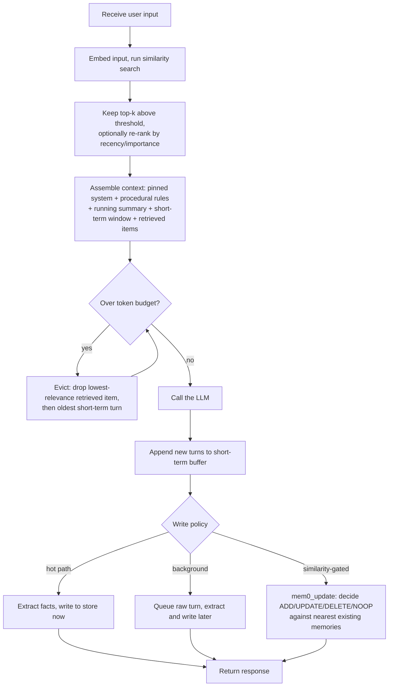

# Memory

Memory is the set of mechanisms that let an agent carry information across turns and sessions, beyond a single prompt, along two horizons. Short-term memory is the working context the model can currently see: system prompt, running conversation, and tool outputs, bounded by the token window and gone once the session ends. Long-term memory is an external store, usually a vector database, holding facts, past events, and learned procedures; items are written to it selectively and retrieved back into the window by similarity search when relevant. The pattern is the plumbing deciding what to keep, evict, persist, and pull back in.

## When to use it

Reach for memory when a task spans many turns and the raw history no longer fits the token budget, when the agent must personalize across separate sessions, or when it should learn from past runs instead of repeating the same mistake. Do not add a vector store prematurely: if the whole history fits in context, a plain buffer is correct and a database only adds moving parts, though stable rules still belong pinned to the system prompt even when they fit, since constraints placed mid-history suffer positional decay. For exact, authoritative recall (order totals, legal text) prefer a structured query over an approximate similarity store, and weigh privacy and retention obligations before persisting user data.

## How this example works

Every module builds a small, composable piece (a buffer, a store, a memory type, a write policy) that `main.py` wires together into sixteen runnable demos. The canonical control flow below is what the headline demo (`write_policy.run_two_session_demo`) walks through: a fact told to the agent in session one is recalled in session two from an empty short-term window, purely through long-term retrieval.



Two mechanisms run out of band, not on this per-turn path, so they are deliberately not boxes above: `forgetting.py`'s decay/TTL/capacity sweeps run periodically over a namespace, not once per turn, and `sleep_time.py`'s offline pre-derivation runs before any query arrives, amortized across whichever queries follow.

## Variants implemented

- `vector_store.py`: the shared retrieval machinery, namespaced in-memory records of (text, embedding, metadata), cosine top-k search, upsert-by-id.
- `short_term.py`: full buffer, sliding window, and summarization/compaction behind one `ShortTermMemory` interface, plus token-budget eviction and context editing (dropping stale tool results outright, distinct from summarization).
- `retrieval.py`: retrieval scoring strategies beyond plain top-k, recency decay, importance weighting, hybrid keyword-plus-vector search, and MMR-style diversity re-ranking.
- `semantic.py`: semantic memory as a profile schema, one fact record per subject key, conflicts resolved by overwrite rather than accumulation (narrower than it sounds: see `mem0_update.py` for the similarity-gated fix).
- `episodic.py`: episodic memory, Reflexion-style verbal lessons recorded after a task and recalled before a similar later attempt.
- `procedural.py`: procedural memory, standing rules rendered into the system prompt, with no vector store involved since every rule always applies.
- `write_policy.py`: hot-path vs background writing, fact extraction, and offline contradiction reconciliation for facts already known to share a subject; also holds the two-session round-trip demo.
- `assembler.py`: the context assembler, merging every source under a token budget with durable constraints pinned to the system prompt regardless of eviction.
- `memgpt.py`: MemGPT-style paged memory, main vs external context, recursive summarization on overflow, and model-driven paging through function calls.
- `memory_tools.py`: memory-as-tools, store/retrieve/update/delete exposed as callable tools so the model decides retrieval timing inside its own loop.
- `file_memory.py`: a file-directory memory backend, a peer of the vector store with no embedding index, mirroring Anthropic's memory tool and Letta's filesystem memory.
- `mem0_update.py`: Mem0-style extract-then-update, a similarity-gated ADD/UPDATE/DELETE/NOOP decision per candidate fact that catches a same-claim, different-subject-key conflict plain overwrite misses.
- `forgetting.py`: forgetting as a first-class store operation, deterministic decay/reinforcement, TTL, and capacity-bound eviction, plus a mutation-time model-judged intent-aware delete for requests a lexical rule cannot express.
- `memory_bench.py`: an offline LongMemEval-style recall benchmark, five tagged abilities including abstention, comparing memory backends with the reader model held fixed.
- `sleep_time.py`: sleep-time compute, one offline pre-derivation amortized across several later queries, with the call-count crossover and its query-predictability caveat both made explicit.

Deferred, with reasons: A-MEM's Zettelkasten-style linked notes (Xu et al., arXiv:2502.12110) are cited below but not built, since their testable core, a model deciding relationships between a new item and existing ones, is already exercised by `mem0_update.py`'s decision step. KV-cache and prefix-cache reuse is inference-runtime state with no keep-evict-persist-retrieve loop for `MockProvider` to reason over, so it stays out of scope as code. Prospective memory (future-intention reminders that fire at a later time) is a genuine memory type but its mechanism is a scheduler or agenda, closer to a cron trigger than to this pattern's plumbing, and `MockProvider` has no clock to advance meaningfully; it is named here rather than built. Server-side provider compaction APIs are not wrapped, since they are provider-specific endpoints rather than pattern logic this repo's `Provider` seam can abstract over without a live account. LLM-judge rubric design belongs to `patterns/evaluation/`; deeper retrieval-pipeline work (chunking, cross-encoder rerank, agentic retrieval loops) belongs to `patterns/rag/`; shared or cross-agent memory belongs to `patterns/multi_agent/`. A real context-editing benchmark against a live 100-turn transcript is also out (the 84% token reduction Anthropic reports needs a real long-running agent loop to measure; `drop_stale_tool_results` implements the primitive itself and is unit tested).

## Run it

```
python -m patterns.memory.main
```

Expected output (truncated):

```
MEMORY PATTERN: short-term buffers + long-term vector retrieval

=== 1. Vector store fundamentals ===
  rec-coffee: similarity=0.447  The user drinks dark roast coffee every morning.
  ...
=== 8. End-to-end round trip across two sessions ===
  session 1 wrote: ['deployment_region=us-west-2', 'iac_tool=Terraform']
  session 2 window size at query time: 1 (fresh, nothing carried over)
  session 2 retrieved: iac_tool: Terraform; deployment_region: us-west-2
  session 2 answer: Your deployment is in us-west-2, provisioned with Terraform.
...
=== 13. Mem0-style update decision (ADD/UPDATE/DELETE/NOOP) ===
  operations: ['ADD(mem-1)', 'UPDATE(mem-1)', 'NOOP(-)', 'DELETE(mem-1)']
  record count after each turn: [1, 1, 1, 0]
  ...
=== 15. Offline recall benchmark (LongMemEval-style abilities) ===
  overwrite backend accuracy: 0.75 by ability: {'extraction': 1.0, 'multi_session': 1.0, 'abstention': 1.0, 'knowledge_update': 0.0}
  overwrite knowledge-update answer: 'pro tier, 1M requests/month' (correct: False)
  mem0 knowledge-update answer: 'free tier, 10k requests/month' (correct: True)

=== 16. Sleep-time compute: offline pre-derivation, amortized ===
  path A (test-time only) online calls: 6
  path B (sleep-time) online calls: 4 (+1 offline sleep pass = 5 total)
  at n=1, no online-call advantage: True

All sixteen sections completed without exhausting their scripts.
```

## Real providers

Set `AGENTIC_PATTERNS_PROVIDER=openai` (with `OPENAI_API_KEY` set) or `AGENTIC_PATTERNS_PROVIDER=anthropic` (with `ANTHROPIC_API_KEY` set) to run the same demos against a real model. Set `AGENTIC_PATTERNS_EMBEDDER=openai` (with `OPENAI_API_KEY` set) to swap the deterministic hash embedder for real embeddings. No source change is needed: every demo function builds its provider and embedder through `agentic_patterns.get_provider` / `agentic_patterns.get_embedder`.

## Sources

- Charles Packer et al., "MemGPT: Towards LLMs as Operating Systems" (arXiv:2310.08560, 2023): main vs external context, paging via function calls, recursive summarization.
- Joon Sung Park et al., "Generative Agents: Interactive Simulacra of Human Behavior" (arXiv:2304.03442, 2023): memory stream scored by recency + importance + relevance.
- Noah Shinn et al., "Reflexion: Language Agents with Verbal Reinforcement Learning" (arXiv:2303.11366, 2023): episodic memory of verbal self-reflections.
- Antonio Gulli, _Agentic Design Patterns: A Hands-On Guide to Building Intelligent Systems_ (2025), Chapter 8, Memory Management.
- Anthropic, "Managing context on the Claude Developer Platform" (29 Sep 2025), claude.com/blog/context-management: the memory tool and context editing.
- Letta, "MemGPT Is Now Part of Letta" and "Benchmarking AI Agent Memory: Is a Filesystem All You Need?", letta.com/blog: MemGPT-to-Letta naming, filesystem memory on LoCoMo (hedged below), sleep-time compute (arXiv:2504.13171).
- LangChain, "LangMem SDK" launch post, langchain.com/blog: the semantic/episodic/procedural split and hot-path vs background writes.
- Di Wu, Hongwei Wang, Wenhao Yu, Yuwei Zhang, Kai-Wei Chang, Dong Yu, "LongMemEval: Benchmarking Chat Assistants on Long-Term Interactive Memory," ICLR 2025. arXiv:2410.10813: the five-ability taxonomy (extraction, multi-session, temporal, knowledge-update, abstention) `memory_bench.py` follows, and the stronger reference to cite over a single LoCoMo number.
- Adyasha Maharana, Dong-Ho Lee, Sergey Tulyakov, Mohit Bansal, Francesco Barbieri, Yuwei Fang, "Evaluating Very Long-Term Conversational Memory of LLM Agents" (LoCoMo), 2024. arXiv:2402.17753: the multi-session dialogue shape `memory_bench.py`'s dataset borrows.
- Prateek Chhikara, Dev Khant, Saket Aryan, Taranjeet Singh, Deshraj Yadav, "Mem0: Building Production-Ready AI Agents with Scalable Long-Term Memory," ECAI 2025. arXiv:2504.19413: the extract-then-update ADD/UPDATE/DELETE/NOOP decision `mem0_update.py` implements.
- Kevin Lin, Charlie Snell, Yu Wang, Charles Packer, Sarah Wooders, Ion Stoica, Joseph E. Gonzalez, "Sleep-time Compute: Beyond Inference Scaling at Test-time," 2025. arXiv:2504.13171: offline pre-derivation amortized across queries, the mechanism `sleep_time.py` implements and `write_policy.consolidate`'s docstring now points to instead of claiming for itself.
- Wanjun Zhong, Lianghong Guo, Qiqi Gao, He Ye, Yanlin Wang, "MemoryBank: Enhancing Large Language Models with Long-Term Memory," 2023. arXiv:2305.10250: Ebbinghaus-curve decay and reinforcement, the deterministic half of `forgetting.py`.
- Dongxu Yang, "Control-Plane Placement Shapes Forgetting: An Architectural Study of Agent Memory Across Thirteen System Configurations," 2026. arXiv:2606.15903: the deterministic-primitives-vs-mutation-time-LLM split `forgetting.py`'s decay/TTL/capacity vs intent-aware-delete boundary follows.
- Kuan Wang, "MemDelta: Controlled Baselines and Hidden Confounds in Agent Memory Evaluation," 2026. arXiv:2606.29914: the confound critique behind hedging the LoCoMo 74% number and behind holding the reader model fixed in `memory_bench.py`.
- Wujiang Xu, Zujie Liang, Kai Mei, Hang Gao, Juntao Tan, Yongfeng Zhang, "A-MEM: Agentic Memory for LLM Agents," 2025. arXiv:2502.12110: Zettelkasten-style linked notes, cited for the deferred graph-memory direction above.
