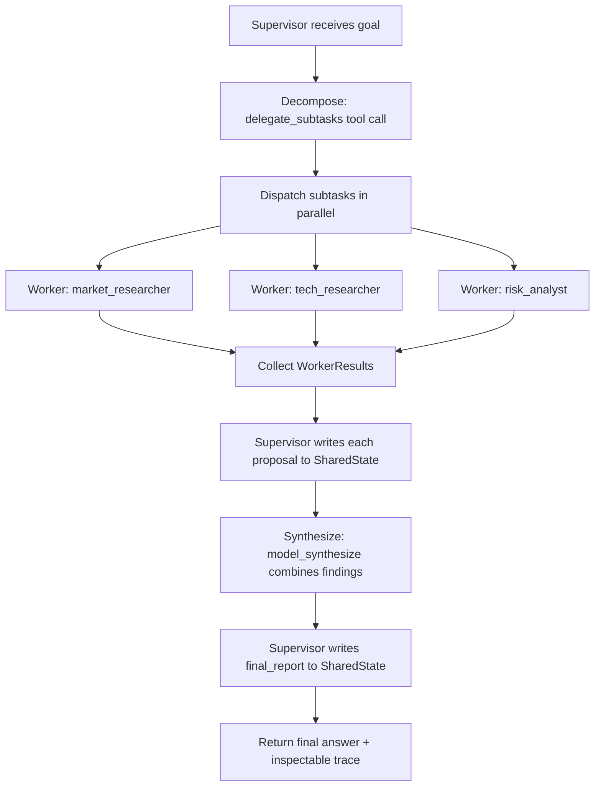

# Multi-agent orchestration

Multi-agent orchestration splits a task across several language-model agents that each hold a narrow role, then coordinates them so their combined output solves a problem a single agent handles poorly. The default shape is a supervisor that receives a goal, decomposes it into scoped subtasks, delegates them to worker agents, and synthesizes their returns; other shapes move control between agents directly, share one conversation, or check and revise work before accepting it.

## When to use it

Reach for multi-agent orchestration when the work is genuinely cross-domain, when subtasks are independent enough to run in parallel, when distinct agents need distinct tools or security boundaries, or when a single agent's prompt has grown so large that instruction-following degrades. Anthropic reported a large gain from an orchestrator-worker design on breadth-first research, at a large multiple of the tokens of a single chat turn, so the task's value has to justify the cost. Avoid it when a single agent with good tools already succeeds, when subtasks share tight state that is expensive to serialize, or when latency and cost budgets are strict. The MAST study (arXiv:2503.13657) found multi-agent failures are mostly coordination bugs, not model weakness: vague subtask specs, agents talking past each other, and missing verification account for most of them, so start with the simplest topology that works and add agents only when it fails.

## How this example works

Every variant module builds on two shared pieces: `worker.py` (the `Subtask` delegation payload, the `Worker` agent, and parallel fan-out) and `state.py` (a `SharedState` object that is the single source of truth, written only by the agent holding `SharedState.WRITER_ROLE`, with a trace log and a checkpoint/resume hook). The canonical control flow is the supervisor demo in `supervisor.py`:



Workers never see `SharedState` and never write to it; they return a `WorkerResult` to whoever dispatched them. Only the supervisor writes, which keeps writes single-threaded even when reads (worker dispatch) fan out, per Cognition's "Don't Build Multi-Agents" observation that parallel writes from partial context produce conflicting decisions.

## Variants implemented

- `worker.py`: shared `Subtask`/`Worker`/`WorkerResult` abstraction and `dispatch_parallel`, the concurrent / parallel (fan-out) mechanics every other module dispatches through.
- `state.py`: shared-state single source of truth, single-writer enforcement, and checkpoint/resume for durable execution.
- `supervisor.py`: supervisor / orchestrator-worker (star topology), the canonical control flow, plus a resume-from-checkpoint demo.
- `aggregation.py`: fan-in for the concurrent / parallel variant, with both required aggregation strategies: majority vote and model synthesis.
- `handoff.py`: handoff / routing / triage (control transfers permanently), contrasted with the subagent variant (control returns to the parent), both carrying an A2A-style task with an explicit pending/in_progress/completed/failed lifecycle.
- `group_chat.py`: group chat / roundtable, with a chat manager choosing the next speaker and a hard turn cap guarding against a manager that never stops.
- `debate.py`: debate / society of minds, converging across rounds or falling back to a majority tally when a round cap is reached.
- `maker_checker.py`: maker-checker / generator-critic loop with an attempt cap and a defined fallback when the cap is reached without approval.
- `hierarchical.py`: hierarchical teams (supervisor of supervisors), nesting the same fan-out/synthesize mechanics one level deeper.

Skipped: blackboard / shared-state as its own demo, since `state.py`'s `SharedState` already is the blackboard every other module reads and writes through a single writer; a second dedicated blackboard demo would mostly repeat the supervisor demo's mechanics under a different name. Magentic / planner-ledger as a full replanning-on-stall demo, since `state.py`'s status ledger and checkpoint/resume already cover the progress-tracking half of that variant; a complete stall-detection-and-replan loop was left out to keep the folder to a reasonable size rather than half-implement it.

## Run it

```
python -m patterns.multi_agent.main
```

Expected output (truncated):

```
MULTI-AGENT ORCHESTRATION PATTERN: supervisor, workers, and their cousins

=== 1. Supervisor / orchestrator-worker (star topology) ===
goal: Produce a one-page competitive brief on note-taking apps for the product team.
  worker market_researcher (market): Notion prices at $10/user/month ...
final report: Notion ($10/mo) and Evernote ($15/mo) both require network sync ...
...
=== 5. Debate / society of minds ===
  round 1: {'agent_a': '0.10', 'agent_b': '0.05'}
  round 2: {'agent_a': '0.05', 'agent_b': '0.05'}
final_answer='0.05', stop_reason=converged
...
All sub-variants completed without exhausting their scripts.
```

## Real providers

Set `AGENTIC_PATTERNS_PROVIDER=openai` (with `OPENAI_API_KEY` set) or `AGENTIC_PATTERNS_PROVIDER=anthropic` (with `ANTHROPIC_API_KEY` set) to run the same code against a real model. Every demo function builds its providers through `agentic_patterns.get_provider`, and each worker or agent gets its own provider instance, so no source change is needed and no path special-cases the mock.

## Sources

- Anthropic, "How we built our multi-agent research system" (engineering blog, 2025). https://www.anthropic.com/engineering/multi-agent-research-system
- Yilun Du, Shuang Li, Antonio Torralba, Joshua B. Tenenbaum, Igor Mordatch, "Improving Factuality and Reasoning in Language Models through Multiagent Debate," arXiv:2305.14325 (2023).
- Cognition, "Don't Build Multi-Agents" (engineering blog, 2025). https://cognition.com/blog/dont-build-multi-agents
- MAST: a study of 200-plus multi-agent traces across seven frameworks, arXiv:2503.13657 (NeurIPS 2025).
- Microsoft Azure Architecture Center, "AI Agent Orchestration Patterns." https://learn.microsoft.com/en-us/azure/architecture/ai-ml/guide/ai-agent-design-patterns
- Linux Foundation, Agent2Agent (A2A) protocol, spec v0.3.0. https://www.linuxfoundation.org/press/linux-foundation-launches-the-agent2agent-protocol-project
