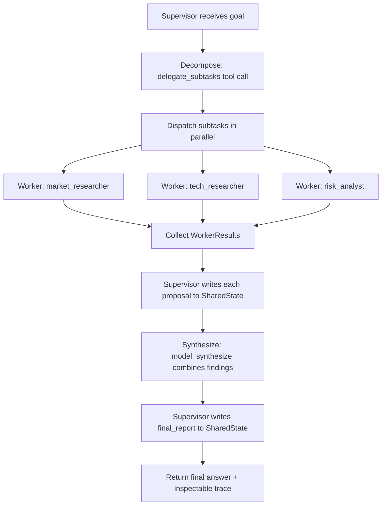
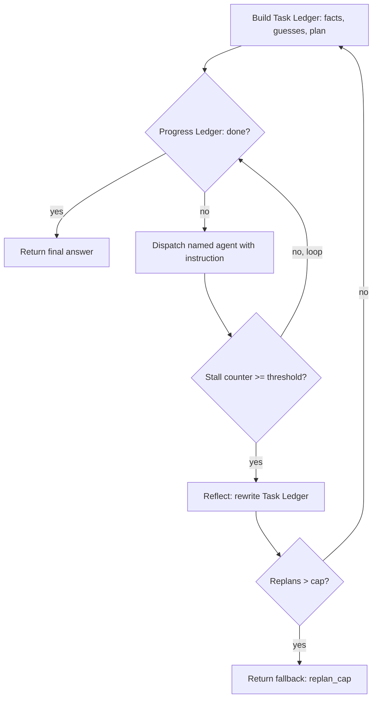

# Multi-agent orchestration

Multi-agent orchestration splits a task across several language-model agents that each hold a narrow role, then coordinates them so their combined output solves a problem a single agent handles poorly. The default shape is a supervisor that receives a goal, decomposes it into scoped subtasks, delegates them to worker agents, and synthesizes their returns; other shapes move control between agents directly, share one conversation, or check and revise work before accepting it.

## When to use it

Reach for multi-agent orchestration when the work is genuinely cross-domain, when subtasks are independent enough to run in parallel, when distinct agents need distinct tools or security boundaries, or when a single agent's prompt has grown so large that instruction-following degrades. Anthropic reported their orchestrator-worker system beat a single agent by 90.2% on an internal research eval, but at roughly 15x the tokens of a single chat turn (versus about 4x for one chat turn), so the task's value has to justify the cost; `economics.py` measures that multiple instead of just quoting it. Avoid it when a single agent with good tools already succeeds, when subtasks share tight state that is expensive to serialize, or when latency and cost budgets are strict. Cognition's "Don't Build Multi-Agents" argues single-threaded is the correct default for many tasks precisely because parallel workers acting on partial context make conflicting decisions; treat that as the baseline to beat, not just a rule to note. The MAST study (arXiv:2503.13657) hand-annotated 1600-plus multi-agent traces across seven frameworks and found failures are mostly coordination bugs, not model weakness, in three categories: specification and system-design issues (41.8%), inter-agent misalignment (36.9%), and task verification (21.3%). `failure_attribution.py` turns that taxonomy into a working attributor instead of leaving it as a citation. Start with the simplest topology that works and add agents only when it fails.

## How this example works

Every variant module builds on two shared pieces: `worker.py` (the `Subtask` delegation payload, the `Worker` agent, and parallel fan-out) and `state.py` (a `SharedState` object that is the single source of truth, written only by the agent holding `SharedState.WRITER_ROLE`, with a trace log and a checkpoint/resume hook). The canonical control flow is the supervisor demo in `supervisor.py`:



Workers never see `SharedState` and never write to it; they return a `WorkerResult` to whoever dispatched them. Only the supervisor writes, which keeps writes single-threaded even when reads (worker dispatch) fan out, per Cognition's "Don't Build Multi-Agents" observation that parallel writes from partial context produce conflicting decisions.

`magentic.py` adds the active loop the plain supervisor does not have: a Task Ledger (facts, guesses, plan) and a Progress Ledger (done, progress, next agent and instruction) that detect a stall and replan instead of running the same fixed plan to the end:



## Variants implemented

- `worker.py`: shared `Subtask`/`Worker`/`WorkerResult` abstraction and `dispatch_parallel`, the concurrent / parallel (fan-out) mechanics every other module dispatches through.
- `state.py`: shared-state single source of truth, single-writer enforcement, and checkpoint/resume for durable execution.
- `supervisor.py`: supervisor / orchestrator-worker (star topology), the canonical control flow, plus a resume-from-checkpoint demo.
- `aggregation.py`: fan-in for the concurrent / parallel variant, with both required aggregation strategies: majority vote and model synthesis.
- `handoff.py`: handoff / routing / triage (control transfers permanently), contrasted with the subagent variant (control returns to the parent), both carrying an A2A-style task with an explicit pending/in_progress/completed/failed lifecycle.
- `group_chat.py`: group chat / roundtable, with a chat manager choosing the next speaker and a hard turn cap guarding against a manager that never stops.
- `debate.py`: debate / society of minds, converging across rounds or falling back to a majority tally when a round cap is reached.
- `maker_checker.py`: maker-checker / generator-critic loop with an attempt cap and a defined fallback when the cap is reached without approval.
- `hierarchical.py`: hierarchical teams (supervisor of supervisors), nesting the same fan-out/synthesize mechanics one level deeper.
- `failure_attribution.py`: the MAST 14-mode failure taxonomy as a static table, plus an attributor that reads a run trace and names the responsible agent, the decisive step, and the MAST mode, in all three strategies from the Who&When benchmark (All-at-Once, Step-by-Step, Binary-Search).
- `economics.py`: context-isolation economics; runs one goal both single-threaded and through the `supervisor.py` fan-out, tallies each path's actual tokens with a `TrackedProvider` wrapper, and reports the token multiple and each path's peak per-agent context.
- `magentic.py`: Magentic-style dual-ledger orchestrator (Task Ledger outer loop, Progress Ledger inner loop) with a stall counter and a reflect-revise-restart replan, the active loop `state.py`'s passive status ledger does not provide.
- `agent_card.py`: A2A Agent Card capability discovery, ranking registered cards by skill match and delegating to the winner through the existing `handoff.DelegationTask` lifecycle, including the no-capable-agent discovery failure.

Skipped: blackboard / shared-state as its own demo, since `state.py`'s `SharedState` already is the blackboard every other module reads and writes through a single writer; a second dedicated blackboard demo would mostly repeat the supervisor demo's mechanics under a different name. Full A2A network transport (JSON-RPC over HTTP, `/.well-known/agent-card.json` fetch, OAuth), since it is a transport wrapper with no new offline-testable coordination behavior; `agent_card.py` keeps the card-matching and delegation logic that is actually teachable. Magentic's replanning-on-stall was noted in an earlier version of this README as "skipped for size"; `magentic.py` is that completion, not a permanent omission.

## Run it

```
python -m patterns.multi_agent.main
```

Expected output (truncated):

```
MULTI-AGENT ORCHESTRATION PATTERN: supervisor, workers, and their cousins

=== 1. Supervisor / orchestrator-worker (star topology) ===
goal: Produce a one-page competitive brief on note-taking apps for the product team.
  worker market_researcher (market): Notion prices at $10/user/month ...
final report: Notion ($10/mo) and Evernote ($15/mo) both require network sync ...
...
=== 5. Debate / society of minds ===
  round 1: {'agent_a': '0.10', 'agent_b': '0.05'}
  round 2: {'agent_a': '0.05', 'agent_b': '0.05'}
final_answer='0.05', stop_reason=converged
...
=== 8. Failure attribution (MAST taxonomy) ===
  all_at_once:   agent=market_researcher step=2 mode=FM-2.3 (inter_agent)
  step_by_step:  agent=market_researcher step=2 mode=FM-2.3 (inter_agent)
  binary_search: agent=market_researcher step=4 mode=FM-2.3 (inter_agent)
...
=== 10. Magentic dual-ledger orchestrator ===
stall tripped after 2 no-progress steps, replans=1, stop_reason=completed
answer: Room C (Innovation Lab) is booked for the 3pm design review.
...
All sub-variants completed without exhausting their scripts.
```

## Real providers

Set `AGENTIC_PATTERNS_PROVIDER=openai` (with `OPENAI_API_KEY` set) or `AGENTIC_PATTERNS_PROVIDER=anthropic` (with `ANTHROPIC_API_KEY` set) to run the same code against a real model. Every demo function builds its providers through `agentic_patterns.get_provider`, and each worker or agent gets its own provider instance, so no source change is needed and no path special-cases the mock.

## Sources

- Anthropic, "How we built our multi-agent research system" (engineering blog, 2025). https://www.anthropic.com/engineering/multi-agent-research-system . Single agents about 4x chat tokens, multi-agent about 15x; orchestrator-worker beat single-agent Claude Opus 4 by 90.2% on the internal research eval; token usage alone explains 80% of BrowseComp variance (three factors explain 95%).
- Yilun Du, Shuang Li, Antonio Torralba, Joshua B. Tenenbaum, Igor Mordatch, "Improving Factuality and Reasoning in Language Models through Multiagent Debate," arXiv:2305.14325 (2023).
- Cognition, "Don't Build Multi-Agents" (engineering blog, 2025). https://cognition.com/blog/dont-build-multi-agents . Single-threaded agent as the default; parallel workers on partial context make conflicting decisions.
- Mert Cemri, Melissa Z. Pan, Shuyi Yang, Lakshya A. Agrawal, Bhavya Chopra, Rishabh Tiwari, Kurt Keutzer, Aditya Parameswaran, Dan Klein, Kannan Ramchandran, Matei Zaharia, Joseph E. Gonzalez, Ion Stoica, "Why Do Multi-Agent LLM Systems Fail?", arXiv:2503.13657. MAST: 14 failure modes, three categories at 41.8% (specification/system design), 36.9% (inter-agent misalignment), 21.3% (task verification); 1600-plus annotated traces across seven frameworks, annotator agreement kappa = 0.88.
- Shaokun Zhang, Ming Yin, Jieyu Zhang, Jiale Liu, Zhiguang Han, Jingyang Zhang, Beibin Li, Chi Wang, Huazheng Wang, Yiran Chen, Qingyun Wu, "Which Agent Causes Task Failures and When? On Automated Failure Attribution of LLM Multi-Agent Systems", arXiv:2505.00212. Who&When benchmark (127 failure logs); All-at-Once, Step-by-Step, and Binary-Search attribution; agent-level accuracy near 53%, step-level near 14%; agent-vs-step method trade-off.
- Mengzhuo Chen, Junjie Wang, Fangwen Mu, Yawen Wang, Zhe Liu, Huanxiang Feng, Qing Wang, "Seeing the Whole Elephant: A Benchmark for Failure Attribution in LLM-based Multi-Agent Systems", arXiv:2604.22708. Full-execution-trace attribution (TraceElephant); full traces improve attribution accuracy by up to 76% over output-only traces.
- Adam Fourney, Gagan Bansal, Hussein Mozannar, Cheng Tan, Eduardo Salinas, Erkang Zhu, Friederike Niedtner, Grace Proebsting, Griffin Bassman, Jack Gerrits, Jacob Alber, Peter Chang, Ricky Loynd, Robert West, Victor Dibia, Ahmed Awadallah, Ece Kamar, Rafah Hosn, Saleema Amershi, "Magentic-One: A Generalist Multi-Agent System for Solving Complex Tasks", arXiv:2411.04468. Task Ledger (outer loop: facts, guesses, plan) and Progress Ledger (inner loop: progress, next agent and instruction); stall counter with a threshold near 2 that triggers reflect-revise-restart.
- Microsoft Agent Framework, Magentic orchestration (production form of Magentic-One's dual-ledger loop). https://learn.microsoft.com/en-us/agent-framework/workflows/orchestrations/magentic
- Microsoft Azure Architecture Center, "AI Agent Orchestration Patterns." https://learn.microsoft.com/en-us/azure/architecture/ai-ml/guide/ai-agent-design-patterns
- Agent2Agent (A2A) protocol, donated to the Linux Foundation June 23, 2025 (Google, AWS, Cisco, Microsoft, Salesforce, SAP, and ServiceNow as founding members). Agent Cards published at a well-known path advertise capabilities and skills for cross-vendor discovery and delegation. https://www.linuxfoundation.org/press/linux-foundation-launches-the-agent2agent-protocol-project-to-enable-secure-intelligent-communication-between-ai-agents and https://github.com/a2aproject/A2A . Current spec version is past v0.3.0 but could not be confirmed from a primary spec page as of this writing; left unverified rather than restated as "v0.3.0".
