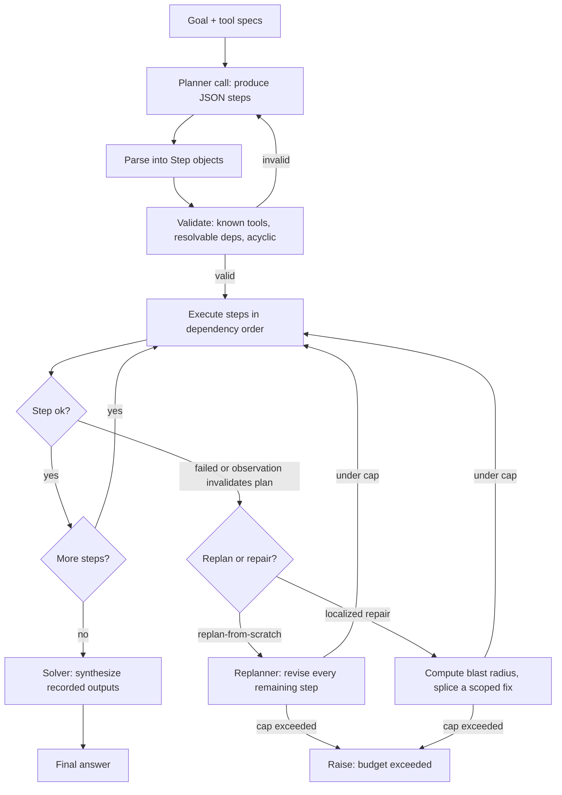

# Planning (plan-then-execute)

Planning is the pattern in which an agent first turns a goal into an explicit, inspectable plan and then carries that plan out, instead of deciding its next action one token at a time. Producing the plan is task decomposition: a planning phase reasons about the whole problem and commits to a structure, and a separate execution phase runs the steps, usually with tools. This is the front-loaded-reasoning counterpart to interleaved ReAct, where the model thinks, acts, and observes one step at a time.

## When to use it

Use planning when a task has several dependent steps, when independent steps can run in parallel, when you want to review or gate a plan before anything executes (approvals, cost, safety), or when an interleaved agent tends to loop on a long-horizon goal. It works best when the sub-task structure is fairly predictable from the prompt and when you want to minimize model calls.

Prefer interleaved ReAct instead when the next action depends heavily on what earlier actions return and cannot be guessed up front (exploratory search, debugging), when the task is a single step, or when the environment is unpredictable enough that any fixed plan goes stale within a step or two. A rigid plan with no replanning is brittle in a dynamic setting; add replanning rather than abandoning structure altogether.

## How this example works

Every variant in this folder plans against the same small trip-planning tool domain (`tools.py`): weather, attractions, hotel cost and booking, and an itinerary drafter. A shared plan representation (`plan.py`), parser (`parser.py`), and structural validator (`validator.py`) sit underneath the structured variants; `validator.py` checks tool names, dependency ids, and acyclicity only, and `modulo_loop.py` adds the semantic layer on top. The flowchart below shows the canonical structured control flow that `sequential_executor.py`, `dag_executor.py`, `replanning.py`, `plan_repair.py`, and `rewoo.py` all specialize, including the fork between replanning from scratch and localized repair.



## Variants implemented

- `plan_and_solve.py` - Plan-and-Solve (PS+) prompting: one model call plans and solves a word problem in the same generation, no tools, no executor.
- `sequential_executor.py` - classic plan-then-execute: one planner call, a sequential executor over the ordered step list, one solver call.
- `dag_executor.py` - DAG / dependency-ordered planning with parallel plan execution: steps run wave by wave, every step in a wave dispatched concurrently. Dependency inference and speculative execution are out of scope.
- `replanning.py` - plan-then-execute with replanning, capped, triggered by either a step failure or an observation that invalidates the rest of the plan. This is the replan-from-scratch baseline `plan_repair.py` upgrades.
- `plan_repair.py` - localized plan repair: on a failure, computes the failing step's blast radius in the dependency graph and repairs only that region, leaving every step outside it, and its recorded result, untouched.
- `modulo_loop.py` - LLM-Modulo: a suite of sound, deterministic semantic verifiers judges a plan after the structural validator passes, back-prompting the planner with concrete critiques until it passes or a round cap is hit.
- `rewoo.py` - ReWOO's decoupled planner, workers, solver: exactly two model calls regardless of tool count, evidence referenced with `#Eid` placeholders.
- `react_baseline.py` - interleaved ReAct-style baseline with no upfront plan, kept as a contrast for model-call counting.
- `todo_list.py` - todo-list / in-context planning: a single agent writes and rewrites a `write_todos`-style checklist mid-run instead of committing to a fixed plan upfront. This revises a flat list mid-run; it is not hierarchical decomposition.
- `hierarchical.py` - hierarchical decomposition: a compound step expands into its own sub-plan on demand, recursing under a depth cap and a total node budget, until every leaf names a real tool.
- `plan_selection.py` - plan selection: generates several candidate plans, drops the infeasible ones, scores or tournament-ranks the rest, and executes only the winner, so a rejected candidate never has a side effect.
- `premortem.py` - premortem: simulates a plan against a tracked world state before any real tool runs, catching a doomed step in simulation instead of after a real, possibly irreversible, side effect.
- `context_offload.py` - persists the plan and step outputs to a JSON checkpoint file so a run can resume after a simulated restart with zero planner calls.
- `subagent_executor.py` - an orchestrator delegates each step to an isolated child conversation and keeps only a compact one-line result per step.

Hierarchical decomposition and plan selection were added in this deep pass (`hierarchical.py`, `plan_selection.py`), alongside localized repair (`plan_repair.py`), sound-verifier back-prompting (`modulo_loop.py`), and simulate-before-execute premortem (`premortem.py`). See `docs/research/planning_deep.md` for the mechanisms and the papers behind each.

## Run it

```
python -m patterns.planning.main
```

Expected output (abridged):

```
######################################################################
# 1/14: plan_and_solve
######################################################################
=== Plan-and-Solve (PS+) ===
Question: A bakery bakes 144 cookies and packs them into boxes of 12. ...
...
######################################################################
# 5/14: plan_repair
######################################################################
Repairs: 1, preserved: ['A'], repaired: ['B', 'C']
...
######################################################################
# 12/14: premortem
######################################################################
Doomed: True at 'outdoor', executed for real: False
...
All planning variants ran successfully, offline, with no API key.
```

## Real providers

Every demo builds its provider with `get_provider(script=...)` from `agentic_patterns`, so switching providers needs no code change:

- `AGENTIC_PATTERNS_PROVIDER=openai` plus `OPENAI_API_KEY` (and optionally `OPENAI_MODEL`, `OPENAI_BASE_URL`)
- `AGENTIC_PATTERNS_PROVIDER=anthropic` plus `ANTHROPIC_API_KEY` (and optionally `ANTHROPIC_MODEL`)

With no environment variables set, everything runs against `MockProvider` with the scripts defined next to each `demo()` function.

## Sources

- Wang et al., "Plan-and-Solve Prompting: Improving Zero-Shot Chain-of-Thought Reasoning by Large Language Models," ACL 2023, arXiv:2305.04091.
- Xu et al., "ReWOO: Decoupling Reasoning from Observations for Efficient Augmented Language Models," 2023, arXiv:2305.18323.
- Kim et al., "An LLM Compiler for Parallel Function Calling," ICML 2024, arXiv:2312.04511.
- Shen et al., "HuggingGPT: Solving AI Tasks with ChatGPT and its Friends in Hugging Face," 2023, arXiv:2303.17580.
- LangChain, "Plan-and-Execute Agents," and the LangGraph plan-and-execute tutorial.
- Erdogan et al., "Plan-and-Act: Improving Planning of Agents for Long-Horizon Tasks," 2025, arXiv:2503.09572.

Added for the 2025-2026 deep pass (`plan_repair.py`, `modulo_loop.py`, `hierarchical.py`, `plan_selection.py`, `premortem.py`); see `docs/research/planning_deep.md` for the mechanisms each one implements:

- Subbarao Kambhampati, Karthik Valmeekam, Lin Guan, Mudit Verma, Kaya Stechly, Siddhant Bhambri, Lucas Saldyt, Anil Murthy, "LLMs Can't Plan, But Can Help Planning in LLM-Modulo Frameworks," ICML 2024. arXiv:2402.01817
- Atharva Gundawar, Karthik Valmeekam, Mudit Verma, Subbarao Kambhampati, "Robust Planning with Compound LLM Architectures: An LLM-Modulo Approach," November 2024. arXiv:2411.14484
- Yue Zhang, Sihan Chen, Ziwen Huang, Hanyun Cui, Kangye Ji, Zhi Wang, "Atomic Task Graph: A Unified Framework for Agentic Planning and Execution," July 2026. arXiv:2607.01942
- Longling Geng, Edward Y. Chang, "ALAS: Transactional and Dynamic Multi-Agent LLM Planning," November 2025. arXiv:2511.03094
- Hector Munoz-Avila, David W. Aha, Paola Rizzo, "ChatHTN: Interleaving Approximate (LLM) and Symbolic HTN Planning," May 2025. arXiv:2505.11814
- Xu Huang, Weiwen Liu, Xiaolong Chen, Xingmei Wang, Hao Wang, Defu Lian, Yasheng Wang, Ruiming Tang, Enhong Chen, "Understanding the planning of LLM agents: A survey," February 2024. arXiv:2402.02716
- Yu Gu, Kai Zhang, Yuting Ning, Boyuan Zheng, Boyu Gou, Tianci Xue, Cheng Chang, Sanjari Srivastava, Yanan Xie, Peng Qi, Huan Sun, Yu Su, "Is Your LLM Secretly a World Model of the Internet? Model-Based Planning for Web Agents," November 2024, revised April 2025. arXiv:2411.06559
- Annu Rana, Gaurav Kumar, "Model-First Reasoning LLM Agents: Reducing Hallucinations through Explicit Problem Modeling," December 2025. arXiv:2512.14474
- Shuyang Liu, Saman Dehghan, Jatin Ganhotra, Martin Hirzel, Reyhaneh Jabbarvand, "Evaluating Plan Compliance in Autonomous Programming Agents," April 2026 (earlier titled "From Plan to Action: How Well Do Agents Follow the Plan?"). arXiv:2604.12147
- Maria Fox, Alfonso Gerevini, Derek Long, Ivan Serina, "Plan Stability: Replanning versus Plan Repair," ICAPS 2006 (classical origin of the repair-versus-replan distinction `plan_repair.py` operationalizes).
