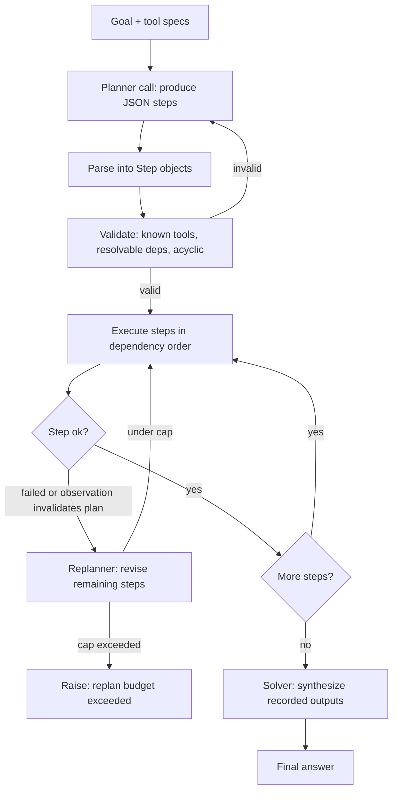

# Planning (plan-then-execute)

Planning is the pattern in which an agent first turns a goal into an explicit, inspectable plan and then carries that plan out, instead of deciding its next action one token at a time. Producing the plan is task decomposition: a planning phase reasons about the whole problem and commits to a structure, and a separate execution phase runs the steps, usually with tools. This is the front-loaded-reasoning counterpart to interleaved ReAct, where the model thinks, acts, and observes one step at a time.

## When to use it

Use planning when a task has several dependent steps, when independent steps can run in parallel, when you want to review or gate a plan before anything executes (approvals, cost, safety), or when an interleaved agent tends to loop on a long-horizon goal. It works best when the sub-task structure is fairly predictable from the prompt and when you want to minimize model calls.

Prefer interleaved ReAct instead when the next action depends heavily on what earlier actions return and cannot be guessed up front (exploratory search, debugging), when the task is a single step, or when the environment is unpredictable enough that any fixed plan goes stale within a step or two. A rigid plan with no replanning is brittle in a dynamic setting; add replanning rather than abandoning structure altogether.

## How this example works

Every variant in this folder plans against the same small trip-planning tool domain (`tools.py`): weather, attractions, hotel cost and booking, and an itinerary drafter. A shared plan representation (`plan.py`), parser (`parser.py`), and validator (`validator.py`) sit underneath the structured variants. The flowchart below shows the canonical structured control flow that `sequential_executor.py`, `dag_executor.py`, `replanning.py`, and `rewoo.py` all specialize.



## Variants implemented

- `plan_and_solve.py` - Plan-and-Solve (PS+) prompting: one model call plans and solves a word problem in the same generation, no tools, no executor.
- `sequential_executor.py` - classic plan-then-execute: one planner call, a sequential executor over the ordered step list, one solver call.
- `dag_executor.py` - DAG / dependency-ordered planning with parallel plan execution: steps run wave by wave, every step in a wave dispatched concurrently.
- `replanning.py` - plan-then-execute with replanning, capped, triggered by either a step failure or an observation that invalidates the rest of the plan.
- `rewoo.py` - ReWOO's decoupled planner, workers, solver: exactly two model calls regardless of tool count, evidence referenced with `#Eid` placeholders.
- `react_baseline.py` - interleaved ReAct-style baseline with no upfront plan, kept as a contrast for model-call counting.
- `todo_list.py` - todo-list / in-context planning: a single agent writes and rewrites a `write_todos`-style checklist mid-run instead of committing to a fixed plan upfront.
- `context_offload.py` - persists the plan and step outputs to a JSON checkpoint file so a run can resume after a simulated restart with zero planner calls.
- `subagent_executor.py` - an orchestrator delegates each step to an isolated child conversation and keeps only a compact one-line result per step.

Hierarchical planning and plan selection/critique from the taxonomy are not implemented as separate modules: they are not on the brief's must-cover checklist, and `todo_list.py` already demonstrates the hierarchical idea of expanding work on demand within a run.

## Run it

```
python -m patterns.planning.main
```

Expected output (abridged):

```
######################################################################
# 1/9: plan_and_solve
######################################################################
=== Plan-and-Solve (PS+) ===
Question: A bakery bakes 144 cookies and packs them into boxes of 12. ...
...
######################################################################
# 3/9: dag_executor
######################################################################
Wave 1 (dispatched together): ['weather', 'attractions', 'hotel']
Wave 2 (dispatched together): ['itinerary']
...
All planning variants ran successfully, offline, with no API key.
```

## Real providers

Every demo builds its provider with `get_provider(script=...)` from `agentic_patterns`, so switching providers needs no code change:

- `AGENTIC_PATTERNS_PROVIDER=openai` plus `OPENAI_API_KEY` (and optionally `OPENAI_MODEL`, `OPENAI_BASE_URL`)
- `AGENTIC_PATTERNS_PROVIDER=anthropic` plus `ANTHROPIC_API_KEY` (and optionally `ANTHROPIC_MODEL`)

With no environment variables set, everything runs against `MockProvider` with the scripts defined next to each `demo()` function.

## Sources

- Wang et al., "Plan-and-Solve Prompting: Improving Zero-Shot Chain-of-Thought Reasoning by Large Language Models," ACL 2023, arXiv:2305.04091.
- Xu et al., "ReWOO: Decoupling Reasoning from Observations for Efficient Augmented Language Models," 2023, arXiv:2305.18323.
- Kim et al., "An LLM Compiler for Parallel Function Calling," ICML 2024, arXiv:2312.04511.
- Shen et al., "HuggingGPT: Solving AI Tasks with ChatGPT and its Friends in Hugging Face," 2023, arXiv:2303.17580.
- LangChain, "Plan-and-Execute Agents," and the LangGraph plan-and-execute tutorial.
- Erdogan et al., "Plan-and-Act: Improving Planning of Agents for Long-Horizon Tasks," 2025, arXiv:2503.09572.
