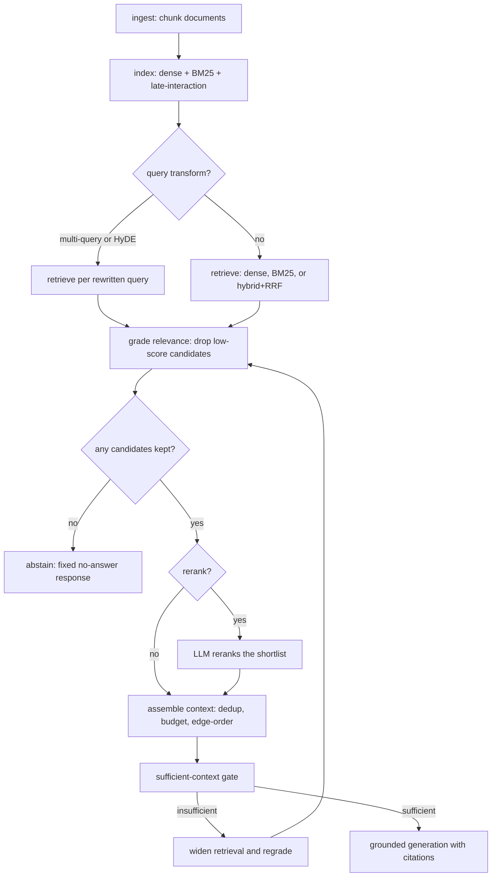

# RAG (naive, hybrid, and reranked)

Retrieval-augmented generation grounds a model's answer in text fetched at query time from an external corpus, instead of relying only on what the model memorized during training. A RAG system splits documents into chunks, indexes them, retrieves the chunks most relevant to a question, places those chunks in the prompt, and asks the model to answer from them, citing what it used. Naive RAG does one dense-vector lookup and stuffs the results into the prompt; hybrid RAG combines keyword and vector search and fuses their rankings; reranking over-fetches candidates and reorders them with a model that reads the query and each candidate together.

## When to use it

Reach for RAG when answers depend on a knowledge base the model was not trained on or that changes often: internal docs, product manuals, tickets, or recent events. Use it when an answer must be attributable, so a reader can check a citation, or when the corpus is larger than a context window. Skip it when the model already knows the answer well and retrieval only adds latency and noise, when a task needs reasoning over a whole document rather than a few passages, or when the corpus is small enough to paste in full. RAG does not fix a weak generator: bad retrieval plus a confident model produces grounded-looking but wrong answers.

## How this example works

Every retrieval and generation stage is its own small module with reusable functions; each module also carries a demo function with its scripted `MockProvider` conversation next to it, so a reader sees the whole exchange in one place. `pipeline.py` wires ingest through answer into one function; `main.py` runs all ten variants against the same "Aurora Cloud" sample corpus and queries, so a reader can compare how each variant handles the same material.



## Variants implemented

- `chunking.py`: ingestion, fixed-size overlapping chunking that snaps to word boundaries, keeping source id and character offsets on every chunk.
- `corpus.py`: the shared sample corpus (six Aurora Cloud policy documents) every other module and the tests retrieve against.
- `dense.py`: naive dense RAG, embed-and-cosine top-k retrieval over a `DenseIndex`.
- `bm25.py`: a pure-Python BM25 term-based retriever with its own tokenizer and inverse-document-frequency table.
- `hybrid.py`: hybrid retrieval, running dense and BM25 in parallel and fusing the ranked lists with Reciprocal Rank Fusion.
- `late_interaction.py`: a ColBERT-style late-interaction retriever, one vector per token scored with MaxSim, the middle tier between dense recall and cross-encoder precision.
- `rerank.py`: LLM listwise reranking of an over-fetched shortlist, kept separate from retrieval.
- `query_transform.py`: multi-query expansion (split a vague question into sub-queries, fuse with RRF) and HyDE (embed a generated hypothetical answer instead of the question).
- `contextual.py`: contextual retrieval, prepending a model-written blurb to a chunk before embedding so a pronoun-orphaned chunk stays findable; notes late chunking (arXiv:2409.04701) as the cheaper production alternative, not separately implemented here.
- `assembly.py`: context assembly, deduplicating near-identical chunks, fitting a token budget, and edge-ordering so the strongest evidence sits at the start and end of the prompt rather than the middle.
- `grading.py`: two gates, a per-chunk relevance threshold (drives the abstain path) and a sufficient-context gate that grades a retrieved set as a whole and can trigger a corrective, wider re-fetch.
- `generation.py`: grounded generation, a prompt that answers only from labeled chunks, citation extraction validated against the chunks actually supplied, and a fixed abstain response when there is nothing to ground an answer in.
- `agentic.py`: agentic RAG, retrieval exposed as a `search_knowledge_base` tool the model calls in a loop, narrowing its own query when a first search comes back incomplete, mirroring LangGraph's grade-then-rewrite-or-generate pattern.
- `pipeline.py`: the canonical ingest-to-answer control flow (`answer_question`), plus the naive, hybrid+rerank, and abstain end-to-end demos `main.py` runs.

Skipped: GraphRAG/LightRAG and visual (ColPali-style) RAG are not implemented; they need a document graph or an image-patch encoder respectively, both out of scope for a single-corpus, text-only offline demo. Sentence-window and parent-document ("small-to-big") chunking, where a small unit is retrieved but a larger surrounding unit is fed to the model, are named in the research brief but not given their own module here, to keep the folder to one chunking strategy plus the contextual-embedding refinement rather than a fourth variant of the same idea.

## Run it

```
python -m patterns.rag.main
```

Expected output (truncated):

```
RAG PATTERN: naive, hybrid, and reranked retrieval-augmented generation

=== 1. Ingestion: chunk the Aurora Cloud knowledge base ===
  6 documents chunked into 14 overlapping chunks
  ...
=== 2. Naive dense RAG (one embed-and-cosine lookup) ===
  query: What is the first mitigation step for a SEV1 incident caused by a recent deploy?
  answer: The first mitigation step for a SEV1 caused by a recent deploy is an immediate rollback... [incident-runbook#1]...
  ...
All ten RAG variant demos completed without exhausting their scripts.
```

## Real providers

Set `AGENTIC_PATTERNS_PROVIDER=openai` (with `OPENAI_API_KEY` set) or `AGENTIC_PATTERNS_PROVIDER=anthropic` (with `ANTHROPIC_API_KEY` set) to run the same code against a real model. Set `AGENTIC_PATTERNS_EMBEDDER=openai` (with `OPENAI_API_KEY` set) to embed with a real embedding model instead of the deterministic `HashEmbedder`. Every demo function builds its provider through `agentic_patterns.get_provider` and its embedder through `agentic_patterns.get_embedder`, so no source change is needed.

## Sources

- Jay Alammar and Maarten Grootendorst, _Hands-On Large Language Models_ (O'Reilly, 2024), Chapter 8, "Semantic Search and RAG."
- Chip Huyen, _AI Engineering_ (O'Reilly, 2025), RAG and Agents chapter.
- Nelson F. Liu et al., "Lost in the Middle: How Language Models Use Long Contexts," TACL 2024 (arXiv:2307.03172).
- Gordon Cormack et al., "Reciprocal Rank Fusion Outperforms Condorcet and Individual Rank Learning Methods," SIGIR 2009.
- Luyu Gao et al., "Precise Zero-Shot Dense Retrieval without Relevance Labels" (HyDE), 2022 (arXiv:2212.10496).
- Akari Asai et al., "Self-RAG: Learning to Retrieve, Generate, and Critique," 2023 (arXiv:2310.11511).
- Michael Gunther et al., "Late Chunking," 2024, revised 2025 (arXiv:2409.04701).
- Anthropic, "Introducing Contextual Retrieval" (2024).
