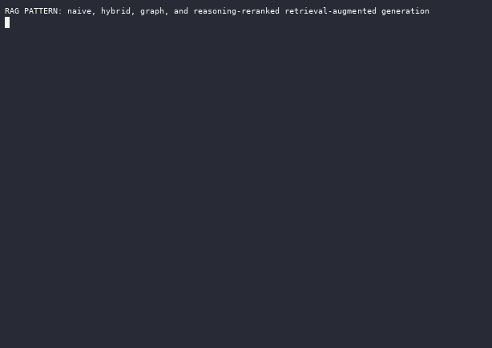
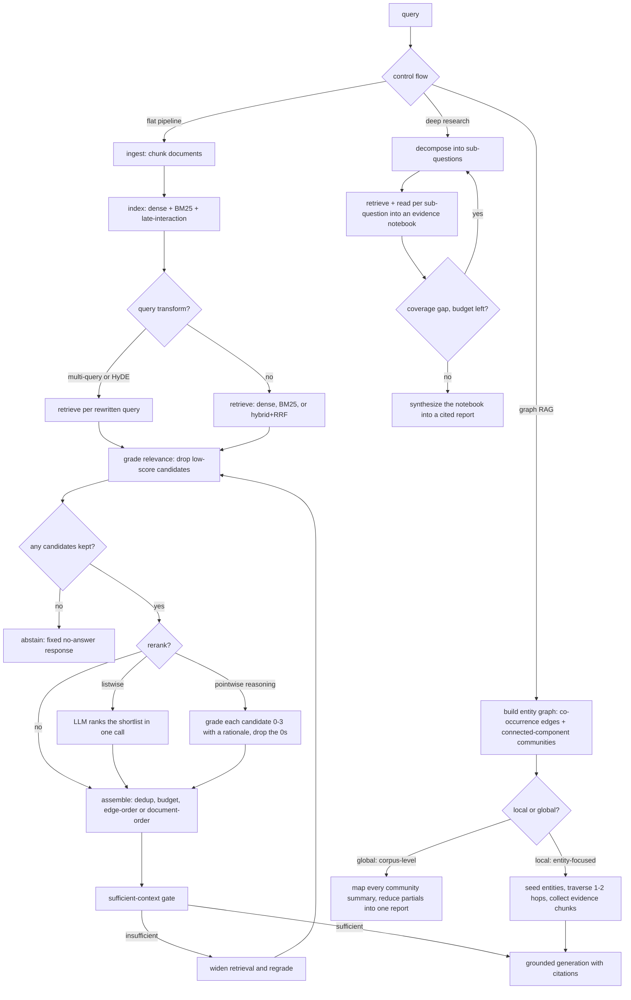

# RAG (naive, hybrid, graph, and reasoning-reranked)

Retrieval-augmented generation grounds a model's answer in text fetched at query time from an external corpus, instead of relying only on what the model memorized during training. A RAG system splits documents into chunks, indexes them, retrieves the chunks most relevant to a question, places those chunks in the prompt, and asks the model to answer from them, citing what it used. Naive RAG does one dense-vector lookup and stuffs the results into the prompt; hybrid RAG combines keyword and vector search and fuses their rankings; reranking over-fetches candidates and reorders them with a model that reads the query and each candidate together. Retrieval also does not have to stay a flat, single-shot lookup: a deep-research loop decomposes a question and accumulates evidence across rounds, and a graph retriever follows entity structure across chunks for questions no single passage answers.



_Recorded from `python3 -m patterns.rag.main`, offline, no API key. Regenerate with `python3 tools/record_demos.py record-all`._

## When to use it

Reach for RAG when answers depend on a knowledge base the model was not trained on or that changes often: internal docs, product manuals, tickets, or recent events. Use it when an answer must be attributable, so a reader can check a citation, or when the corpus is larger than a context window. Skip it when the model already knows the answer well and retrieval only adds latency and noise, when a task needs reasoning over a whole document rather than a few passages, or when the corpus is small enough to paste in full. RAG does not fix a weak generator: bad retrieval plus a confident model produces grounded-looking but wrong answers. The heavier variants here (deep research, graph RAG) carry their own cost-benefit question: reach for a graph only on multi-hop or corpus-level questions a flat retriever genuinely cannot serve, not by default (see `graph_rag.py`'s skeptic demo).

## How this example works

Every retrieval and generation stage is its own small module with reusable functions; each module also carries a demo function with its scripted `MockProvider` conversation next to it, so a reader sees the whole exchange in one place. `pipeline.py` wires ingest through answer into one function for the flat control flow; `deep_research.py` and `graph_rag.py` are alternative top-level control flows, not stages inside `pipeline.py`. `main.py` runs all fourteen variants against the same "Aurora Cloud" sample corpus and queries, so a reader can compare how each variant handles the same material.



## Variants implemented

- `chunking.py`: ingestion, fixed-size overlapping chunking that snaps to word boundaries, keeping source id and character offsets on every chunk.
- `corpus.py`: the shared sample corpus (six Aurora Cloud policy documents) every other module and the tests retrieve against.
- `dense.py`: naive dense RAG, embed-and-cosine top-k retrieval over a `DenseIndex`.
- `bm25.py`: a pure-Python BM25 term-based retriever with its own tokenizer and inverse-document-frequency table.
- `hybrid.py`: hybrid retrieval, running dense and BM25 in parallel and fusing the ranked lists with Reciprocal Rank Fusion.
- `late_interaction.py`: a ColBERT-style late-interaction retriever, one vector per token scored with MaxSim, the middle tier between dense recall and cross-encoder precision.
- `rerank.py`: LLM listwise reranking of an over-fetched shortlist, kept separate from retrieval.
- `query_transform.py`: multi-query expansion (split a vague question into sub-queries, fuse with RRF) and HyDE (embed a generated hypothetical answer instead of the question).
- `contextual.py`: contextual retrieval, prepending a model-written blurb to a chunk before embedding so a pronoun-orphaned chunk stays findable; demonstrates only the contextual-embedding half of Anthropic's recipe, and notes late chunking (arXiv:2409.04701) as the cheaper production alternative, not separately implemented here.
- `assembly.py`: context assembly, deduplicating near-identical chunks, fitting a token budget, and edge-ordering so the strongest evidence sits at the start and end of the prompt rather than the middle; frames edge-order as one option, pointing to `order_preserve.py`.
- `grading.py`: two gates, a per-chunk relevance threshold (drives the abstain path) and a sufficient-context gate that grades a retrieved set as a whole and can trigger a corrective, wider re-fetch.
- `generation.py`: grounded generation, a prompt that answers only from labeled chunks, citation extraction validated against the chunks actually supplied, and a fixed abstain response when there is nothing to ground an answer in.
- `agentic.py`: agentic RAG, retrieval exposed as a `search_knowledge_base` tool the model calls in a loop, narrowing its own query when a first search comes back incomplete, mirroring LangGraph's grade-then-rewrite-or-generate pattern; the flat, single-tool sibling to `deep_research.py`.
- `deep_research.py`: a decompose-retrieve-read-check-synthesize loop that keeps an evidence notebook across rounds and spawns gap-driven follow-up sub-questions, the inference shape the 2025 RL-for-search line (Search-R1, ReSearch, DeepResearcher) induces.
- `graph_rag.py`: an offline GraphRAG-lite: an entity co-occurrence graph built with a scripted extractor or a zero-model-call heuristic, connected-component communities, local search that reaches a two-hop fact flat retrieval misses, global search that map-reduces over community summaries, and an honest skeptic demo where the graph adds nothing on a single-hop question.
- `reasoning_rerank.py`: a pointwise reranker that reasons briefly per candidate before grading it 0-3, reading the rationale from the opaque `Completion.reasoning` channel and dropping zero-graded candidates outright; the reasoning-reranker sibling to `rerank.py`'s listwise call.
- `order_preserve.py`: order-preserving assembly (kept chunks sorted by source position, not score) plus a `k`-sweep that surfaces the inverted-U in answer quality as retrieved-chunk count grows.
- `pipeline.py`: the canonical ingest-to-answer control flow (`answer_question`), plus the naive, hybrid+rerank, and abstain end-to-end demos `main.py` runs.

Skipped: visual (ColPali-style) RAG is not implemented; it needs an image-patch encoder and page images, out of scope for a text-only offline demo. Actual late-chunking (arXiv:2409.04701) and Contextual Document Embeddings (arXiv:2410.02525) are not implemented either: both need a trained long-context or corpus-conditioned encoder to absorb context into a token or document vector, which the deterministic `HashEmbedder` cannot reproduce without either showing no win or fabricating one; `contextual.py`'s LLM-blurb approach already teaches the orphaned-chunk problem with a real offline win. HippoRAG 2's Personalized PageRank scorer (arXiv:2502.14802) is named in `graph_rag.py` as the production scorer over the same co-occurrence graph, not implemented, since it adds a random-walk implementation with no new offline-testable retrieval behavior beyond the one-to-two-hop traversal already built. Sentence-window and parent-document ("small-to-big") chunking, where a small unit is retrieved but a larger surrounding unit is fed to the model, are named in the research brief but not given their own module here, to keep the folder to one chunking strategy plus the contextual-embedding refinement rather than a fourth variant of the same idea.

## Run it

```
python -m patterns.rag.main
```

Expected output (truncated):

```
RAG PATTERN: naive, hybrid, graph, and reasoning-reranked retrieval-augmented generation

=== 1. Ingestion: chunk the Aurora Cloud knowledge base ===
  6 documents chunked into 14 overlapping chunks
  ...
=== 2. Naive dense RAG (one embed-and-cosine lookup) ===
  query: What is the first mitigation step for a SEV1 incident caused by a recent deploy?
  answer: The first mitigation step for a SEV1 caused by a recent deploy is an immediate rollback... [incident-runbook#1]...
  ...
=== 12. Graph RAG: local two-hop win, global map-reduce, skeptic no-benefit ===
  local search adds value over flat retrieval: True
  ...
  skeptic search adds value over flat retrieval: False
  ...
All fourteen RAG variant demos completed without exhausting their scripts.
```

## Real providers

Set `AGENTIC_PATTERNS_PROVIDER=openai` (with `OPENAI_API_KEY` set) or `AGENTIC_PATTERNS_PROVIDER=anthropic` (with `ANTHROPIC_API_KEY` set) to run the same code against a real model. Set `AGENTIC_PATTERNS_EMBEDDER=openai` (with `OPENAI_API_KEY` set) to embed with a real embedding model instead of the deterministic `HashEmbedder`. Every demo function builds its provider through `agentic_patterns.get_provider` and its embedder through `agentic_patterns.get_embedder`, so no source change is needed.

## Sources

- Jay Alammar and Maarten Grootendorst, _Hands-On Large Language Models_ (O'Reilly, 2024), Chapter 8, "Semantic Search and RAG."
- Chip Huyen, _AI Engineering_ (O'Reilly, 2025), RAG and Agents chapter.
- Nelson F. Liu et al., "Lost in the Middle: How Language Models Use Long Contexts," TACL 2024 (arXiv:2307.03172).
- Gordon Cormack et al., "Reciprocal Rank Fusion Outperforms Condorcet and Individual Rank Learning Methods," SIGIR 2009.
- Luyu Gao et al., "Precise Zero-Shot Dense Retrieval without Relevance Labels" (HyDE), 2022 (arXiv:2212.10496).
- Akari Asai et al., "Self-RAG: Learning to Retrieve, Generate, and Critique," 2023 (arXiv:2310.11511).
- Michael Gunther et al., "Late Chunking," 2024, revised 2025 (arXiv:2409.04701).
- Anthropic, "Introducing Contextual Retrieval" (2024).
- Bowen Jin et al., "Search-R1: Training LLMs to Reason and Leverage Search Engines with Reinforcement Learning," March 2025. arXiv:2503.09516 (41% over RAG baselines on Qwen2.5-7B across seven QA sets; retrieved-token masking; interleaved reasoning and search).
- Mingyang Chen et al., "ReSearch: Learning to Reason with Search for LLMs via Reinforcement Learning," March 2025. arXiv:2503.19470 (search as part of the reasoning chain for multi-hop questions).
- Yuxiang Zheng et al., "DeepResearcher: Scaling Deep Research via Reinforcement Learning in Real-world Environments," April 2025. arXiv:2504.03160 (end-to-end web research; planning, cross-validation, self-reflection, verification as emergent behaviors).
- Darren Edge et al., "From Local to Global: A Graph RAG Approach to Query-Focused Summarization," April 2024, revised February 2025. arXiv:2404.16130 (entity graph plus pregenerated community summaries; local and global search).
- Zirui Guo et al., "LightRAG: Simple and Fast Retrieval-Augmented Generation," October 2024, revised April 2025. arXiv:2410.05779 (dual-level low/high graph retrieval).
- Bernal Jiménez Gutiérrez et al., "From RAG to Memory: Non-Parametric Continual Learning for Large Language Models" (HippoRAG 2), February 2025. arXiv:2502.14802 (Personalized PageRank over a passage-entity graph).
- Zhishang Xiang et al., "When to use Graphs in RAG: A Comprehensive Analysis for Graph Retrieval-Augmented Generation," June 2025. arXiv:2506.05690 (GraphRAG-Bench; graph methods frequently underperform vanilla RAG; graphs pay on multi-hop and global tasks).
- Orion Weller et al., "Rank1: Test-Time Compute for Reranking in Information Retrieval," February 2025. arXiv:2502.18418 (reasoning traces distilled from R1; explainable reranking chains).
- Tan Yu et al., "In Defense of RAG in the Era of Long-Context Language Models" (OP-RAG), September 2024. arXiv:2409.01666 (order-preserve assembly; inverted-U of answer quality in retrieved-chunk count).
- Bowen Jin et al., "Long-Context LLMs Meet RAG: Overcoming Challenges for Long Inputs in RAG," October 2024. arXiv:2410.05983 (hard negatives as the cause of decline; retrieval reordering as a training-free fix).
- Zhuowan Li et al., "Retrieval Augmented Generation or Long-Context LLMs? A Comprehensive Study and Hybrid Approach" (Self-Route), July 2024, EMNLP 2024. arXiv:2407.16833 (long context wins when resourced; Self-Route for near-parity at RAG cost).
- John X. Morris and Alexander M. Rush, "Contextual Document Embeddings," October 2024. arXiv:2410.02525 (embeddings conditioned on neighboring documents; cited as background for the rejected offline path).
