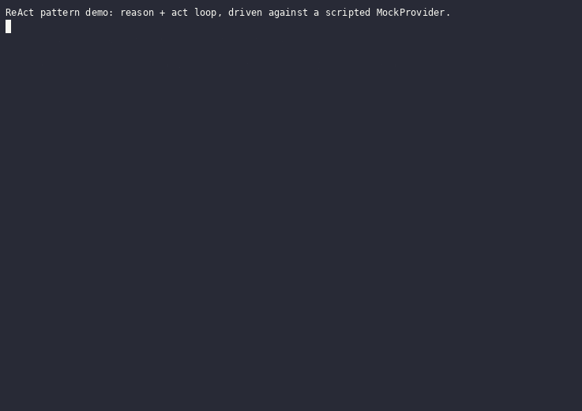
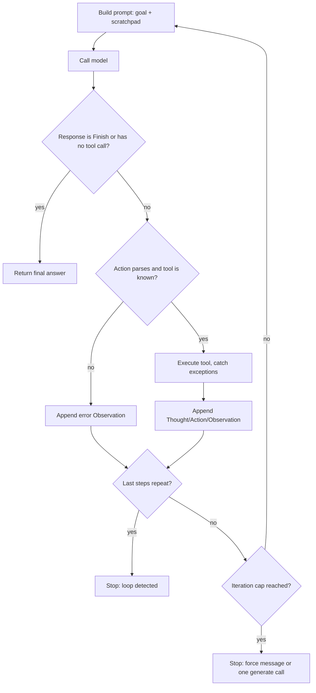
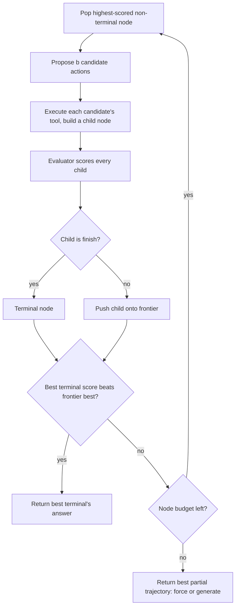

# ReAct (reason + act loop)

ReAct is an agent control pattern that interleaves natural-language reasoning with tool use inside a single loop. At each step the model emits a Thought, then an Action (a tool call with arguments), and the runtime returns an Observation; the Thought/Action/Observation triple is appended to a running scratchpad and the model is prompted again with the accumulated history. The loop repeats until the model emits a terminal Finish action or a stop condition fires.



_Recorded from `python3 -m patterns.react.main`, offline, no API key. Regenerate with `python3 tools/record_demos.py record-all`._

## When to use it

Use ReAct when a task needs several tool calls whose arguments depend on earlier results, when the number of steps is not known ahead of time, or when you want a readable trace for debugging and trust. It fits multi-hop lookups, retrieval-augmented question answering, and any workflow where the model must decide dynamically what to do next.

Avoid it for a single tool call or a fixed pipeline, where a plain function-calling round trip is faster and cheaper. Avoid it when latency and token budget are tight, since every iteration is a separate model call over a growing transcript. If the full plan is knowable upfront, a planner-executor or ReWOO-style approach avoids paying for reasoning between every action.

## How this example works

Every variant in this folder shares the same control flow: build a prompt from the goal and the history so far, call the model, decide whether the response is a terminal answer or a tool request, execute the tool if any, append the result, and repeat until Finish, a repeat guard, or the iteration cap fires.



`tree_search.py` replaces the single linear rollout above with a best-first search over a tree of trajectories:



## Variants implemented

- `parser.py`: the `Thought: ... / Action: Tool[args]` text grammar and its strict parse-failure behavior, unit-tested on its own.
- `scratchpad.py`: the Thought/Action/Observation history, its rendering back into a prompt, observation truncation, and repeat detection. `max_observation_chars` truncation is the naive placeholder for context management: it caps one observation but never reclaims transcript length as steps accumulate. See `compaction.py` for the upgrade.
- `text_loop.py`: few-shot and zero-shot text-parsing ReAct, the canonical form from the original paper, with force and generate early-stop policies.
- `native_loop.py`: native tool-calling ReAct using structured `ToolCall` objects instead of parsed text; carries reasoning content across turns unmodified, which is also the right handling for a reasoning model's thinking output. Its `_repeats_previous_call` guard only catches an exact repeat of the immediately preceding turn; see `derailment.py` for oscillation, no-progress, and error-storm detectors it misses.
- `programmatic.py`: batched tool calling, where one model turn requests several independent tool calls at once instead of one call per round trip.
- `reflexion.py`: ReAct plus Reflexion, an outer loop that retries a failed episode after the agent writes a self-critique of its own trajectory. This only fires when an episode stops _without_ reaching Finish; a confidently wrong Finish is accepted as-is. See `verify.py` for that gap.
- `tree_search.py`: LATS-lite best-first search over ReAct trajectories, branching into several candidate actions per node, scoring each with an evaluator call, and backtracking to a higher-scored sibling instead of committing to a single linear rollout.
- `compaction.py`: summarize-and-continue context management, folding the oldest steps into a scripted summary note once the running transcript crosses a size threshold, keeping the most recent steps verbatim.
- `self_consistency.py`: runs several independent ReAct rollouts and votes on the final answer, with early stop once one answer has an unbeatable lead and an optional confidence-weighted soft vote.
- `verify.py`: a verify-before-finish gate that asks a verifier whether a proposed Finish is actually supported by the trajectory before accepting it, rejecting and continuing when it is not.
- `derailment.py`: pure-function detectors for oscillation, no-progress, and error-storm trajectory failures, beyond exact-repeat, with a one-time recovery nudge before giving up.
- `reasoning_loop.py`: a thin extension of `native_loop.py` that carries a reasoning-model's `reasoning` channel verbatim across turns and adds no `Thought:` scaffolding to the prompt.
- `world.py`: the toy knowledge base and the two tools (`search`, `lookup`) every demo above answers questions against.

Not implemented, with reasons: Plan-then-execute and ReWOO decouple planning from execution entirely rather than adding a ReAct variant, and belong in `patterns/planning/`, not here. An MCP tool adapter would only wrap `ToolRegistry` in a transport layer with no new offline-testable loop behavior, and subagent delegation is a multi-agent concern better suited to `patterns/multi_agent/`. Full stochastic MCTS (UCB selection, rollout simulation, value backpropagation), process reward model training, and a CoT-SC switching router were all considered and left out; see `docs/research/react_deep.md` for why.

## Run it

```
python3 -m patterns.react.main
```

Expected output (abridged):

```
ReAct pattern demo: reason + act loop, driven against a scripted MockProvider.

=== 1. Few-shot text-parsing ReAct (canonical, two-hop lookup) ===
Step 1
  Thought:     I need to find which country the Great Wall is located in.
  Action:      search[Great Wall]
  Observation: The Great Wall is located in China.
...
Answer:  Beijing

=== 6. Best-first tree search (LATS-lite) ===
  node 0: score=0 (frontier)
  node 1: score=6 (frontier)
...
Expansion order: [0, 1, 2]
Answer:  Beijing
```

## Real providers

Every demo calls `get_provider(script=...)`, which defaults to `MockProvider`. Set one of these to run the identical loop code against a real API instead:

- `AGENTIC_PATTERNS_PROVIDER=openai` plus `OPENAI_API_KEY` (and optionally `OPENAI_MODEL`, `OPENAI_BASE_URL`).
- `AGENTIC_PATTERNS_PROVIDER=anthropic` plus `ANTHROPIC_API_KEY` (and optionally `ANTHROPIC_MODEL`).

## Sources

- Shunyu Yao et al., "ReAct: Synergizing Reasoning and Acting in Language Models," 2022. https://arxiv.org/abs/2210.03629
- Noah Shinn et al., "Reflexion: Language Agents with Verbal Reinforcement Learning," 2023. https://arxiv.org/abs/2303.11366
- Binfeng Xu et al., "ReWOO: Decoupling Reasoning from Observations for Efficient Augmented Language Models," 2023. https://arxiv.org/abs/2305.18323
- Lilian Weng, "LLM Powered Autonomous Agents," Lil'Log, 2023. https://lilianweng.github.io/posts/2023-06-23-agent/
- Anthropic, "Building Effective Agents," 2024. https://www.anthropic.com/research/building-effective-agents
- LangGraph docs, `create_agent` (successor to the deprecated `create_react_agent`). https://langchain-ai.github.io/langgraph/
- Andy Zhou et al., "Language Agent Tree Search Unifies Reasoning, Acting, and Planning in Language Models," 2023. https://arxiv.org/abs/2310.04406
- Jing Yu Koh, Stephen McAleer, Daniel Fried et al., "Tree Search for Language Model Agents," July 2024. https://arxiv.org/abs/2407.01476
- Han Wang, Archiki Prasad, et al., "Soft Self-Consistency Improves Language Model Agents," February 2024. https://arxiv.org/abs/2402.13212
- Chenlong Wang et al., "Wait, We Don't Need to 'Wait'! Removing Thinking Tokens Improves Reasoning Efficiency" (NoWait), June 2025. https://arxiv.org/abs/2506.08343
- Zhu et al., "Where LLM Agents Fail and How They can Learn From Failures," September 2025. https://arxiv.org/abs/2509.25370
- Rana et al., "Model-First Reasoning LLM Agents: Reducing Hallucinations through Explicit Problem Modeling," December 2025. https://arxiv.org/abs/2512.14474
- Khushal Sethi, "Don't Overthink It: Inter-Rollout Action Agreement as a Free Adaptive-Compute Signal for LLM Agents" (TrACE), April 2026. https://arxiv.org/abs/2604.08369
- Xia et al., "Diagnosing and Mitigating Context Rot in Long-horizon Search," June 2026. https://arxiv.org/abs/2606.29718
- Anthropic, "Effective context engineering for AI agents," September 29, 2025. https://www.anthropic.com/engineering/effective-context-engineering-for-ai-agents
- Anthropic, "Effective harnesses for long-running agents," November 26, 2025. https://www.anthropic.com/engineering/effective-harnesses-for-long-running-agents
