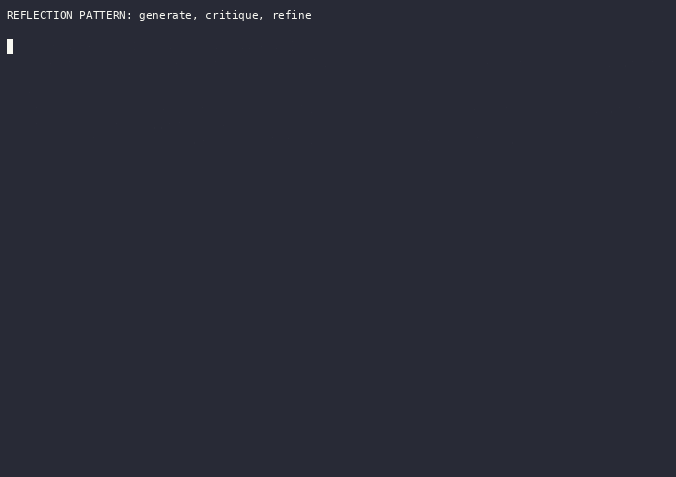

# Reflection

Reflection is the pattern where an agent evaluates its own work against explicit criteria and uses that evaluation to revise the work. A generator produces a draft, a critic names what is wrong with it, and a refiner rewrites the draft using that feedback; the three steps repeat until the output is good enough or a limit is hit. Current framework docs (LangGraph, OpenAI Agents SDK) call this same loop the evaluator-optimizer workflow.



_Recorded from `python3 -m patterns.reflection.main`, offline, no API key. Regenerate with `python3 tools/record_demos.py record-all`._

## When to use it

Reach for reflection when output quality matters more than latency and token cost: long-form writing, code generation checked against tests, multi-step plans, or any task with a clear notion of "better" and a cheap way to check it. It is strongest when a trustworthy external signal exists, such as a test suite, a compiler, or a scoring rubric. Skip it when a task is simple enough to get right in one shot, when the budget is tight, or when there is no external signal to ground the critique: a model grading its own reasoning from memory alone can leave accuracy flat or make it worse.

## How this example works

Every variant module builds three callables (generate, critique, refine) and hands them to one shared loop in `loop.py`. The loop checks its stop conditions in a fixed order every round and always returns the best-scoring draft seen, not simply the last one. Two of those stop conditions are optional and off by default: a pre-critique revision gate and a diminishing-returns stop, both wired through `run_reflection_loop`'s keyword arguments and exercised by `adaptive_stop.py`.

```mermaid
flowchart TD
    A[generate initial draft] --> G0{revision gate set and draft OK? (optional)}
    G0 -->|yes, skip| Z0[stop: gated_no_revision]
    G0 -->|no gate, or gate says REVISE| B[critique current draft]
    B --> C{critique empty?}
    C -->|yes| Z1[stop: keep draft unchanged]
    C -->|no| D{approved or score >= threshold?}
    D -->|yes| Z2[stop: approved / score_threshold]
    D -->|no| E2{diminishing-returns set and gain plateaued? (optional)}
    E2 -->|yes| Z6[stop: diminishing_returns]
    E2 -->|no| E{max_iterations reached?}
    E -->|yes| Z3[stop: max_iterations]
    E -->|no| F[refine draft using critique]
    F --> G{refinement blank?}
    G -->|yes| Z4[stop: keep prior draft]
    G -->|no| H{refinement identical to draft?}
    H -->|yes| Z5[stop: no-change convergence]
    H -->|no| I[current draft = refined draft]
    I --> B
```

The critique step itself is just another `Provider.complete()` call, so it can be replaced wholesale: a fixed local checker (`tool_grounded.py`), several independent lens critics fanned out and aggregated (`multi_critic.py`), one critic sampled several times and denoised (`sampled_verdict.py`), or skipped by a cheap gate before it ever runs (`adaptive_stop.py`).

## Variants implemented

- `self_refine.py`: single-model self-refinement (Self-Refine); one provider plays generator, critic, and refiner across separate calls, plus a guard demo showing an empty critique stopping the loop on round one.
- `generator_critic.py`: generator/critic separation using two independent providers, with the critic shown the draft as a submission from another author (external framing) to work around the self-correction blind spot.
- `rubric.py`: rubric-based structured critique with named dimensions and a score threshold that gates stopping, demonstrated with a score sequence that peaks then regresses to show best-so-far tracking.
- `tool_grounded.py`: tool-grounded critique (CRITIC), reframed as verifier-gated action; the critic is a deterministic local test runner, not a model, and a pass both stops the loop and authorizes a terminal action.
- `reflexion.py`: memory-augmented, Reflexion-style reflection across repeated attempts at one task, where a failed attempt's evaluator lesson is written to episodic memory and read by the next attempt.
- `multi_critic.py`: parallel specialist critics (correctness, style, safety) run independently on the same draft and combined by an aggregation policy (veto, mean, or weighted), with a weighted-policy demo where one heavily weighted lens flips the verdict.
- `sampled_verdict.py`: self-consistent judging, one critic sampled several times per round and aggregated by median score and majority approval, to denoise a single noisy judge call.
- `adaptive_stop.py`: a pre-critique revision gate that skips critique and refine entirely when a draft is already fine, plus a diminishing-returns stop that fires on a plateaued score before the iteration cap, distinct from the no-change guard.
- `reasoning_critic.py`: native reasoning self-critique read from the opaque `reasoning` channel, benchmarked against the explicit multi-call loop on the same task, with a decision rule for when to add the loop at all.

`loop.py` holds the shared engine (`Critique` parsing, `run_reflection_loop`, best-so-far tracking, the optional gate and diminishing-returns stop); `prompting.py` builds the common single-provider callables; `transcript.py` renders a readable transcript.

## Run it

```
python -m patterns.reflection.main
```

Expected output (truncated):

```
REFLECTION PATTERN: generate, critique, refine

=== 1. Self-refine (single model, all roles) ===
initial draft: A hash table stores data using keys. It is fast. ...
-- round 1 --
   critique: score=5 approved=False
   decision: refine
-- round 2 --
   critique: score=9 approved=True
   decision: stop: approved
stopped: approved after 2 round(s)
...
=== 6. Multi-critic aggregation (veto policy) ===
...
   critique: score=3 approved=False
             [correctness] SCORE: 9 ... [style] SCORE: 8 ... [safety] SCORE: 3 unverified claim ...
   decision: refine
...
8b. Adaptive stop: diminishing-returns stop
    round scores [5.0, 7.0, 7.2]: round 3's gain (0.2) is below epsilon (0.5)
    stopped: diminishing_returns after 3 round(s), never reaching the round-5 cap it was budgeted for
...
All nine sub-variants completed without exhausting their scripts.
```

## Real providers

Set `AGENTIC_PATTERNS_PROVIDER=openai` (with `OPENAI_API_KEY` set) or `AGENTIC_PATTERNS_PROVIDER=anthropic` (with `ANTHROPIC_API_KEY` set) to run the same code against a real model. Every demo function builds its provider through `agentic_patterns.get_provider`, so no source change is needed. Two exceptions never call a provider for critique by design: `tool_grounded.py`'s critique step is grounded in a local checker, and `adaptive_stop.py`'s gate skips critique entirely when it fires. `reasoning_critic.py` is worth pointing at a real reasoning model in particular; its whole point is comparing what that model's native `reasoning` channel already does against the explicit loop.

## Sources

- Aman Madaan et al., "Self-Refine: Iterative Refinement with Self-Feedback," NeurIPS 2023. arXiv:2303.17651.
- Noah Shinn et al., "Reflexion: Language Agents with Verbal Reinforcement Learning," NeurIPS 2023. arXiv:2303.11366.
- Zhibin Gou et al., "CRITIC: Large Language Models Can Self-Correct with Tool-Interactive Critiquing," ICLR 2024. arXiv:2305.11738.
- Jie Huang et al., "Large Language Models Cannot Self-Correct Reasoning Yet," ICLR 2024. arXiv:2310.01798.
- Sajad Mousavi et al., "N-Critics: Self-Refinement of Large Language Models with Ensemble of Critics," 2023. arXiv:2310.18679 (ensemble aggregation; reported plateau beyond about four critics).
- Lunjun Zhang et al., "Generative Verifiers: Reward Modeling as Next-Token Prediction," 2024. arXiv:2408.15240 (GenRM-CoT; majority-vote over sampled chain-of-thought verifications at inference).
- Ken Tsui, "Self-Correction Bench: Revealing and Addressing the Self-Correction Blind Spot in LLMs," July 2025. arXiv:2507.02778 (64.5% average blind-spot rate; appending "Wait" cuts it 89.3%).
- Chenlong Wang et al., "Wait, We Don't Need to 'Wait'! Removing Thinking Tokens Improves Reasoning Efficiency," June 2025. arXiv:2506.08343.
- "Don't Overthink It: A Survey of Efficient R1-style Large Reasoning Models," 2025. arXiv:2508.02120 (overthinking as measured degradation).
- "100 Days After DeepSeek-R1: A Survey on Replication Studies and More Directions for Reasoning Language Models," 2025. arXiv:2505.00551 (native self-verification; re-checking and self-overturning of correct answers).
- Tae-Eun Song, "Cross-Context Review: Improving LLM Output Quality by Separating Production and Review Sessions," 2026. arXiv:2603.12123 (fresh-session review F1 28.6% vs same-session 24.6%; reviewing twice in-session did not beat once).
- Hongxu Zhou, "From Hallucination to Structure Snowballing: The Alignment Tax of Constrained Decoding in LLM Reflection," 2026. arXiv:2604.06066 (structure snowballing is a constrained-decoding failure, not a round-count one).
- Antonio Gulli, _Agentic Design Patterns: A Hands-On Guide to Building Intelligent Systems_ (Springer, 2025), Chapter 4 "Reflection".
- LangChain, "Reflection Agents," langchain.com blog.
- LangGraph reflection package, a main agent plus a critique agent looping generate-reflect-regenerate. github.com/langchain-ai/langgraph-reflection
- OpenAI Agents SDK guardrails, output guardrail with `tripwire_triggered` and conditional (non-parallel) execution to avoid spending the evaluator. openai.github.io/openai-agents-python/guardrails/
