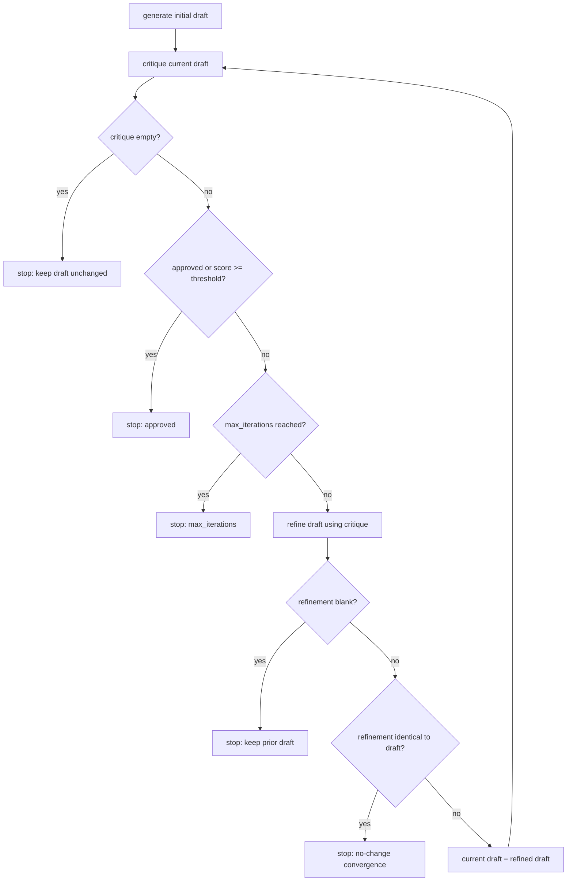

# Reflection

Reflection is the pattern where an agent evaluates its own work against explicit criteria and uses that evaluation to revise the work. A generator produces a draft, a critic names what is wrong with it, and a refiner rewrites the draft using that feedback; the three steps repeat until the output is good enough or a limit is hit. Current framework docs (LangGraph, OpenAI Agents SDK) call this same loop the evaluator-optimizer workflow.

## When to use it

Reach for reflection when output quality matters more than latency and token cost: long-form writing, code generation checked against tests, multi-step plans, or any task with a clear notion of "better" and a cheap way to check it. It is strongest when a trustworthy external signal exists, such as a test suite, a compiler, or a scoring rubric. Skip it when a task is simple enough to get right in one shot, when the budget is tight, or when there is no external signal to ground the critique: a model grading its own reasoning from memory alone can leave accuracy flat or make it worse.

## How this example works

Every variant module builds three callables (generate, critique, refine) and hands them to one shared loop in `loop.py`. The loop checks its stop conditions in a fixed order every round and always returns the best-scoring draft seen, not simply the last one.



## Variants implemented

- `self_refine.py`: single-model self-refinement (Self-Refine); one provider plays generator, critic, and refiner across separate calls, plus a guard demo showing an empty critique stopping the loop on round one.
- `generator_critic.py`: generator/critic separation using two independent providers, with the critic shown the draft as a submission from another author (external framing) to work around the self-correction blind spot.
- `rubric.py`: rubric-based structured critique with named dimensions and a score threshold that gates stopping, demonstrated with a score sequence that peaks then regresses to show best-so-far tracking.
- `tool_grounded.py`: tool-grounded critique (CRITIC), reframed as verifier-gated action; the critic is a deterministic local test runner, not a model, and a pass both stops the loop and authorizes a terminal action.
- `reflexion.py`: memory-augmented, Reflexion-style reflection across repeated attempts at one task, where a failed attempt's evaluator lesson is written to episodic memory and read by the next attempt.

`loop.py` holds the shared engine (`Critique` parsing, `run_reflection_loop`, best-so-far tracking); `prompting.py` builds the common single-provider callables; `transcript.py` renders a readable transcript.

## Run it

```
python -m patterns.reflection.main
```

Expected output (truncated):

```
REFLECTION PATTERN: generate, critique, refine

=== 1. Self-refine (single model, all roles) ===
initial draft: A hash table stores data using keys. It is fast. ...
-- round 1 --
   critique: score=5 approved=False
   decision: refine
-- round 2 --
   critique: score=9 approved=True
   decision: stop: approved
stopped: approved after 2 round(s)
...
All five sub-variants completed without exhausting their scripts.
```

## Real providers

Set `AGENTIC_PATTERNS_PROVIDER=openai` (with `OPENAI_API_KEY` set) or `AGENTIC_PATTERNS_PROVIDER=anthropic` (with `ANTHROPIC_API_KEY` set) to run the same code against a real model. Every demo function builds its provider through `agentic_patterns.get_provider`, so no source change is needed; only `tool_grounded.py`'s critique step never calls a provider, by design, since it is grounded in a local checker instead.

## Sources

- Madaan et al., "Self-Refine: Iterative Refinement with Self-Feedback," NeurIPS 2023. arXiv:2303.17651.
- Shinn et al., "Reflexion: Language Agents with Verbal Reinforcement Learning," NeurIPS 2023. arXiv:2303.11366.
- Gou et al., "CRITIC: Large Language Models Can Self-Correct with Tool-Interactive Critiquing," ICLR 2024. arXiv:2305.11738.
- Huang et al., "Large Language Models Cannot Self-Correct Reasoning Yet," ICLR 2024. arXiv:2310.01798.
- Antonio Gulli, _Agentic Design Patterns: A Hands-On Guide to Building Intelligent Systems_ (Springer, 2025), Chapter 4 "Reflection".
- LangChain, "Reflection Agents," langchain.com blog.
