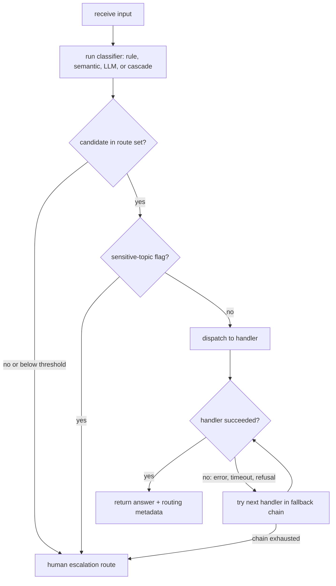

# Routing

Routing is the pattern of classifying an input and directing it to a specialized downstream handler: a different prompt, a tool or sub-agent, or a different model. It separates the decision of "who should answer this" from the answering itself, so each handler stays narrow instead of one general prompt covering every case. The classifier can be a rule, an embedding comparison, an LLM prompt, or a trained model, and it works at two altitudes: task routing (billing questions to the billing handler) and model routing (easy questions to a cheap model, hard ones to a strong model).

## When to use it

Use routing when the input space splits into distinct categories better handled separately, and classification can be done accurately: you are stuffing one prompt with conditional instructions for unrelated cases, different inputs need different tools or safety rules, or most traffic is easy and a minority is hard. Model routing pays off when a cheap model answers the common case and a strong model is reserved for the tail.

Avoid routing when categories overlap heavily or the boundary is fuzzy, since a wrong route sends the input to a handler that cannot recover. Avoid it when the classifier costs about as much as answering with the strong model, which erases the savings. For a few stable categories a plain rule table beats any learned router, and if one general prompt already performs well, routing adds moving parts for no gain.

## How this example works

Every classifier in this folder returns the same `RouteDecision` shape (route, score, method, attempts, metadata), defined once in `registry.py`, so a caller can inspect any decision the same way regardless of which variant produced it. `RouteRegistry` holds named routes with a description, example utterances, a handler, and a tier; `validate()` and `dispatch()` implement the "check the candidate against the route set" and "run the handler" steps every variant shares.



## Variants implemented

- `rule_based.py`: keyword/regex dispatch, standard library only, no model call.
- `semantic.py`: embedding-similarity routing using `HashEmbedder` and `cosine_similarity`, per-route utterance vectors, and a below-threshold "no match" default.
- `llm_classifier.py`: an LLM returns a structured `ROUTE: <name>` label, validated against the route set, with fallback on an invalid or missing label.
- `cascade.py`: cost/quality cascade (try the cheap tier, escalate on a failed quality check) and capability model selection (decide the tier up front from a difficulty heuristic), plus a baseline comparison against random-choice and always-strong routers.
- `fallback.py`: an ordered chain of handlers tried until one succeeds, covering a simulated timeout, a refusal, and a raised error, with a terminal human route if every handler fails.
- `escalation.py`: human escalation triggered by a below-threshold score or a sensitive-topic keyword; a sensitive-topic flag overrides even a fully confident decision, so a misroute never routes a sensitive input to a weaker handler.
- `reasoning_mode.py`: a binary "reason or not" router, distinct from tier or category selection, that decides whether a prompt gets a chain-of-thought system prompt.
- `handoff.py`: the triage model transfers the conversation to a sub-agent by calling a `transfer_to_<name>` tool; the sub-agent then owns the rest of the conversation instead of returning through triage.

Skipped: trained-classifier / learned routing (RouteLLM-style). The brief's must-cover checklist does not list it as required, and a faithful offline version would need a real labeled preference dataset and a training dependency outside this repo's stdlib-plus-`httpx` scope; the taxonomy and its accuracy caveats are covered in this README's Sources instead.

## Run it

```
python -m patterns.routing.main
```

Expected output (truncated):

```
ROUTING PATTERN: classify, then dispatch

=== 1. Rule-based routing ===
route: billing  (method=rule, score=1.000, attempts=1)
  matched_keyword: charge
...
=== 6b. Human escalation (sensitive topic overrides confidence) ===
route: human  (method=escalation, score=0.900, attempts=1)
  escalation_reason: sensitive_topic
  original_route: billing
...
All eight sub-variants and the end-to-end pipeline completed without exhausting their scripts.
```

## Real providers

Set `AGENTIC_PATTERNS_PROVIDER=openai` (with `OPENAI_API_KEY` set) or `AGENTIC_PATTERNS_PROVIDER=anthropic` (with `ANTHROPIC_API_KEY` set) to run the same code against a real model. Every demo function that calls a model builds its provider through `agentic_patterns.get_provider`, so no source change is needed. `rule_based.py` and `semantic.py` make no model call at all and are unaffected by this setting; set `AGENTIC_PATTERNS_EMBEDDER=openai` (with `OPENAI_API_KEY` set) to route `semantic.py` through real embeddings instead of the deterministic hash embedder.

## Sources

- Antonio Gulli, _Agentic Design Patterns_ (Springer, 2025), Chapter 2 "Routing." LLM-based, embedding-based, and rule/ML routing with LangChain/LangGraph, CrewAI, and Google ADK.
- Chip Huyen, _AI Engineering_ (O'Reilly, 2025). Router (intent classifier) and model gateway: cheap-model routing, centralized access, fallback.
- Anthropic, "Building Effective Agents" (2024), Routing section: classify and dispatch; easy questions to a small model, hard ones to a capable model. https://www.anthropic.com/engineering/building-effective-agents
- Chen, Zaharia, Zou, "FrugalGPT" (2023). LLM cascade with router, quality estimator, and stop judge. https://arxiv.org/abs/2305.05176
- Ong et al., "RouteLLM: Learning to Route LLMs with Preference Data" (2024). Learned routers from preference data; treat the reported roughly 2x cost reduction as workload specific, since LLMRouterBench (Li et al., arXiv:2601.07206) finds many routers near a random or single-strong-model baseline under unified evaluation. https://arxiv.org/abs/2406.18665
- Wang et al., "When to Reason: Semantic Router for vLLM" (2025). Reasoning-mode routing: 10.2-point MMLU-Pro gain with 47.1% lower latency and 48.5% fewer tokens versus always reasoning. https://arxiv.org/abs/2510.08731
- Kassem, Scholkopf, Jin, "How Robust Are Router-LLMs?" (2025). Preference-trained routers misroute by category, including sending adversarial inputs to weaker handlers; sensitive inputs should escalate up, never down. https://arxiv.org/abs/2504.07113
