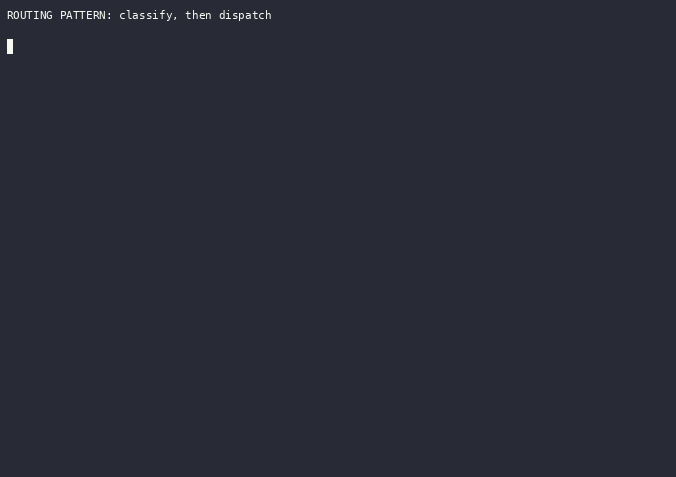
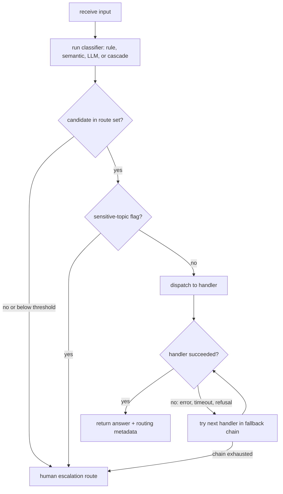

# Routing

Routing is the pattern of classifying an input and directing it to a specialized downstream handler: a different prompt, a tool or sub-agent, or a different model. It separates the decision of "who should answer this" from the answering itself, so each handler stays narrow instead of one general prompt covering every case. The classifier can be a rule, an embedding comparison, an LLM prompt, or a trained model, and it works at two altitudes: task routing (billing questions to the billing handler) and model routing (easy questions to a cheap model, hard ones to a strong model).



_Recorded from `python3 -m patterns.routing.main`, offline, no API key. Regenerate with `python3 tools/record_demos.py record-all`._

## When to use it

Use routing when the input space splits into distinct categories better handled separately, and classification can be done accurately: you are stuffing one prompt with conditional instructions for unrelated cases, different inputs need different tools or safety rules, or most traffic is easy and a minority is hard. Model routing pays off when a cheap model answers the common case and a strong model is reserved for the tail.

Avoid routing when categories overlap heavily or the boundary is fuzzy, since a wrong route sends the input to a handler that cannot recover. Avoid it when the classifier costs about as much as answering with the strong model, which erases the savings. For a few stable categories a plain rule table beats any learned router, and if one general prompt already performs well, routing adds moving parts for no gain.

## How this example works

Every classifier in this folder returns the same `RouteDecision` shape (route, score, method, attempts, metadata), defined once in `registry.py`, so a caller can inspect any decision the same way regardless of which variant produced it. `RouteRegistry` holds named routes with a description, example utterances, a handler, and a tier; `validate()` and `dispatch()` implement the "check the candidate against the route set" and "run the handler" steps every variant shares.



This is the category/tier dispatch pipeline; `router_eval.py` and `threshold_sweep.py` evaluate routers offline rather than sit in this runtime path, and `verified_cascade.py` is a second, three-tier cascade (cheap, strong, human) that swaps the sensitive-topic escalation for a model-judge verdict. One more safety branch is not pictured: `reasoning_mode.py`'s decision (reason or answer directly) is a separate axis from the one this diagram dispatches, and `reasoning_mode.enforce_reasoning_safety` applies the same sensitive-topic override to it, so a sensitive input never lands on the no-reasoning path either.

## Variants implemented

- `rule_based.py`: keyword/regex dispatch, standard library only, no model call.
- `semantic.py`: embedding-similarity routing using `HashEmbedder` and `cosine_similarity`, per-route utterance vectors, and a below-threshold "no match" default.
- `llm_classifier.py`: an LLM returns a structured `ROUTE: <name>` label, validated against the route set, with fallback on an invalid or missing label.
- `cascade.py`: cost/quality cascade (try the cheap tier, escalate on a failed quality check) and capability model selection (decide the tier up front from a difficulty heuristic), plus a baseline comparison against random-choice and always-strong routers.
- `fallback.py`: an ordered chain of handlers tried until one succeeds, covering a simulated timeout, a refusal, and a raised error, with a terminal human route if every handler fails.
- `escalation.py`: human escalation triggered by a below-threshold score or a sensitive-topic keyword; a sensitive-topic flag overrides even a fully confident decision, so a misroute never routes a sensitive input to a weaker handler.
- `reasoning_mode.py`: a binary "reason or not" router, distinct from tier or category selection, that decides whether a prompt gets a chain-of-thought system prompt.
- `handoff.py`: the triage model transfers the conversation to a sub-agent by calling a `transfer_to_<name>` tool; the sub-agent then owns the rest of the conversation instead of returning through triage.
- `router_eval.py`: benchmarks every router above against random-choice, always-cheapest, always-strongest, and an oracle, charging each router its own classifier overhead, reproducing LLMRouterBench's "many routers barely beat a baseline" finding at a small offline scale.
- `threshold_sweep.py`: a continuous score against a swept threshold, RouteLLM's operating shape, tracing the cost-quality frontier and picking the threshold that meets a cost budget.
- `verified_cascade.py`: a three-tier cascade (cheap, strong, human) gated by a scripted model judge at each hop instead of `cascade.py`'s length-plus-hedge heuristic, abstaining to a human when even the strong tier fails review.
- `robustness.py`: measures how often the rule-based, semantic, and reasoning-mode routers flip their route under a meaning-preserving paraphrase, and asserts the safety invariant that a sensitive or adversarial-flavored input never flips toward a weaker handler or a no-reasoning mode.

Skipped: training a learned router (RouteLLM's matrix factorization or BERT classifier). Training needs a labeled preference dataset and a training dependency outside this repo's stdlib-plus-`httpx` scope. The operable half of RouteLLM, a continuous score against a swept threshold, is not skipped: `threshold_sweep.py` builds it offline, without the training step.

## Run it

```
python -m patterns.routing.main
```

Expected output (truncated):

```
ROUTING PATTERN: classify, then dispatch

=== 1. Rule-based routing ===
route: billing  (method=rule, score=1.000, attempts=1)
  matched_keyword: charge
...
=== 6b. Human escalation (sensitive topic overrides confidence) ===
route: human  (method=escalation, score=0.900, attempts=1)
  escalation_reason: sensitive_topic
  original_route: billing
...
9. Router benchmark: every router vs. random, always-cheap/strong, and an oracle
router           dataset   accuracy    cost  beats_random  beats_strong$  oracle_gap           verdict
oracle           category     1.000     8.0          True            n/a       0.000        (baseline)
...
cascade          tier         1.000    48.0          True           True       0.000  earns_complexity
select_tier      tier         1.000    44.0          True           True       0.000  earns_complexity
...
    escalation safety invariant: passed
    reasoning-mode safety invariant: passed
...
All twelve sub-variants and the end-to-end pipeline completed without exhausting their scripts.
```

## Real providers

Set `AGENTIC_PATTERNS_PROVIDER=openai` (with `OPENAI_API_KEY` set) or `AGENTIC_PATTERNS_PROVIDER=anthropic` (with `ANTHROPIC_API_KEY` set) to run the same code against a real model. Every demo function that calls a model builds its provider through `agentic_patterns.get_provider`, so no source change is needed. `rule_based.py` and `semantic.py` make no model call at all and are unaffected by this setting; set `AGENTIC_PATTERNS_EMBEDDER=openai` (with `OPENAI_API_KEY` set) to route `semantic.py` through real embeddings instead of the deterministic hash embedder.

## Measured

Against Gemini 3.1 Flash-Lite on 24 tier-labeled prompts, the semantic router matched the correct tier 96% of the time (the LLM-classifier router 88%, an always-strong baseline 50%), while projecting about half the answer cost of sending every task to the strong model. Full method and numbers in [RESULTS.md](../../RESULTS.md#routing-match-the-strong-models-choices-for-half-the-cost).

## Sources

- Antonio Gulli, _Agentic Design Patterns_ (Springer, 2025), Chapter 2 "Routing." LLM-based, embedding-based, and rule/ML routing with LangChain/LangGraph, CrewAI, and Google ADK.
- Chip Huyen, _AI Engineering_ (O'Reilly, 2025). Router (intent classifier) and model gateway: cheap-model routing, centralized access, fallback.
- Anthropic, "Building Effective Agents" (2024), Routing section: classify and dispatch; easy questions to a small model, hard ones to a capable model. https://www.anthropic.com/engineering/building-effective-agents
- Lingjiao Chen, Matei Zaharia, James Zou, "FrugalGPT: How to Use Large Language Models While Reducing Cost and Improving Performance." arXiv:2305.05176. LLM cascade: router, quality estimator, stop judge; the model-based verifier `verified_cascade.py` builds. https://arxiv.org/abs/2305.05176
- Isaac Ong, Amjad Almahairi, Vincent Wu, Wei-Lin Chiang, Tianhao Wu, Joseph E. Gonzalez, M. Waleed Kadous, Ion Stoica, "RouteLLM: Learning to Route LLMs with Preference Data." arXiv:2406.18665. Learned router predicts a win-rate score; a swept threshold trades cost for quality, the operating shape `threshold_sweep.py` builds without the training. https://arxiv.org/abs/2406.18665
- Chen Wang, Xunzhuo Liu, Yuhan Liu, Yue Zhu, Xiangxi Mo, Junchen Jiang, Huamin Chen, "When to Reason: Semantic Router for vLLM." arXiv:2510.08731. Reasoning-mode routing: 10.2-point MMLU-Pro gain with 47.1% lower latency and 48.5% fewer tokens versus always reasoning. https://arxiv.org/abs/2510.08731
- Aly M. Kassem, Bernhard Scholkopf, Zhijing Jin, "How Robust Are Router-LLMs? Analysis of the Fragility of LLM Routing Capabilities." arXiv:2504.07113. DSC benchmark; category-driven misrouting; jailbreaks routed to weaker models; preference-data privacy and backdoor exposure. https://arxiv.org/abs/2504.07113
- Hao Li, Yiqun Zhang, Zhaoyan Guo, Chenxu Wang, Shengji Tang, Qiaosheng Zhang, Yang Chen, Biqing Qi, Peng Ye, Lei Bai, Zhen Wang, Shuyue Hu, "LLMRouterBench: A Massive Benchmark and Unified Framework for LLM Routing." arXiv:2601.07206. 400K instances, 21 datasets, 33 models, 10 baselines; many routers, commercial included, fail to reliably beat a simple baseline; oracle gap is model-recall. `router_eval.py` reproduces this methodology offline. https://arxiv.org/abs/2601.07206
- Claudio Fanconi, Mihaela van der Schaar, "Cascaded Language Models for Cost-effective Human-AI Decision-Making." arXiv:2506.11887. Deferral policy (confidence decides accept-cheap or regenerate-with-large) plus abstention policy (escalate to a human on high uncertainty); the cheap/strong/human shape `verified_cascade.py` builds. https://arxiv.org/abs/2506.11887
- Michael J. Zellinger, Rex Liu, Matt Thomson, "Cost-Saving LLM Cascades with Early Abstention." arXiv:2502.09054. Tuned confidence thresholds with early abstention; 13.0% cost and 5.0% error reduction for a 4.1% abstention increase over six benchmarks. https://arxiv.org/abs/2502.09054
