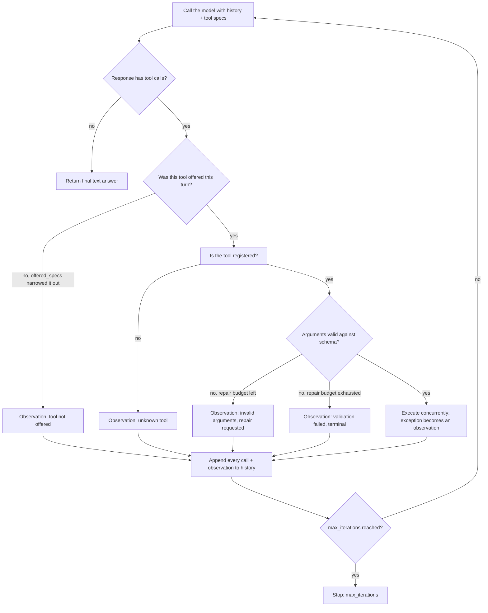

# Tool use / function calling

Tool use (function calling) is the pattern where a model, instead of only producing free text, emits a structured request to invoke an external function. The app describes a catalog of tools, each with a name, description, and JSON Schema of parameters; the model reads the request plus the catalog and decides whether to answer directly or return a tool name and typed arguments. The app parses that call, validates it, runs the real function, and feeds the result back so the model can call more tools or produce a final answer. The model never runs code itself; it only proposes calls, and the runtime executes them inside a controlled boundary.

## When to use it

Use tool calling when the task needs information the model does not hold, exact or verifiable computation, or an effect in an external system, or when a typed payload beats prose parsed with regexes. Skip it when one deterministic function would always be called regardless of input (call it directly), when the task is pure generation with no external dependency, or when the latency and cost of extra model turns cannot be absorbed. A large tool catalog also degrades selection accuracy: RAG-MCP measured baseline selection accuracy collapsing to 13.6 percent on a catalog flooded with near-duplicate tools, recovered to 43.1 percent by retrieval-based selection, which is what `tool_search.py` now demonstrates directly instead of only asserting.

## How this example works

Most variant modules build a `ToolRegistry` and a scripted `MockProvider`, then drive them through the one shared engine in `loop.py`. The engine rejects any call to a tool that was not in this turn's offered specs, validates the rest against their tool's schema, executes valid calls (concurrently within a turn), turns rejections, validation failures, and raised exceptions into observations, and stops when the model returns plain text or an iteration cap is hit.

Two modules deliberately do not go through `loop.py`, because their whole point is a different control flow: `error_recovery.py` runs its own classify-then-route loop, since a class-routed transient retry happens against the real tool with no extra model round trip, something `run_tool_loop`'s single retry budget cannot express; `code_action.py` replaces the validate-execute-observe cycle with one `exec` call against a restricted namespace, since the point is keeping many tool calls out of the message history entirely, not validating and appending each one. The diagram below describes `run_tool_loop`, the engine every other module (including `constrained_decoding.py`'s repair-avoidance contrast) shares.



`error_recovery.py`'s loop replaces step E and F with a four-way classifier (transient, permanent, malformed_args, implicit) that routes to a distinct strategy per class instead of one repair budget; see that module's docstring for its own control-flow description.

## Variants implemented

- `schema.py`: `auto_tool`, a decorator that derives a tool's JSON Schema and description from its type hints and Google-style docstring, so no schema is written by hand.
- `catalog.py`: the shared read-only ops-assistant tools (weather, currency conversion, order and customer lookup) most other modules reuse, registered through `auto_tool`.
- `single_shot.py`: one call, one final answer, the base case of the canonical control flow.
- `sequential.py`: a two-step agentic loop where the second call's arguments come from the first call's observation.
- `parallel.py`: three independent calls in one turn, executed concurrently with a thread pool, observations recombined in call order.
- `forced_choice.py`: `tool_choice` semantics (`none`, `required`, a named tool) reproduced at the app layer, since the shared `Provider.complete()` contract has no native `tool_choice` field.
- `structured_output.py`: the degenerate forced-tool case, extraction with no side effect, answered in one round trip since the call's arguments are the answer.
- `validation.py`: argument validation against a tool's schema with a self-repair turn on a structural error, plus a pointer to `constrained_decoding.py` for the generation-time alternative to this after-the-fact repair.
- `guardrails.py`: tool-execution errors, unknown-tool names, an exhausted repair budget, and a model that never stops calling tools, none of which crash the loop; its docstring now names the limit these four undifferentiated guardrails share and points to `error_recovery.py` for the class-routed upgrade.
- `write_action.py`: a write-action tool gated behind a `confirmed` flag, unlocked by a simulated elicitation step (accept/decline), the same accept/decline/cancel model MCP's `elicitation/create` standardizes.
- `code_execution.py`: programmatic tool calling in its linear form: a multi-step plan is run locally in one pass instead of one model round trip per step. Its docstring is now scoped honestly: this is not code-as-action (no loops, no branches); see `code_action.py` for the Turing-complete form.
- `tool_search.py`: retrieval-based tool selection at flooded catalog scale. `build_flooded_registry` adds six near-duplicate distractor tools to the ten-tool catalog, and three demos now show what a ten-tool demo could only assert: offering the whole flooded catalog collapses selection to a plausible-but-wrong distractor, top-k retrieval restores the right pick at a fraction of the offered tokens, and a one-shot top-k retrieval can itself miss the right tool, recoverable only by widening k and re-offering.
- `concepts.py`: conceptual, non-runnable notes on learned tool use (Toolformer) and neuro-symbolic routing (MRKL), the latter repointed to `patterns/routing/` as the correct neighbor pattern (not multi-agent); it also records that retrieval-based selection and code-as-action, concept-only in the original taxonomy, are runnable here because both became first-party API primitives after the brief's base sources.
- `constrained_decoding.py`: schema-grammar token masking at generation time. Compiles a tool's JSON Schema into a per-field grammar, splits legality checks XGrammar-style into a context-independent enum precheck (built once, at compile time) and a context-dependent number check (a regex run per candidate), and masks a scripted ranked-preference stream down to the legal tokens at each step. Contrasts the masked call against an unmasked argmax decode that `validate_arguments` rejects, the exact repair round trip masking avoids paying.
- `error_recovery.py`: class-routed tool-failure recovery. Classifies each failed call into transient, permanent, malformed_args, or implicit (empty-result) and routes each to its own strategy: bounded retry with a per-tool budget shared across the whole run, substitution from a small alias map, the existing repair path, or an injected verify observation instead of silently accepting an empty result.
- `code_action.py`: code-as-action with real control flow. One `run_python` action executes a scripted code string against a restricted namespace exposing every registered tool as a plain callable; loops, branches, and comprehensions run many tool calls inside one `exec`, and only the final `result` re-enters the conversation, collapsing many tool calls into one observation the way `code_execution.py`'s linear step list cannot.

Learned tool use (Toolformer) needs a real fine-tuning run and MRKL needs a genuine multi-module router; both stay as notes in `concepts.py` rather than half-built demos. Speculative or optimistic tool execution, MCP protocol-level dynamic discovery, LLMCompiler as a standalone DAG planner, deterministic pre-tool policy gates, and a pass^k reliability harness were all considered and left out of this folder; see `docs/research/tool_use_deep.md`'s "Explicitly rejected" section for why each belongs to a different pattern or needs a real training run.

## Run it

```
python3 -m patterns.tool_use.main
```

Expected output (abridged):

```
TOOL USE PATTERN: model proposes calls, app validates and executes them

=== 1. Schema autogeneration (decorator-based registry) ===
derived description: Convert an amount between currencies using fixed demo exchange rates.
...
=== 6. Argument validation with self-repair (structural error) ===
  round 1 [repair_requested]: {'amount': '100', ...} -> ERROR: invalid arguments: field 'amount' expected type number, got str
  round 2 [ok]: {'amount': 100, ...} -> 100 USD = 92.00 EUR
...
=== 10a. Tool retrieval at scale: flooded catalog collapses selection ===
picked: 'exchange_rate_convert' (WRONG, a plausible near-duplicate)
...
=== 12. Constrained decoding: schema-grammar token masking ===
  field=amount: ranked=['hundred', '100'] blocked=['hundred'] emitted='100'
masked call:   {'amount': 100, 'currency': 'EUR'} (validate_arguments errors: none)
unmasked call: {'amount': 'hundred', 'currency': 'JPY'} (validate_arguments errors: ["field 'amount' expected type number, got str"])
...
=== 13c. Error recovery: all four classes routed in one run ===
  convert_currency: classification=malformed_args strategy=repair_requested
  get_weather: classification=transient strategy=retried x1, succeeded
  lookup_order: classification=permanent strategy=substituted 'lookup_order_backup'
  get_customer_email: classification=implicit strategy=verify_injected
...
All fourteen sub-variants completed without exhausting their scripts.
```

## Real providers

Every demo builds its provider through `agentic_patterns.get_provider`, which defaults to `MockProvider`. Set one of these to run the identical loop code against a real API instead:

- `AGENTIC_PATTERNS_PROVIDER=openai` plus `OPENAI_API_KEY` (and optionally `OPENAI_MODEL`, `OPENAI_BASE_URL`).
- `AGENTIC_PATTERNS_PROVIDER=anthropic` plus `ANTHROPIC_API_KEY` (and optionally `ANTHROPIC_MODEL`).

`tool_search.py` also honors `AGENTIC_PATTERNS_EMBEDDER=openai` (with `OPENAI_API_KEY`) to rank tools with real embeddings instead of `HashEmbedder`. `constrained_decoding.py` and `error_recovery.py`'s failure classification are app-level mechanisms that do not call a provider at all (or, for `error_recovery.py`'s tool calls, call one exactly as every other module does), so they behave identically under a real provider.

## Sources

- Chip Huyen, _AI Engineering_ (O'Reilly), Chapter 6 on agents: the three tool categories, tool selection, and failure modes.
- Anthropic engineering: "Tool use with Claude," "Writing effective tools for AI agents," "Advanced tool use" (Tool Search Tool, about 85 percent token reduction), and "Code execution with MCP" (Nov 2025, 150K to 2K token workflow claim, a vendor engineering claim rather than a measured benchmark).
- OpenAI function-calling / tools docs: the `tools` array, `tool_choice` (`auto` / `required` / `none` / named), and parallel tool calls; OpenAI's `strict: true` and Anthropic's structured-outputs beta as the production constrained-decoding primitives `constrained_decoding.py` mirrors.
- Schick et al., "Toolformer: Language Models Can Teach Themselves to Use Tools" (Meta AI, 2023).
- Karpas et al., "MRKL Systems" (AI21 Labs, 2022).
- Model Context Protocol spec 2025-06-18: structured tool output (`outputSchema`) and elicitation (`elicitation/create`). Separately, SEP-1821 (Dynamic Tool Discovery) is a draft proposal opened November 2025, not part of any released spec revision.
- Xingyao Wang, Yangyi Chen, Lifan Yuan, Yizhe Zhang, Yunzhu Li, Hao Peng, Heng Ji, "Executable Code Actions Elicit Better LLM Agents," ICML 2024. arXiv:2402.01030 (CodeAct, up to 20 percent higher success than text/JSON action formats; `code_action.py`).
- Sehoon Kim et al., "An LLM Compiler for Parallel Function Calling," ICML 2024. arXiv:2312.04511 (LLMCompiler, the parallel-DAG relative of `code_action.py`; cited as background, not built here, since a standalone DAG planner is `patterns/planning/` territory).
- Yixin Dong, Charlie F. Ruan, Yaxing Cai, Ruihang Lai, Ziyi Xu, Yilong Zhao, Tianqi Chen, "XGrammar: Flexible and Efficient Structured Generation Engine for Large Language Models," MLSys 2025. arXiv:2411.15100 (the context-independent/context-dependent token split `constrained_decoding.py` reproduces).
- Saibo Geng et al., "JSONSchemaBench: A Rigorous Benchmark of Structured Outputs for Language Models," 2025. arXiv:2501.10868 (coverage varies sharply by framework and difficulty across 9,558 schemas: Guidance reaches about 86 percent on easy schemas, Outlines alone collapses to about 3 percent on the hardest, and XGrammar falls only to about 28 percent there).
- Yao et al., "τ-bench: A Benchmark for Tool-Agent-User Interaction in Real-World Domains," 2024. arXiv:2406.12045 (pass^k reliability metric; motivates `error_recovery.py`, the measurement harness itself is `patterns/evaluation/` territory).
- Victor Barres, Honghua Dong, Soham Ray, Xujie Si, Karthik Narasimhan, "τ²-Bench: Evaluating Conversational Agents in a Dual-Control Environment," 2025. arXiv:2506.07982 (pass@1 drop up to 40 percent solo to dual control; background motivation, not built).
- Dongsheng Zhu, Xuchen Ma, Yucheng Shen, Xiang Li, Yukun Zhao, Shuaiqiang Wang, Lingyong Yan, Dawei Yin, "When Tools Fail: Benchmarking Dynamic Replanning and Anomaly Recovery in LLM Agents," 2026. arXiv:2606.05806 (ToolMaze, 2x2 perturbation taxonomy and the over-trust and futile-loop findings `error_recovery.py` answers).
- Sri Vatsa Vuddanti, Aarav Shah, Satwik Kumar Chittiprolu, Tony Song, Sunishchal Dev, Kevin Zhu, Maheep Chaudhary, "PALADIN: Self-Correcting Language Model Agents to Cure Tool-Failure Cases," 2025. arXiv:2509.25238 (keyed recovery lookup over ToolScan error types; `error_recovery.py` borrows only the inference-time lookup, not the LoRA training).
- Harsh Soni, "ToolFailBench: Diagnosing Tool-Use Failures in LLM Agents," 2026. arXiv:2607.04686 (Tool-Skip, Result-Ignore, Output-Fabrication, Unnecessary-Tool-Use; the source for `error_recovery.py`'s "implicit" class).
- Vikas Reddy, Sumanth Reddy Challaram, Abhishek Basu, "Reason Less, Verify More: Deterministic Gates Recover a Silent Policy-Violation Failure Mode in Tool-Using LLM Agents," 2026. arXiv:2607.07405 (deterministic pre-tool policy gates; rejected here, that territory is `patterns/guardrails/`).
- "RAG-MCP: Mitigating Prompt Bloat in LLM Tool Selection via Retrieval-Augmented Generation," 2025. arXiv:2505.03275 (selection accuracy raised from 13.6 to 43.1 percent by retrieval, over 50 percent token cut; the source `tool_search.py`'s flood/retrieval/recall-miss demos reproduce).
- "ScaleMCP: Dynamic and Auto-Synchronizing Model Context Protocol Tools for LLM Agents," 2025. arXiv:2505.06416 (agent-driven retrieval over thousands of servers; the model for `tool_search.py`'s widen-and-re-offer recall-miss recovery).
- "LiveMCPBench: Can Agents Navigate an Ocean of MCP Tools?," 2025. arXiv:2508.01780 (background).
