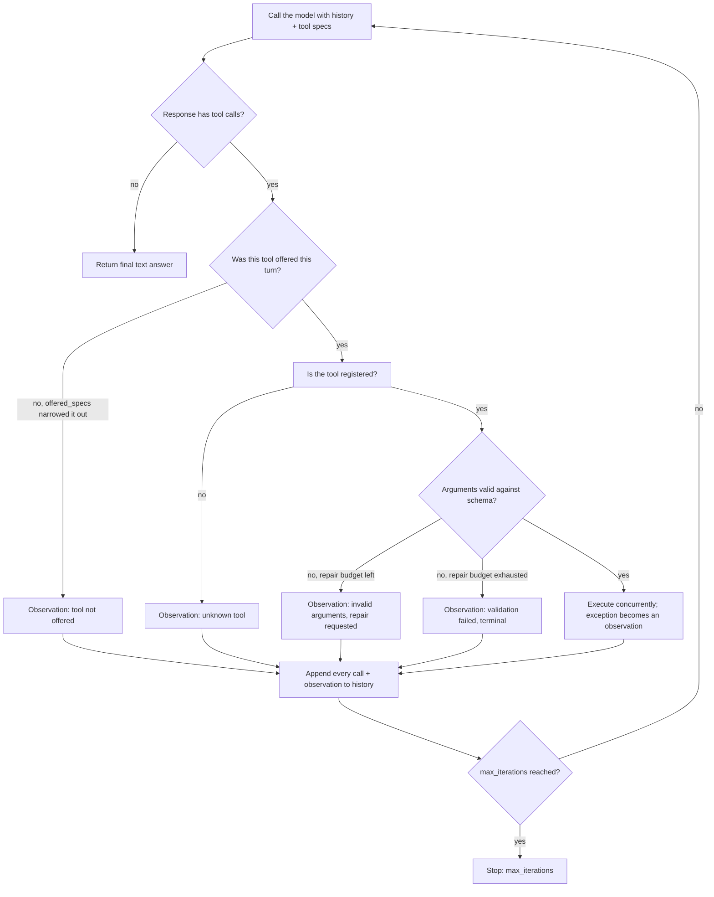

# Tool use / function calling

Tool use (function calling) is the pattern where a model, instead of only producing free text, emits a structured request to invoke an external function. The app describes a catalog of tools, each with a name, description, and JSON Schema of parameters; the model reads the request plus the catalog and decides whether to answer directly or return a tool name and typed arguments. The app parses that call, validates it, runs the real function, and feeds the result back so the model can call more tools or produce a final answer. The model never runs code itself; it only proposes calls, and the runtime executes them inside a controlled boundary.

## When to use it

Use tool calling when the task needs information the model does not hold, exact or verifiable computation, or an effect in an external system, or when a typed payload beats prose parsed with regexes. Skip it when one deterministic function would always be called regardless of input (call it directly), when the task is pure generation with no external dependency, or when the latency and cost of extra model turns cannot be absorbed. A large tool catalog also degrades selection accuracy, which is why `tool_search.py` exists.

## How this example works

Every variant module builds a `ToolRegistry` and a scripted `MockProvider`, then drives them through the one shared engine in `loop.py`. The engine rejects any call to a tool that was not in this turn's offered specs, validates the rest against their tool's schema, executes valid calls (concurrently within a turn), turns rejections, validation failures, and raised exceptions into observations, and stops when the model returns plain text or an iteration cap is hit.



## Variants implemented

- `schema.py`: `auto_tool`, a decorator that derives a tool's JSON Schema and description from its type hints and Google-style docstring, so no schema is written by hand.
- `catalog.py`: the shared read-only ops-assistant tools (weather, currency conversion, order and customer lookup) most other modules reuse, registered through `auto_tool`.
- `single_shot.py`: one call, one final answer, the base case of the canonical control flow.
- `sequential.py`: a two-step agentic loop where the second call's arguments come from the first call's observation.
- `parallel.py`: three independent calls in one turn, executed concurrently with a thread pool, observations recombined in call order.
- `forced_choice.py`: `tool_choice` semantics (`none`, `required`, a named tool) reproduced at the app layer, since the shared `Provider.complete()` contract has no native `tool_choice` field.
- `structured_output.py`: the degenerate forced-tool case, extraction with no side effect, answered in one round trip since the call's arguments are the answer.
- `validation.py`: argument validation against a tool's schema with a self-repair turn on a structural error, plus a note on how constrained decoding prevents that class of error in production.
- `guardrails.py`: tool-execution errors, unknown-tool names, an exhausted repair budget, and a model that never stops calling tools, none of which crash the loop.
- `write_action.py`: a write-action tool gated behind a `confirmed` flag, unlocked by a simulated elicitation step (accept/decline), the same accept/decline/cancel model MCP's `elicitation/create` standardizes.
- `code_execution.py`: programmatic tool calling (code-as-action): a multi-step plan is run locally in one pass instead of one model round trip per step, with a printed round-trip count contrasted against `sequential.py`.
- `tool_search.py`: retrieval-based tool selection over a ten-tool catalog, using the shared `HashEmbedder` and `cosine_similarity` to offer only the top few tools to the model.
- `concepts.py`: conceptual, non-runnable notes on learned tool use (Toolformer) and neuro-symbolic routing (MRKL); it also records that retrieval-based selection and code-as-action, concept-only in the original taxonomy, are runnable here because both became first-party API primitives after the brief's base sources.

Not implemented: strict/constrained decoding as an actual generation-time constraint, since that requires a real provider's grammar-masked sampling; `validation.py`'s docstring covers what it prevents and why self-repair still matters for semantic errors. Learned tool use (Toolformer) needs a real fine-tuning run and MRKL needs a genuine multi-module router; both stay as notes in `concepts.py` rather than half-built demos.

## Run it

```
python3 -m patterns.tool_use.main
```

Expected output (abridged):

```
TOOL USE PATTERN: model proposes calls, app validates and executes them

=== 1. Schema autogeneration (decorator-based registry) ===
derived description: Convert an amount between currencies using fixed demo exchange rates.
...
=== 6. Argument validation with self-repair (structural error) ===
  round 1 [repair_requested]: {'amount': '100', ...} -> ERROR: invalid arguments: field 'amount' expected type number, got str
  round 2 [ok]: {'amount': 100, ...} -> 100 USD = 92.00 EUR
...
All eleven sub-variants completed without exhausting their scripts.
```

## Real providers

Every demo builds its provider through `agentic_patterns.get_provider`, which defaults to `MockProvider`. Set one of these to run the identical loop code against a real API instead:

- `AGENTIC_PATTERNS_PROVIDER=openai` plus `OPENAI_API_KEY` (and optionally `OPENAI_MODEL`, `OPENAI_BASE_URL`).
- `AGENTIC_PATTERNS_PROVIDER=anthropic` plus `ANTHROPIC_API_KEY` (and optionally `ANTHROPIC_MODEL`).

`tool_search.py` also honors `AGENTIC_PATTERNS_EMBEDDER=openai` (with `OPENAI_API_KEY`) to rank tools with real embeddings instead of `HashEmbedder`.

## Sources

- Chip Huyen, _AI Engineering_ (O'Reilly), Chapter 6 on agents: the three tool categories, tool selection, and failure modes.
- Anthropic engineering: "Tool use with Claude," "Writing effective tools for AI agents," "Advanced tool use," and "Code execution with MCP" (Nov 2025).
- OpenAI function-calling / tools docs: the `tools` array, `tool_choice` (`auto` / `required` / `none` / named), and parallel tool calls.
- Schick et al., "Toolformer: Language Models Can Teach Themselves to Use Tools" (Meta AI, 2023).
- Karpas et al., "MRKL Systems" (AI21 Labs, 2022).
- Model Context Protocol spec 2025-06-18: structured tool output (`outputSchema`), elicitation (`elicitation/create`), and SEP-1821 (Dynamic Tool Discovery).
